# Deep Research & Valuation Pipeline Architecture

This document details the multi-stage, model-directed research graph, showing how deep research and specialist diligence are cleanly separated between **The Analyst Workbench (Stage 2 Tools)** and **The Investment Committee Boardroom (Stage 5 Governance)**.

---

## 1. End-to-End Pipeline Architecture Diagram

```mermaid
flowchart TD
    %% Global styling
    classDef stage fill:#1e1e2e,stroke:#89b4fa,stroke-width:2px,color:#cdd6f4;
    classDef tool fill:#181825,stroke:#f38ba8,stroke-width:1px,color:#cdd6f4;
    classDef engine fill:#11111b,stroke:#a6e3a1,stroke-width:2px,color:#a6e3a1;
    classDef gate fill:#313244,stroke:#f9e2af,stroke-width:1.5px,color:#fab387;
    classDef read fill:#181825,stroke:#cba6f7,stroke-width:1.5px,color:#cdd6f4;

    START([User Query / Trigger]) --> S1

    %% ==========================================
    %% STAGE 1: PLANNER
    %% ==========================================
    subgraph S1["Stage 1: Structured Planning (planner)"]
        direction TB
        P_DESC["<b>Structured Research Plan Generator</b><br/>• Decomposes query into ResearchPlanSchema<br/>• Sets single vs multi-candidate scope<br/>• Establishes initial tickers & primary hypotheses"]
    end

    S1 --> S2

    %% ==========================================
    %% STAGE 2: DEEP RESEARCH AGENT LOOP (ANALYST WORKBENCH)
    %% ==========================================
    subgraph S2["Stage 2: Deep Research Agent Loop (executor)"]
        direction TB
        EXEC["<b>Deep Research Agent (The Analyst)</b><br/>(Tool-directed LLM reasoning engine with dynamic routing)"]

        subgraph T_DISC["1. Discovery & Web Intelligence"]
            t_web["search_web: Macro & industry trends"]
            t_art["search_articles & read_article: News & PRs"]
            t_doc["read_document: Analyst reports & PDF parsing"]
            t_soc["search_social: Retail sentiment & momentum"]
        end

        subgraph T_SEC["2. SEC Hard Evidence & Analyst Sub-Agent"]
            t_sec_inv["<b>investigate_sec</b>: High-leverage SEC Filing Analyst Sub-Agent<br/>(Auto-discovery, hybrid FAISS+BM25 RAG, and cited synthesis in 1 turn)"]
            t_sec_ver["verify_sec_claim: Ground claims in SEC filings with auto-resolving ticker"]
            t_sec_fin["get_sec_financials: Deterministic XBRL accounting<br/>• Form 10-Q YTD Cash Flow De-cumulation<br/>• True TTM Free Cash Flow Base<br/>• 8 Forensic Concepts (Assets, Receivables, PP&E, SG&A)"]
            t_sec_list["list_sec_filings: Official EDGAR catalog & 8-K item codes browsing"]
            t_sec_plumb["pull_sec_filings / search_sec_evidence / read_sec_evidence: Low-level plumbing"]
        end

        subgraph T_MKT["3. Market & Context Data"]
            t_mkt["get_market_data: Real-time price, volume ratio, 50/200 SMA, ATR"]
            t_co["get_company_research: Wall Street consensus targets & estimates"]
            t_own["get_ownership_and_insider_activity: Form 4 insider trades (Code P vs S vs F)"]
            t_macro["get_macro_context: Official FRED Treasury yields, inflation, rates"]
        end

        subgraph T_COMP["4. Candidate Screening & Ranking"]
            t_reg["register_candidate: Build isolated candidate workspace<br/>(Supports Fast-Path Early Veto: status='vetoed')"]
            t_cmp["compare_candidates: Build normalized cross-peer comparison matrix"]
        end

        subgraph T_DIL["5. Model-Directed Diligence Tools"]
            t_val["evaluate_valuation(ticker)<br/>Runs Reverse DCF for any candidate"]
            
            subgraph SUBAGENT["conduct_candidate_diligence(ticker) Sub-Agent"]
                direction TB
                ENG_EXP["Expectations Analyst<br/>Reverses consensus & market-implied growth"]
                ENG_FOR["Forensic & Moat<br/>Full 8-Factor Beneish M-Score & Sloan Accruals"]
                ENG_QNT["Deterministic Quant DCF<br/>calculator.mjs on audited TTM FCF & consensus assumptions"]
                ENG_BULL["Bull Advocate<br/>Operating leverage catalysts & upside thesis"]
                ENG_BEAR["Hostile Bear Red Team<br/>Catastrophic failure modes & numeric kill criteria"]

                ENG_EXP --> ENG_FOR --> ENG_QNT --> ENG_BULL --> ENG_BEAR
            end
        end

        EXEC --> T_DISC
        EXEC --> T_SEC
        EXEC --> T_MKT
        EXEC --> T_COMP
        EXEC --> T_DIL
        T_DIL -. returns structured dossier .-> EXEC
    end

    %% ==========================================
    %% STAGE 3: INGESTION
    %% ==========================================
    subgraph S3["Stage 3: Evidence Ingestion (ingest)"]
        INGEST["<b>Deterministic Ingest Engine</b><br/>• Normalizes financial tables & ratios<br/>• Distills atomic, cited FactCards into candidate and top state<br/>• Logs immutable SEC receipts to disk ledger<br/>• Stores candidate dossiers into candidate state"]
    end

    T_DISC --> S3
    T_SEC --> S3
    T_MKT --> S3
    T_COMP --> S3
    T_DIL --> S3
    S3 -->|Feedback Loop with Tool Outputs| EXEC

    %% ==========================================
    %% STAGE 4: GAP REFLECTION
    %% ==========================================
    subgraph S4["Stage 4: Gap Reflection (reflect)"]
        REFLECT["<b>Reflection Supervisor</b><br/>• Audits state against ResearchPlanSchema & candidate workspaces<br/>• Catches missing diligence/valuation or unread PDFs<br/>• Injects targeted gap prompts (up to 2 rounds)<br/>• Fast-Path Early Veto Circuit Breaker (status='vetoed')<br/>  bypasses uninvestable/fraudulent assets cleanly"]
    end

    EXEC -->|Turn Complete / No More Tool Calls| S4
    S4 -->|Gaps Found: Re-enter Research Loop| EXEC

    %% ==========================================
    %% STAGE 5: FINAL AUDIT & GATES (THE BOARDROOM)
    %% ==========================================
    subgraph S5["Stage 5: Final Decision & Governance (diligence_node)"]
        direction TB
        
        G_EV["<b>1. Evidence Gate (G1)</b><br/>Audit check: Are primary SEC citations & market context verified?"]:::gate
        
        PROMO["<b>2. Read Promoted Candidate Dossier</b><br/>Pulls existing DCF, Bull Catalysts, and Bear Kill Triggers<br/>from Stage 2 for the winning/primary candidate"]:::read

        subgraph GATES["3. Governance Gates (Deterministic Instant Math)"]
            G_ACC["<b>Accounting Gate (G2)</b><br/>Beneish M-Score manipulation check (reused from dossier)"]:::gate
            G_VAL["<b>Valuation Gate (G3)</b><br/>DCF growth hurdle reproducibility check (calculator.mjs)"]:::gate
            G_ASYM["<b>Asymmetry Gate (G4)</b><br/>Reward-to-Risk ratio ≥ 3.0x (reused from dossier)"]:::gate
            G_ACC --> G_VAL --> G_ASYM
        end

        COMM["<b>4. Investment Committee (CIO Deliberation)</b><br/>• Single LLM deliberation on Bull vs Bear evidence<br/>• Enforces strict 3:1 Passing Discipline<br/>• Sizes portfolio weight via Fractional Kelly"]:::gate

        G_EV --> PROMO --> GATES --> COMM
    end

    S4 -->|Research Complete / Budget Reached| S5
    EXEC -->|Direct Route on Full Completion| S5
    S5 --> END_NODE([<b>Final Universal Memo & Verdict</b>])

    %% Class assignments
    class S1,S2,S3,S4,S5 stage;
    class t_web,t_art,t_doc,t_soc,t_sec_inv,t_sec_list,t_sec_plumb,t_sec_ver,t_sec_fin,t_mkt,t_co,t_own,t_macro,t_reg,t_cmp,t_val tool;
    class ENG_EXP,ENG_FOR,ENG_QNT,ENG_BULL,ENG_BEAR engine;
    class G_EV,G_ACC,G_VAL,G_ASYM,COMM,GATES gate;
    class PROMO read;
```

---

## 2. Separation of Duties: Analyst (Stage 2) vs Committee (Stage 5)

| Analysis Component | Stage 2 (The Analyst Workbench) | Stage 5 (The Boardroom Committee) |
|---|---|---|
| **Heavy Modeling & Sub-Agents** | Runs per-candidate on demand via `conduct_candidate_diligence(ticker)`: Quant DCF, Forensics, Bull Advocate, and Bear Red Team. Or commands the `investigate_sec` analyst sub-agent for deep filing retrieval. | **Zero engine execution.** It never spins up sub-agents or re-runs models. |
| **Candidate Selection** | Dynamically screens candidates, registers workspaces (`register_candidate`), declares early vetoes (`status='vetoed'`), and builds cross-candidate comparison matrices (`compare_candidates`). | Promotes the **winning candidate's dossier** into state (prioritizing the highest asymmetric reward-to-risk ratio). |
| **Evidence & Compliance** | Commands `investigate_sec` to auto-discover, pull, chunk, and cite 10-K/10-Qs; verifies rumors via `verify_sec_claim`. | Evaluates the **Evidence Gate (G1)**: ensures primary SEC citations and market context exist before voting. |
| **Audit Gates** | Collects raw metrics (Reverse DCF implied growth hurdle, Beneish M-Score, Bear floor). | Runs **instant mathematical checks**: Accounting Gate (G2), Valuation Gate (G3), and Asymmetry Gate (G4 $\ge 3.0x$). |
| **Capital Allocation & Sizing** | Formulates thesis, operating leverage catalysts, and downside floor prices. | The **Chief Investment Officer (CIO)** conducts a single formal deliberation, assigns conviction tier, and sizes the position via **Fractional Kelly %**. |

---

## 3. Data Integrity, Forensics & Evidence Preservation Engine

### 3.1 Form 10-Q Cash Flow De-cumulation Engine
Under SEC Regulation S-X Rule 10-01(a)(4), Form 10-Q cash flows are reported on a cumulative Year-To-Date (YTD) basis:
- **Q1**: 3-month discrete period (~90 days).
- **Q2**: 6-month cumulative period (~180 days).
- **Q3**: 9-month cumulative period (~270 days).
- **Q4 / 10-K**: 12-month annual period (~365 days).

When cumulative amounts are detected, `app/sec/financials.py::_decumulate_cash_flows` derives true discrete quarterly amounts:
$$Q2_{discrete} = YTD_{6M} - Q1_{discrete}$$
$$Q3_{discrete} = YTD_{9M} - YTD_{6M}$$
$$Q4_{discrete} = FY_{12M} - YTD_{9M}$$

The de-cumulated quarterly cash flows are summed across the 4 most recent discrete quarters to compute **True Trailing Twelve Months (TTM) Free Cash Flow** ($FCF_{TTM} = \sum_{k=1}^4 CFO_k - CapEx_k$), which is passed directly to `calculator.mjs` as the annual base cash flow, eliminating historical $2\times$ to $4\times$ DCF valuation distortions.

### 3.2 Academic Triad Forensic Accounting Models
`app/market/forensics.py` extracts 8 official US-GAAP balance sheet and cash flow concepts (`total_assets`, `accounts_receivable`, `current_assets`, `ppe`, `depreciation`, `sg_and_a`, `stock_based_compensation`, `current_liabilities`) to compute:
1. **Beneish 8-Factor M-Score (Messod Beneish, 1999)**:
   $$M = -4.84 + 0.920 \cdot \text{DSRI} + 0.528 \cdot \text{GMI} + 0.404 \cdot \text{AQI} + 0.892 \cdot \text{SGI} + 0.115 \cdot \text{DEPI} - 0.172 \cdot \text{SGAI} + 4.037 \cdot \text{TATA} + 0.0327 \cdot \text{LVGI}$$
   Detects revenue inflation, asset capitalization of operating costs, and artificial margin expansion ($M > -1.78$ triggers manipulator alert).
2. **Sloan Accrual Quality (Richard Sloan, 1996)**:
   $$\text{Accrual Ratio} = \frac{\text{Net Income} - \text{Cash from Operations}}{\text{Average Total Assets}}$$
   Separates accounting paper profits from real cash generation.
3. **Stock-Based Compensation Dilution Burden**:
   $$\text{SBC Burden} = \frac{\text{Stock-Based Compensation}}{\text{Free Cash Flow}}$$
   Flags hidden compensation dilution ($> 25\%$ of FCF indicates high shareholder dilution).

### 3.3 Immutable FactCard Evidence Ledger & Context Compaction
To ensure zero factual or citation amnesia during deep multi-turn investigations:
1. **Deterministic Distillation (`app/agent/tool_result_ingestion.py`)**: Incoming tool payloads from `get_sec_financials` and `get_market_data` are immediately distilled into atomic, cited `FactCard` instances (`fact_{ticker}_{metric}_{period}`).
2. **Entity Backlink Preservation (`app/agent/context.py`)**: When large `ToolMessage` payloads are pruned down to compact metadata envelopes under token limits, entity identifiers (`ticker`, `periods`) are retained in the envelope.
3. **System Prompt Reprojection (`app/agent/prompts.py`)**: Active FactCards are projected into the `SystemMessage` under `DURABLE RESEARCH STATE`. Because `SystemMessage` is permanently preserved during context compaction, all audited metrics, citations, and verified quotes survive indefinitely across turns.
