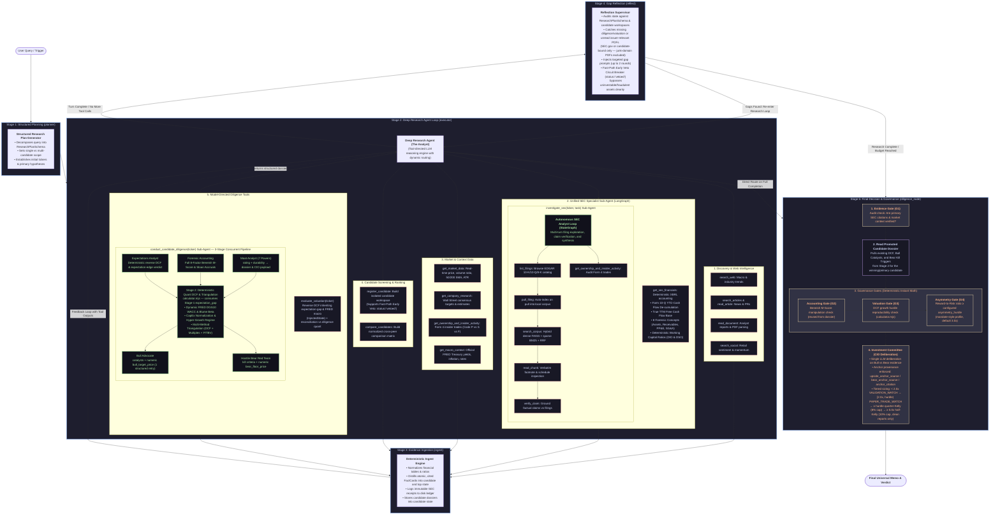

# Deep Research & Valuation Pipeline Architecture

This document details the multi-stage, model-directed research graph, showing how deep research and specialist diligence are cleanly separated between **The Analyst Workbench (Stage 2 Tools)** and **The Investment Committee Boardroom (Stage 5 Governance)**.

---

## 1. End-to-End Pipeline Architecture Diagram

```mermaid
flowchart TD
    %% Global styling
    classDef stage fill:#1e1e2e,stroke:#89b4fa,stroke-width:2px,color:#cdd6f4;
    classDef tool fill:#181825,stroke:#f38ba8,stroke-width:1px,color:#cdd6f4;
    classDef engine fill:#11111b,stroke:#a6e3a1,stroke-width:2px,color:#a6e3a1;
    classDef gate fill:#313244,stroke:#f9e2af,stroke-width:1.5px,color:#fab387;
    classDef read fill:#181825,stroke:#cba6f7,stroke-width:1.5px,color:#cdd6f4;

    START([User Query / Trigger]) --> S1

    %% ==========================================
    %% STAGE 1: PLANNER
    %% ==========================================
    subgraph S1["Stage 1: Structured Planning (planner)"]
        direction TB
        P_DESC["<b>Structured Research Plan Generator</b><br/>• Decomposes query into ResearchPlanSchema<br/>• Sets single vs multi-candidate scope<br/>• Establishes initial tickers & primary hypotheses"]
    end

    S1 --> S2

    %% ==========================================
    %% STAGE 2: DEEP RESEARCH AGENT LOOP (ANALYST WORKBENCH)
    %% ==========================================
    subgraph S2["Stage 2: Deep Research Agent Loop (executor)"]
        direction TB
        EXEC["<b>Deep Research Agent (The Analyst)</b><br/>(Tool-directed LLM reasoning engine with dynamic routing)"]

        subgraph T_DISC["1. Discovery & Web Intelligence"]
            t_web["search_web: Macro & industry trends"]
            t_art["search_articles & read_article: News & PRs"]
            t_doc["read_document: Analyst reports & PDF parsing"]
            t_soc["search_social: Retail sentiment & momentum"]
        end

        subgraph T_SEC["2. Unified SEC Specialist Sub-Agent (LangGraph)"]
            direction TB
            t_sec_fin["get_sec_financials: Deterministic XBRL accounting<br/>• Form 10-Q YTD Cash Flow De-cumulation<br/>• True TTM Free Cash Flow Base<br/>• 8 Forensic Concepts (Assets, Receivables, PP&E, SG&A)<br/>• Deterministic Working Capital Ratios (DIO & DSO)"]
            
            subgraph SEC_SUBAGENT["investigate_sec(ticker, task) Sub-Agent"]
                direction TB
                sec_sub_desc["<b>Autonomous SEC Analyst Loop (StateGraph)</b><br/>Multi-turn filing exploration, claim verification, and synthesis"]
                sec_list["list_filings: Browse EDGAR 10-K/10-Q/8-K catalog"]
                sec_pull["pull_filing: Auto-index on pull into local corpus"]
                sec_search["search_corpus: Hybrid dense FAISS + sparse BM25 + RRF"]
                sec_chunk["read_chunk: Verbatim footnote & schedule inspection"]
                sec_claim["verify_claim: Ground factual claims vs filings"]
                sec_insider["get_ownership_and_insider_activity: Audit Form 4 trades"]

                sec_sub_desc --> sec_list --> sec_pull --> sec_search --> sec_chunk --> sec_claim
                sec_sub_desc --> sec_insider
            end
        end

        subgraph T_MKT["3. Market & Context Data"]
            t_mkt["get_market_data: Real-time price, volume ratio, 50/200 SMA, ATR"]
            t_co["get_company_research: Wall Street consensus targets & estimates"]
            t_own["get_ownership_and_insider_activity: Form 4 insider trades (Code P vs S vs F)"]
            t_macro["get_macro_context: Official FRED Treasury yields, inflation, rates"]
        end

        subgraph T_COMP["4. Candidate Screening & Ranking"]
            t_reg["register_candidate: Build isolated candidate workspace<br/>(Supports Fast-Path Early Veto: status='vetoed')"]
            t_cmp["compare_candidates: Build normalized cross-peer comparison matrix"]
        end

        subgraph T_DIL["5. Model-Directed Diligence Tools"]
            t_val["evaluate_valuation(ticker)<br/>Reverse DCF inheriting expectation-gap & FRED macro<br/>(InjectedState) + reconciliation vs diligence quant"]
            
            subgraph SUBAGENT["conduct_candidate_diligence(ticker) Sub-Agent — 3-Stage Concurrent Pipeline"]
                direction TB
                ENG_EXP["Expectations Analyst<br/>Deterministic reverse DCF & expectation-edge verdict"]
                ENG_FOR["Forensic Accounting<br/>Full 8-Factor Beneish M-Score & Sloan Accruals"]
                ENG_MOAT["Moat Analyst (7 Powers)<br/>rating + durability → dossier & CIO payload"]
                ENG_QNT["Stage 2: Deterministic Quant DCF & Triangulation<br/>calculator.mjs — consumes Stage-1 expectation_gap<br/>• Dynamic FRED DGS10 WACC & Blume Beta<br/>• CapEx Normalization & Hyper-Growth Regime<br/>• Multi-Method Triangulation (DCF + Multiples + P/TBV)"]
                ENG_BULL["Bull Advocate<br/>catalysts + numeric bull_target_price (1 structured retry)"]
                ENG_BEAR["Hostile Bear Red Team<br/>kill criteria + numeric bear_floor_price"]

                ENG_EXP --> ENG_QNT
                ENG_FOR --> ENG_QNT
                ENG_MOAT --> ENG_QNT
                ENG_QNT --> ENG_BULL
                ENG_QNT --> ENG_BEAR
            end
        end

        EXEC --> T_DISC
        EXEC --> T_SEC
        EXEC --> T_MKT
        EXEC --> T_COMP
        EXEC --> T_DIL
        T_DIL -. returns structured dossier .-> EXEC
    end

    %% ==========================================
    %% STAGE 3: INGESTION
    %% ==========================================
    subgraph S3["Stage 3: Evidence Ingestion (ingest)"]
        INGEST["<b>Deterministic Ingest Engine</b><br/>• Normalizes financial tables & ratios<br/>• Distills atomic, cited FactCards into candidate and top state<br/>• Logs immutable SEC receipts to disk ledger<br/>• Stores candidate dossiers into candidate state"]
    end

    T_DISC --> S3
    T_SEC --> S3
    T_MKT --> S3
    T_COMP --> S3
    T_DIL --> S3
    S3 -->|Feedback Loop with Tool Outputs| EXEC

    %% ==========================================
    %% STAGE 4: GAP REFLECTION
    %% ==========================================
    subgraph S4["Stage 4: Gap Reflection (reflect)"]
        REFLECT["<b>Reflection Supervisor</b><br/>• Audits state against ResearchPlanSchema & candidate workspaces<br/>• Catches missing diligence/valuation or unread issuer-relevant PDFs<br/>(SEC.gov or candidate-bound only — junk-domain PDFs excluded)<br/>• Injects targeted gap prompts (up to 2 rounds)<br/>• Fast-Path Early Veto Circuit Breaker (status='vetoed')<br/>  bypasses uninvestable/fraudulent assets cleanly"]
    end

    EXEC -->|Turn Complete / No More Tool Calls| S4
    S4 -->|Gaps Found: Re-enter Research Loop| EXEC

    %% ==========================================
    %% STAGE 5: FINAL AUDIT & GATES (THE BOARDROOM)
    %% ==========================================
    subgraph S5["Stage 5: Final Decision & Governance (diligence_node)"]
        direction TB
        
        G_EV["<b>1. Evidence Gate (G1)</b><br/>Audit check: Are primary SEC citations & market context verified?"]:::gate
        
        PROMO["<b>2. Read Promoted Candidate Dossier</b><br/>Pulls existing DCF, Bull Catalysts, and Bear Kill Triggers<br/>from Stage 2 for the winning/primary candidate"]:::read

        subgraph GATES["3. Governance Gates (Deterministic Instant Math)"]
            G_ACC["<b>Accounting Gate (G2)</b><br/>Beneish M-Score manipulation check (reused from dossier)"]:::gate
            G_VAL["<b>Valuation Gate (G3)</b><br/>DCF growth hurdle reproducibility check (calculator.mjs)"]:::gate
            G_ASYM["<b>Asymmetry Gate (G4)</b><br/>Reward-to-Risk ratio ≥ configured asymmetry_hurdle<br/>(mandate-style profile, default 3.0x)"]:::gate
            G_ACC --> G_VAL --> G_ASYM
        end

        COMM["<b>4. Investment Committee (CIO Deliberation)</b><br/>• Single LLM deliberation on Bull vs Bear evidence<br/>• Anchor provenance enforced: upside_anchor_source / bear_anchor_source / anchor_citation<br/>• Tiered sizing: < 2.0x VALIDATION_WATCH → [2.0x, hurdle) PAPER_TRADE_WATCH<br/>→ ≥ hurdle quarter-Kelly (8% cap) → ≥ 5.0x half-Kelly (10% cap, clean reports only)"]:::gate

        G_EV --> PROMO --> GATES --> COMM
    end

    S4 -->|Research Complete / Budget Reached| S5
    EXEC -->|Direct Route on Full Completion| S5
    S5 --> END_NODE([<b>Final Universal Memo & Verdict</b>])

    %% Class assignments
    class S1,S2,S3,S4,S5 stage;
    class t_web,t_art,t_doc,t_soc,t_sec_fin,sec_list,sec_pull,sec_search,sec_chunk,sec_claim,sec_insider,t_mkt,t_co,t_own,t_macro,t_reg,t_cmp,t_val tool;
    class ENG_EXP,ENG_FOR,ENG_MOAT,ENG_QNT,ENG_BULL,ENG_BEAR,sec_sub_desc engine;
    class G_EV,G_ACC,G_VAL,G_ASYM,COMM,GATES gate;
    class PROMO read;
```

---

## 2. Separation of Duties: Analyst (Stage 2) vs Committee (Stage 5)

| Analysis Component | Stage 2 (The Analyst Workbench) | Stage 5 (The Boardroom Committee) |
|---|---|---|
| **Heavy Modeling & Sub-Agents** | Runs per-candidate on demand via `conduct_candidate_diligence(ticker)`: Quant DCF (with dynamic FRED WACC, CapEx normalization, and Multi-Method Triangulation), Forensics, Moat, Bull Advocate, and Bear Red Team. Or commands the `investigate_sec` analyst sub-agent for deep filing retrieval. | **Zero engine execution.** It never spins up sub-agents or re-runs models. |
| **Candidate Selection** | Dynamically screens candidates, registers workspaces (`register_candidate`), declares early vetoes (`status='vetoed'`), and builds cross-candidate comparison matrices (`compare_candidates`). | Promotes the **winning candidate's dossier** into state (prioritizing the highest asymmetric reward-to-risk ratio). |
| **Evidence & Compliance** | Commands `investigate_sec` to auto-discover, pull, chunk, and cite 10-K/10-Qs; verifies rumors via `verify_sec_claim`. | Evaluates the **Evidence Gate (G1)**: ensures primary SEC citations and market context exist before voting. |
| **Audit Gates** | Collects raw metrics (deterministic Reverse DCF implied growth, Beneish M-Score, Bear floor, Multi-method divergence flag). | Runs **instant mathematical checks**: Accounting Gate (G2), Valuation Gate (G3), and Asymmetry Gate (G4 $\ge$ the configured `asymmetry_hurdle`, profile-selected, default 3.0x). |
| **Capital Allocation & Sizing** | Formulates thesis, numeric bull target price, and downside floor prices (both debate anchors are validated; missing anchors degrade the report and fall back to labeled Street/DCF anchors). | The **Chief Investment Officer (CIO)** conducts a single formal deliberation with enforced anchor provenance, assigns conviction tier, and sizes via **tiered Fractional Kelly**: near-miss ratios land in a zero-capital `PAPER_TRADE_WATCH` queue for calibration. |

---

## 3. Data Integrity, Forensics & Evidence Preservation Engine

### 3.1 Form 10-Q Cash Flow De-cumulation Engine
Under SEC Regulation S-X Rule 10-01(a)(4), Form 10-Q cash flows are reported on a cumulative Year-To-Date (YTD) basis:
- **Q1**: 3-month discrete period (~90 days).
- **Q2**: 6-month cumulative period (~180 days).
- **Q3**: 9-month cumulative period (~270 days).
- **Q4 / 10-K**: 12-month annual period (~365 days).

When cumulative amounts are detected, `app/sec/financials.py::_decumulate_cash_flows` derives true discrete quarterly amounts:
$$Q2_{discrete} = YTD_{6M} - Q1_{discrete}$$
$$Q3_{discrete} = YTD_{9M} - YTD_{6M}$$
$$Q4_{discrete} = FY_{12M} - YTD_{9M}$$

The de-cumulated quarterly cash flows are summed across the 4 most recent discrete quarters to compute **True Trailing Twelve Months (TTM) Free Cash Flow** ($FCF_{TTM} = \sum_{k=1}^4 CFO_k - CapEx_k$), which is passed directly to `calculator.mjs` as the annual base cash flow, eliminating historical $2\times$ to $4\times$ DCF valuation distortions. A partial 4-quarter window (any quarter missing CFO or CapEx fields on a given fetch) is **never** annualized or partially summed — `_compute_ttm_fcf` reports `None` instead, because unstable TTM values previously flipped downstream reverse-DCF bases between fetches.

### 3.2 Academic Triad Forensic Accounting Models
`app/market/forensics.py` extracts 8 official US-GAAP balance sheet and cash flow concepts (`total_assets`, `accounts_receivable`, `current_assets`, `ppe`, `depreciation`, `sg_and_a`, `stock_based_compensation`, `current_liabilities`) to compute:
1. **Beneish 8-Factor M-Score (Messod Beneish, 1999)**:
   $$M = -4.84 + 0.920 \cdot \text{DSRI} + 0.528 \cdot \text{GMI} + 0.404 \cdot \text{AQI} + 0.892 \cdot \text{SGI} + 0.115 \cdot \text{DEPI} - 0.172 \cdot \text{SGAI} + 4.679 \cdot \text{TATA} - 0.327 \cdot \text{LVGI}$$
   (published eight-variable model coefficients — TATA positive-weighted, LVGI negative-weighted)
   Detects revenue inflation, asset capitalization of operating costs, and artificial margin expansion ($M > -1.78$ triggers manipulator alert).
2. **Sloan Accrual Quality (Richard Sloan, 1996)**:
   $$\text{Accrual Ratio} = \frac{\text{Net Income} - \text{Cash from Operations}}{\text{Average Total Assets}}$$
   Separates accounting paper profits from real cash generation.
3. **Stock-Based Compensation Dilution Burden**:
   $$\text{SBC Burden} = \frac{\text{Stock-Based Compensation}}{\text{Free Cash Flow}}$$
   Flags hidden compensation dilution ($> 25\%$ of FCF indicates high shareholder dilution).
4. **Deterministic Working Capital Ratios (DIO & DSO)**:
   Under `app/sec/financials.py`, discrete period Days Inventory Outstanding (DIO) and Days Sales Outstanding (DSO) are calculated deterministically across all periods (using 365 days for annual FY, 91.25 days for quarterly periods):
   $$\text{DIO} = \frac{\text{Inventories}}{\text{Cost of Goods Sold}} \times \text{Days}$$
   $$\text{DSO} = \frac{\text{Accounts Receivable}}{\text{Revenue}} \times \text{Days}$$
   Spikes in DIO flag inventory build-up at cyclical peaks, while elevated DSO warns of aggressive revenue booking and channel stuffing.

### 3.3 Immutable FactCard Evidence Ledger & Context Compaction
To ensure zero factual or citation amnesia during deep multi-turn investigations:
1. **Deterministic Distillation (`app/agent/tool_result_ingestion.py`)**: Incoming tool payloads from `get_sec_financials` and `get_market_data` are immediately distilled into atomic, cited `FactCard` instances (`fact_{ticker}_{metric}_{period}`).
2. **Entity Backlink Preservation (`app/agent/context.py`)**: When large `ToolMessage` payloads are pruned down to compact metadata envelopes under token limits, entity identifiers (`ticker`, `periods`) are retained in the envelope.
3. **System Prompt Reprojection (`app/agent/prompts.py`)**: Active FactCards are projected into the `SystemMessage` under `DURABLE RESEARCH STATE`. Because `SystemMessage` is permanently preserved during context compaction, all audited metrics, citations, and verified quotes survive indefinitely across turns.

### 3.4 Dynamic Macro WACC & Capital Structure Calibration
In `app/agent/specialists.py::run_quant_analysis`, discount rates are dynamically anchored to macroeconomic conditions rather than static guesses:
1. **Official Risk-Free Rate ($R_f$)**: Extracted from official Federal Reserve FRED series `DGS10` (10-Year Treasury Constant Maturity). If FRED data is unavailable, defaults to institutional benchmark of 4.30%.
2. **Blume-Adjusted Beta**: Reversion toward mean market volatility via Bloomberg/Blume adjustment:
   $$\beta_{\text{adj}} = \min(\max(0.67 \cdot \beta_{\text{raw}} + 0.33, 0.60), 2.00)$$
3. **Cost of Equity ($K_e$)**: CAPM using Damodaran US Equity Risk Premium ($\text{ERP} = 4.75\%$):
   $$K_e = R_f + \beta_{\text{adj}} \cdot \text{ERP}$$
4. **After-Tax Cost of Debt ($K_d$)**:
   $$K_d = (R_f + 1.50\%) \cdot (1 - 0.21)$$
5. **Weighted Average Cost of Capital (WACC)**: Weighted by enterprise capital structure ($W_e, W_d$) and bounded within $[7.5\%, 13.0\%]$ to prevent unrealistic cost-of-capital extremes.

### 3.5 CapEx Normalization & Hyper-Growth Inflection Regime
In heavy capital-expenditure phases (e.g. semiconductor foundry builds, AI hyperscaler cluster buildouts), unadjusted single-stage DCFs suffer severe distortions because growth CapEx directly depresses reported Free Cash Flow. `app/agent/specialists.py::run_quant_analysis` implements automated regime detection:
1. **CapEx Spike Detection**: Flagged when $\text{CapEx} / \text{Revenue} > 25\%$.
2. **Hyper-Growth Inflection**: Flagged when latest quarter revenue annualizes to $>1.35\times$ trailing 12-month revenue ($\text{Quarter Revenue} \times 4 > 1.35 \times \text{TTM Revenue}$).
3. **Maintenance CapEx Normalization**: For firms flagged in growth capex or hyper-growth inflection, maintenance CapEx is normalized to a steady-state rate of $15\%$ of revenue:
   $$\text{Maintenance CapEx} = \min(\text{Reported CapEx}, \text{Revenue} \times 0.15)$$
   $$\text{Normalized FCF} = \text{Cash from Operations} - \text{Maintenance CapEx}$$
4. **Growth-Driven Flow Projection**: Regime detection affects **only** the $FCF_{base}$ normalization above — never the shape of the future. DCF flows are projected directly from each case's authored growth rate ($FCF_y = FCF_{base} \cdot (1+g)^y$) fading into the terminal value, so the expectations analyst's low/base/high assumptions genuinely drive the valuation. (An earlier hard-coded harvesting ladder silently overrode these assumptions and was removed.)

### 3.6 Multi-Method Valuation Triangulation Engine (`calculator.mjs`)
To prevent over-reliance on a single DCF model, `app/valuation/calculator.mjs` executes multi-method triangulation across four institutional pillars:
1. **Intrinsic DCF Fair Value**: Discounted cash flow base case.
2. **Forward Earnings Multiple Valuation**: $\text{Forward EPS} \times 10.0\times P/E$.
3. **Tangible Asset Floor**: $\text{Book Value per Share} \times 1.8\times P/TBV$ (automatically disabled for asset-light businesses where $\text{Book Value} \times \text{Shares} < 8\% \text{ Market Cap}$).
4. **Wall Street Consensus Target**: Mean price target from equity research analysts.
5. **DCF Divergence Circuit Breaker**: If intrinsic DCF falls below $35\%$ of current market price due to temporary peak CapEx drag while forward multiples or consensus targets are $\ge 1.5\times$ higher, the engine flags `dcf_divergence_flagged: true` and re-weights the valuation ($25\%$ DCF, $45\%$ Multiple, $15\%$ Asset Floor, $10\%$ Consensus) with the asset floor as the valuation low and multiple as the valuation high.

### 3.7 Deterministic Expectation Gap & Honest Structured Outputs
Model-authored numbers that describe market pricing are deterministic-only (`app/agent/expectations.py`, `app/agent/bull.py`, `app/agent/adversarial.py`):
1. **Deterministic Implied Growth**: `expectation_gap.implied_fcf_growth_rate` comes exclusively from the calculator's reverse DCF — never from model text. The `implied_growth_interpretation` field is a deterministic template embedding the calculator's number and discount rate; model commentary is stored separately and replaced (report flagged `degraded`) when it contradicts the calculator.
2. **Deterministic Expectation-Edge Verdict**: the gap verdict is classified in code from the spread between consensus forward growth and the deterministic implied growth (`ALREADY_PRICED_IN` / `HIDDEN_EXPECTATIONS_EDGE` / `BALANCED_PRICING` / `UNCERTAIN_DISPERSION`, margin 5 percentage points). The edge itself (`consensus_growth − implied_growth`) is a first-class ranking metric in `compare_candidates`.
3. **Honest Status Vocabulary**: every specialist report carries `status ∈ {available, degraded, unavailable}` plus `degradation_reasons[]`. Field-level parsing drops one malformed field instead of discarding the whole report.
4. **Symmetric Debate Anchors**: the Bull Advocate must supply a numeric `bull_target_price` (one structured retry with validation feedback before degrading); the committee escalates to a labeled `consensus_high_fallback` when no anchor sits above the price, and to `dcf_low_fallback` when the red team's `bear_floor_price` is missing. The CIO payload separates `upside_anchor` (with `upside_anchor_source`) from `dcf_base_fair_value`, and the CIO must cite `anchor_citation` accurately.
5. **Single FCF Base**: the expectations preliminary reverse DCF uses the same CapEx-spike normalization priority as `run_quant_analysis`, so both reverse DCFs share one FCF base by construction. A positive provider `ttm_fcf` is only trusted when it comes from a complete, stable 4-quarter window (`_compute_ttm_fcf` returns `None` for partial windows).

### 3.8 Tiered Position Sizing & Profitability Measurement
Position sizing is config-driven (`ResearchConfig`: `mandate_style`, `asymmetry_hurdle`, `half_kelly_ratio`, `paper_trade_ratio`) and injected into the committee via `budget_state`:
1. **Mandate-Style Hurdle Profiles**: `deep_value = 3.0x`, `compounder = 2.0x`, `momo = 4.0x` — an explicit override always wins.
2. **Tiered Allocation**: ratio $< 2.0\times$ → `VALIDATION_WATCH` (zero capital); $[2.0\times, \text{hurdle})$ → `PAPER_TRADE_WATCH` (decision recorded, zero capital, kept for calibration); $\ge$ hurdle → **quarter-Kelly** (8% single-name cap); $\ge 5.0\times$ with fully available debate reports → **half-Kelly** (10% cap).
3. **Backtest Scorer (`tools/backtest_score.py`)**: grades persisted decisions against forward 3/6/12-month returns via an injectable price provider — per-bucket hit rate, average forward return, predicted upside, and calibration error — closing the empirical loop on the hurdle and win-probability assumptions.
