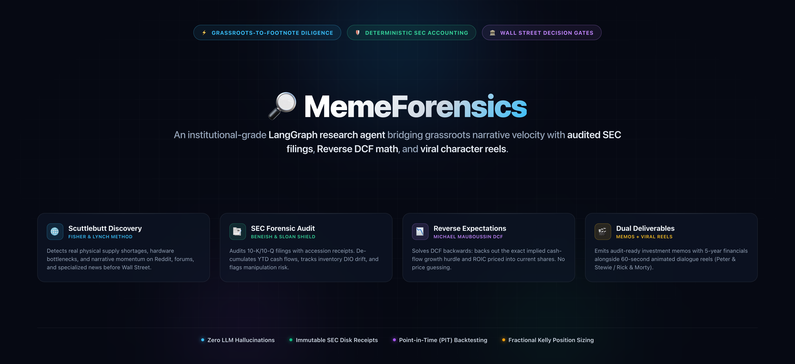
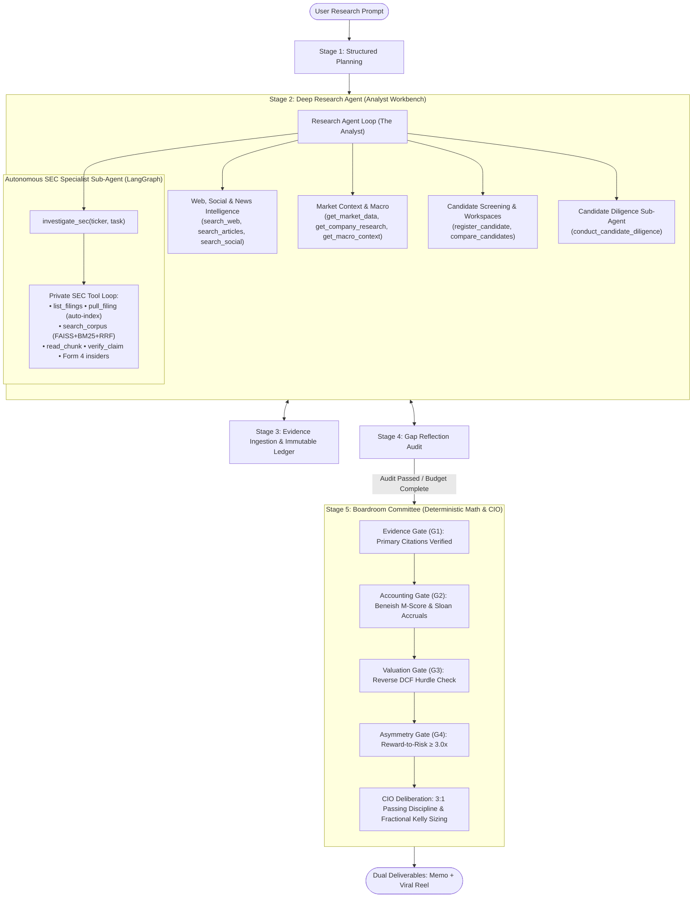

<div align="center">

# 🔎 MemeForensics

### Autonomous Forensic Equity Diligence & Valuation DAG
**From Grassroots Demand Signals to Audited SEC Footnotes • Michael Mauboussin Reverse DCF • Dual Deliverables**

[](pyproject.toml)
[](https://langchain-ai.github.io/langgraph/)
[](app/sec/)
[-7C3AED.svg?style=flat-square)](app/valuation/)
[](tests/)

<br/>

[](./README_images/hero_banner.png)

<br/>

<p align="center">
  <a href="#-quick-start"><b>⚡ Quick Start</b></a> •
  <a href="#-why-memeforensics"><b>💡 Why MemeForensics?</b></a> •
  <a href="#-dual-deliverables-engine"><b>🎬 Dual Deliverables</b></a> •
  <a href="#-system-architecture"><b>📐 Architecture</b></a> •
  <a href="doc/cli.md"><b>💻 Full CLI Guide</b></a> •
  <a href="#-testing--verification"><b>🧪 Testing</b></a>
</p>

</div>

---

## 💡 Why MemeForensics?

Retail investors repeatedly get caught at cyclical tops—chasing speculative narratives on Reddit or X right before catastrophic gross margin compression, unannounced secondary offerings, or inventory write-downs. Meanwhile, generic LLM financial "agents" hallucinate metrics, quote unverified marketing blogs, and rely on fuzzy keyword matching.

**MemeForensics solves this.** It is an institutional-grade deep research agent that bridges grassroots demand discovery with primary SEC forensic auditing, Michael Mauboussin reverse expectations modeling, and automated viral media generation.

```
grassroots demand signal (Reddit, forums, news)
  ↳ supply-chain beneficiary tracing (investable public companies)
    ↳ authoritative SEC execution audit (10-K/10-Q gross margins, inventory, CapEx, Form 4)
      ↳ Wall Street expectation gap (Reverse DCF: implied growth hurdles vs consensus)
        ↳ dual output: Institutional Investment Committee Memo + Viral Faceless Reel
```

- 🔍 **Immutable SEC Evidence Ledger:** Every material revenue, inventory, and margin claim is anchored in official SEC EDGAR filings (`10-K`, `10-Q`, `8-K`) with exact accession numbers and disk receipts. Zero hallucinations.
- 📉 **Reverse DCF (Expectations Investing):** Instead of guessing future stock prices, the engine solves the discounted cash flow equation backwards: what cash-flow growth rate and ROIC is the current share price pricing in?
- 🛡️ **Forensic Accounting Shields:** Automatically computes the **Beneish M-Score** (manipulation risk), **Sloan Accrual Ratio** (earnings quality), and **Days of Inventory Outstanding (DIO)** drift to catch cyclical tops early.
- 🏛️ **Deterministic Committee Boardroom:** Enforces a 4-tier decision gate (Evidence, Accounting, Valuation, and Asymmetry $\ge 3.0\times$) paired with single-pass Chief Investment Officer (CIO) deliberation and **Fractional Kelly Criterion** position sizing.
- ⏱️ **Point-in-Time (PIT) Integrity:** Supports historical cutoff dates (`--as-of YYYY-MM-DD`) that strictly discard future filings and drop undated web content to eliminate lookahead bias during backtests.
- 🎬 **Dual Deliverables Engine:** Emits both exhaustive institutional investment memos (`memo.md`) and viral video reel packages (`faceless/dialogue.json`) featuring animated character duos like Peter & Stewie or Rick & Morty.

---

## 🎬 Dual Deliverables Engine

MemeForensics produces two synchronized deliverables for every investigation:

### 1. Institutional Investment Committee Memorandum (`memo.md`)

An exhaustive, audit-ready memorandum featuring executive verdicts, tradability scorecards, 5-year normalized financial statements, Reverse DCF growth matrices, and hostile bear red team kill criteria.

```markdown
# Investment Committee Memorandum: Micron Technology ($MU)
**Verdict:** PASSED 🚫 | **Conviction:** Tier 3 (Monitor Only) | **Kelly Allocation:** 0.0%

### Executive Rationale
While the grassroots AI demand signal is authentic, the Reverse DCF reveals the market prices in 
a 14.8% FCF CAGR for 10 straight years at peak cycle. Meanwhile, Days of Inventory Outstanding (DIO)
expanded +28 days QoQ to 164 days, signaling channel inventory accumulation. 
Reward-to-Risk Asymmetry stands at 0.91x—failing our mandatory 3.0x hurdle.

### Valuation & Reverse Expectations Matrix
- Current Price: $927.60 | Implied 10-Yr FCF CAGR: 14.8%
- Conservative Bear Floor: $580.00 | Realistic Base Case: $895.00
- Asymmetry Ratio: 0.91x (Required: ≥ 3.0x) ❌ FAILED
```

### 2. Viral Faceless Video Dialogue Reels (`faceless/`)

Translates dense financial forensics, footnote anomalies, and reverse DCF math into 60-second viral storytelling for TikTok, YouTube Shorts, and Instagram Reels:

```json
[
  {
    "index": 0,
    "voiceId": "a84d19016bc34098b3c89d78f9299e33",
    "text": "(excited) Holy crap, Stewie! I just dumped Lois's grocery money into Micron stock! Forty-five Wall Street analysts rated it a massive Buy, and price targets go straight to twenty-two hundred bucks!"
  },
  {
    "index": 1,
    "voiceId": "e91c4f5974f149478a35affe820d02ac",
    "text": "(deadpan) Oh, marvelous, fat man. You just blindly bought a one-trillion-dollar cyclical chipmaker at nine hundred and twenty-seven dollars right into an inventory bear trap."
  },
  {
    "index": 2,
    "voiceId": "e91c4f5974f149478a35affe820d02ac",
    "text": "(confident) If consolidated gross margins slide under thirty-five percent, or Days of Inventory breaches one hundred sixty-five days alongside DRAM price erosion, that pricing premium evaporates overnight. Institutional verdict is a flat zero percent capital allocation!"
  }
]
```

---

## 📐 System Architecture

The pipeline is modeled as a state machine in **LangGraph**, strictly separating model-directed research discovery from deterministic committee governance.

See [PIPELINE_ARCHITECTURE.md](./PIPELINE_ARCHITECTURE.md) for the complete end-to-end specification.



---

## ⚡ Quick Start

### 1. Installation

Requires **Python 3.11+** and **Node.js 18+**:

```bash
# Clone repository
git clone https://github.com/Unheat/memeTrading.git
cd memeTrading

# Create virtual environment
python3 -m venv .venv
source .venv/bin/activate

# Install dependencies
pip install -r requirements.txt
```

### 2. Environment Setup (`.env`)

Copy `.env.example` to `.env` and configure your API keys:

```bash
cp .env.example .env
```

```ini
# Primary LLM provider (OpenAI, OpenRouter, Anthropic, or local proxy)
OPENAI_API_KEY="your_openai_api_key"

# SEC EDGAR Fair Access User-Agent (Required by SEC.gov)
# Format: "Sample User user@domain.com"
SEC_EDGAR_USER_AGENT="MemeTradingResearch yourname@domain.com"

# Optional: Fish Audio TTS API Key (for Peter & Stewie video reels)
FISH_API_KEY="your_fish_audio_api_key"
```

### 3. Run Your First Investigation

```bash
# Interactive Mode — prompts for your research question
python main.py

# Single-ticker investigation
python main.py --ticker MU --query "DRAM cycle pricing power and gross margin expansion"

# Thematic beneficiary discovery across an entire sector
python main.py --query "Find key supply chain beneficiaries of advanced EUV lithography"

# Generate research memo + cited Substack article
python main.py --ticker NVDA --query "Blackwell thermal and packaging yields" --article

# Generate complete viral character reel (Peter & Stewie)
python main.py --ticker TSLA --query "Robotaxi regulatory path and auto gross margin" --video
```

> [!TIP]
> For complete CLI argument descriptions, backtesting workflows, and production recipes, see the **[CLI Guide & Reference Manual](doc/cli.md)**.

---

## 💻 CLI Tools at a Glance

| Command | Description |
| :--- | :--- |
| `python main.py` | Interactive research agent prompt. |
| `python main.py -t <TICKER> -q "<QUERY>"` | Single-ticker forensic equity diligence. |
| `python main.py -q "<THEME>" --depth deep` | Thematic discovery & automatic candidate registration. |
| `python main.py -t <TICKER> --as-of <DATE>` | Historical Point-in-Time audit without lookahead bias. |
| `python main.py -t <TICKER> --article` | Generates cited Substack forensic article (`article.md`). |
| `python main.py -t <TICKER> --video` | Generates article, character script, and renders MP4 video. |
| `python scripts/run_backtest.py` | Historical backtest sweep evaluating verdicts against `SPY` alpha. |
| `node app/valuation/calculator.mjs` | Standalone deterministic Reverse DCF & scenario calculator. |

👉 **Read the complete [CLI Guide (doc/cli.md)](doc/cli.md)** for detailed argument tables, backtesting scorecard metrics, and custom recipes.

---

## 🧠 Institutional Financial Frameworks

```
┌─────────────────────────────────────────────────────────────────────────────────┐
│                           MEMEFORENSICS METHODOLOGY                             │
├──────────────────────────┬──────────────────────────┬───────────────────────────┤
│    1. SCUTTLEBUTT        │   2. FORENSIC AUDITING   │  3. EXPECTATIONS REVERSE  │
│   (Fisher & Lynch)       │    (Beneish & Sloan)     │  (Mauboussin & Rappaport) │
├──────────────────────────┼──────────────────────────┼───────────────────────────┤
│ • Social demand signals  │ • Beneish 8-variable     │ • Back out implied cash   │
│ • Supply-chain choke-    │   M-Score manipulation   │   flow growth (CAGR)      │
│   points & wait times    │ • Sloan accrual ratio:   │ • Reinvestment rate &     │
│ • Beneficiary mapping    │   Operating CF vs Net Inc│   ROIC sustainability     │
│ • Customer contract      │ • Days of Inventory      │ • Expectation gap: priced │
│   validity (Form 8-K)    │   Outstanding (DIO) drift│   catalyst vs unpriced    │
└──────────────────────────┴──────────────────────────┴───────────────────────────┘
```

1. **Scuttlebutt Grassroots Discovery (Philip Fisher & Peter Lynch):** Monitors developer communities, subreddits, and industry reports to identify physical supply-demand imbalances before they appear in quarterly reports.
2. **Deterministic Forensic Accounting (Messod Beneish & Richard Sloan):** Evaluates earnings quality by inspecting Days Sales in Receivables Index (DSRI), Gross Margin Index (GMI), Asset Quality Index (AQI), and Sales Growth Index (SGI) directly from SEC filings.
3. **Expectations Investing & Reverse DCF (Michael Mauboussin):** Solves the classic discounted cash flow equation backwards:
   $$\text{Stock Price} = f(\text{Implied Growth Rate}, \text{Forecast Horizon}, \text{ROIC}, \text{WACC})$$
   Determines whether the market has already fully discounted the catalyst or left an asymmetric margin of safety.
4. **Fractional Kelly Capital Allocation (John Kelly & Ed Thorp):** Sizes recommended position weights based on calculated win probabilities and payoff asymmetries:
   $$f^* = \frac{b \cdot p - q}{b}$$
   Where $b$ is reward-to-risk asymmetry, $p$ is probability of catalyst fruition, and $q = 1 - p$.

---

## 📁 Artifacts & Output Structure

Every run creates a timestamped case folder inside `cases/`:

```
cases/
└── MU-2026-09-15-007/
    ├── memo.md               # Institutional Investment Committee Memorandum
    ├── investigation.json    # Complete structured state, metrics, and audit ledger
    ├── evidence_ledger.jsonl # Append-only ledger of verified evidence items
    ├── run-manifest.json     # Execution metadata, model latency, and token consumption
    ├── article.md            # (Opt-in) Cited Substack / Blog forensic article
    ├── sec/                  # Downloaded raw SEC filings, 10-K/10-Q tables, and Form 4s
    └── faceless/             # Viral Media Generation Assets (Opt-in)
        ├── dialogue.json     # Timestamped character dialogue with emotion tags
        ├── caption.txt       # Viral social caption with hashtags & hook
        └── video/            # Rendered 1080x1920 MP4 video reels
```

---

## 🧪 Testing & Verification

The repository maintains an extensive test suite verifying deterministic data pipelines, SEC parsing, Reverse DCF calculations, and graph transitions:

```bash
# Run the complete test suite (excluding slow live network smoke tests)
pytest tests -q --ignore=tests/smoke
```

```
........................................................................ [ 20%]
........................................................................ [ 41%]
........................................................................ [ 62%]
........................................................................ [ 83%]
..........................................................               [100%]
346 passed in 76.64s
```

---

## 📖 Extended Documentation

- 💻 **[CLI Guide & Reference Manual](doc/cli.md)** — Exhaustive parameter tables, recipes, backtesting sweep instructions, and standalone calculator guide.
- 📐 **[Pipeline Architecture Specification](PIPELINE_ARCHITECTURE.md)** — Full specification of The Analyst Workbench vs The Committee Boardroom.
- 🌐 **[Interactive Architecture Diagram](doc/planned-architecture.html)** — Standalone, responsive HTML visualization with theme toggling.
- 📋 **[Full Architecture Plan](doc/fullplan.md)** — In-depth architectural principles, Scuttlebutt framework, and state schemas.

---

<div align="center">
  <sub>Built for precision fundamental equity research. Star ⭐ this repository if you believe in evidence-backed investing!</sub>
</div>
