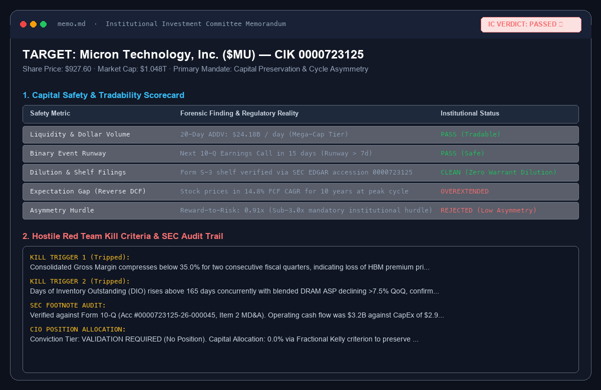
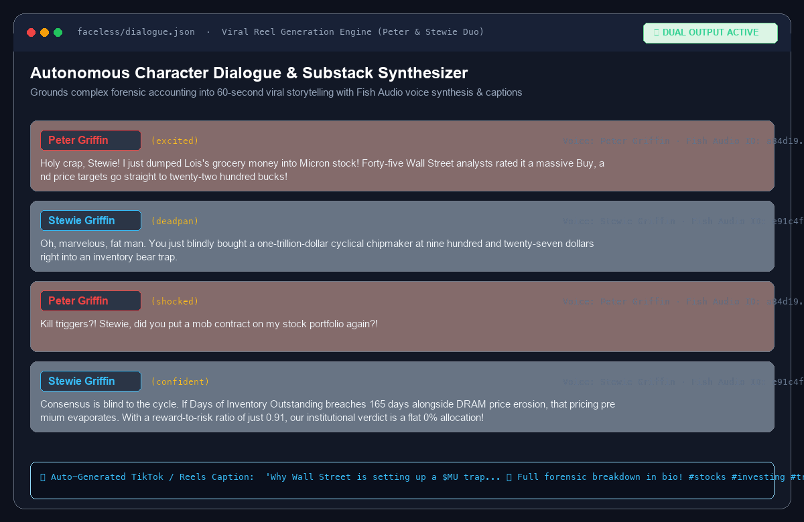
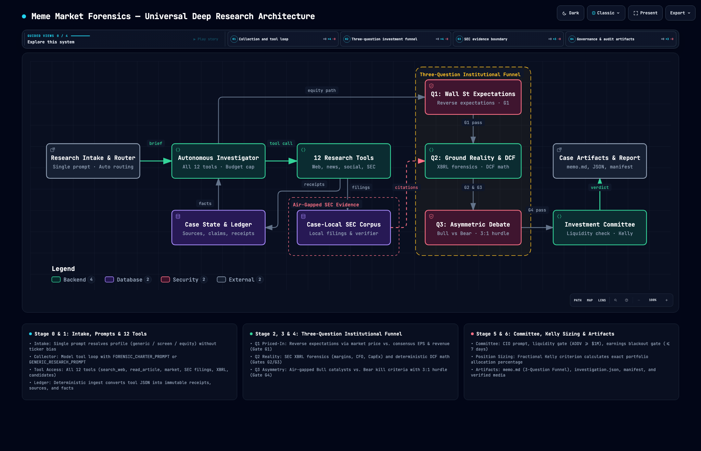
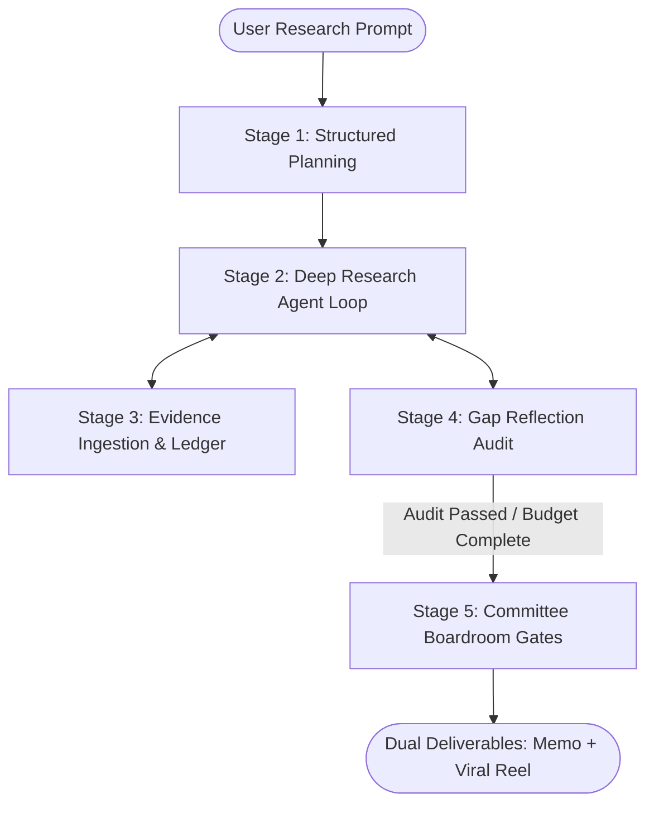

<div align="center">

# 🔎 MemeForensics

### Autonomous Forensic Equity Diligence & Valuation DAG
**From Grassroots Demand Signals to Audited SEC Footnotes • Michael Mauboussin Reverse DCF • Dual Deliverables (Institutional Memos + Viral Character Reels)**

[](pyproject.toml)
[](https://langchain-ai.github.io/langgraph/)
[](app/sec/)
[-7C3AED.svg?style=flat-square)](app/valuation/)
[](cases/)
[](tests/)

<br/>

[](./README_images/hero_banner.png)

</div>

---

## 💡 Why MemeForensics?

Retail investors frequently get trapped at cyclical tops, chasing speculative hype right before catastrophic margin compression, dilutive secondary offerings, or channel-stuffing inventory write-downs. Meanwhile, generic LLM "analysts" suffer from severe hallucinations: they invent financial figures, quote unverified press releases, and rely on fuzzy regex heuristics.

**MemeForensics solves this.** It is an institutional-grade deep research agent that investigates public equities by bridging grassroots demand signals with forensic SEC verification, Michael Mauboussin reverse expectations modeling, and automated viral media generation.

```
grassroots demand signal (Reddit, forums, news)
  ↳ supply-chain beneficiary tracing (investable public companies)
    ↳ authoritative SEC execution audit (10-K/10-Q gross margins, inventory, CapEx, Form 4)
      ↳ Wall Street expectation gap (Reverse DCF: implied growth hurdles vs consensus)
        ↳ dual output: Institutional Investment Committee Memo + Viral Faceless Reel
```

- 🔍 **Immutable SEC Evidence Ledger:** Every material revenue, inventory, and gross margin claim is grounded in primary SEC filings (`10-K`, `10-Q`, `8-K`) with exact accession numbers and disk receipts. Zero hallucinations.
- 📉 **Reverse DCF (Expectations Investing):** Instead of attempting to predict future stock prices, the engine reverses market consensus to compute the exact cash-flow growth rate, return on invested capital (ROIC), and investment horizon priced into current shares.
- 🛡️ **Forensic Accounting Shields:** Automatically computes the **Beneish M-Score** (financial manipulation risk), **Sloan Accrual Ratio** (cash vs accounting earnings quality), and **Days of Inventory Outstanding (DIO)** to flag channel stuffing.
- 🏛️ **Deterministic Committee Boardroom:** Enforces a strict 4-tier decision gate (Evidence Gate, Accounting Gate, Valuation Gate, and Asymmetry Gate $\ge 3.0\times$) paired with single-pass Chief Investment Officer (CIO) deliberation and **Fractional Kelly Criterion** position sizing.
- ⏱️ **Point-in-Time (PIT) Dual Mode:** Supports historical date cutoff (`--as-of YYYY-MM-DD`) that strictly discards post-cutoff filings and undated web items to eliminate lookahead bias during backtests.
- 🎬 **Dual Deliverables Engine:** Emits both high-conviction institutional memos (`memo.md`) with 5-year financial statements and viral video reel packages (`faceless/dialogue.json` & `.mp4`) featuring animated character duos like Peter & Stewie or Rick & Morty.

---

## 🖼️ See It in Action (Dual Output Engine)

MemeForensics pairs rigorous Wall Street financial analysis with modern viral media generation:

### 1. Institutional Investment Committee Memorandum (`memo.md`)

A complete institutional memo containing executive verdicts, tradability scorecards, 5-year audited financial statements, reverse DCF growth matrices, and hostile bear red team kill criteria:

[](./README_images/memo_preview.png)

> [!NOTE]
> In this case study on **Micron Technology ($MU)** at \$927.60/share, the engine issued a **PASSED 🚫** verdict: while the grassroots AI demand signal is real, the Reverse DCF revealed the stock prices in a massive 14.8% FCF CAGR for 10 straight years at peak cycle, while Days of Inventory Outstanding (DIO) expanded +28 days. Asymmetry stood at only 0.91x—falling far below our required 3.0x threshold.

---

### 2. Viral Faceless Video Dialogue Reels (`faceless/`)

Translates dense financial forensics, footnote anomalies, and reverse DCF math into 60-second viral storytelling for TikTok, YouTube Shorts, and Instagram Reels:

[](./README_images/reel_preview.png)

```json
[
  {
    "index": 0,
    "voiceId": "a84d19016bc34098b3c89d78f9299e33",
    "text": "(excited) Holy crap, Stewie! I just dumped Lois's grocery money into Micron stock! Forty-five Wall Street analysts rated it a massive Buy, and price targets go straight to twenty-two hundred bucks!"
  },
  {
    "index": 1,
    "voiceId": "e91c4f5974f149478a35affe820d02ac",
    "text": "(deadpan) Oh, marvelous, fat man. You just blindly bought a one-trillion-dollar cyclical chipmaker at nine hundred and twenty-seven dollars right into an inventory bear trap."
  },
  {
    "index": 2,
    "voiceId": "e91c4f5974f149478a35affe820d02ac",
    "text": "(confident) If consolidated gross margins slide under thirty-five percent, or Days of Inventory Outstanding breaches one hundred sixty-five days alongside DRAM price erosion, that pricing premium evaporates overnight. Institutional verdict is a flat zero percent capital allocation!"
  }
]
```

> [!TIP]
> Generated dialogue files plug directly into the local `faceless/` pipeline to generate synthesized speech via Fish Audio and render complete video reels with background footage and dynamic captions.

---

## 💻 Comprehensive CLI Guide & Execution Reference

MemeForensics provides a suite of command-line tools designed for researchers, quantitative developers, and media creators.

```
┌──────────────────────────────────────────────────────────────────────────────┐
│                            CLI TOOL SUITE OVERVIEW                           │
├─────────────────────────┬────────────────────────────────────────────────────┤
│ Command                 │ Primary Purpose                                    │
├─────────────────────────┼────────────────────────────────────────────────────┤
│ python main.py          │ Main deep research & equity diligence agent        │
│ scripts/run_backtest.py │ Point-in-time historical backtest grid evaluator   │
│ app/valuation/calc.mjs  │ Standalone deterministic financial math calculator │
│ run_e2e_audit.py        │ Programmatic end-to-end pipeline sanity test       │
│ faceless/.../doctor.mjs │ Media generation audio & video environment doctor  │
└─────────────────────────┴────────────────────────────────────────────────────┘
```

---

### 1. Main Research Agent CLI (`main.py`)

The primary entry point executes autonomous multi-stage equity investigations, generates SEC-audited research memos, cited Substack articles, and viral character reels.

```bash
python main.py [OPTIONS]
```

#### Core Operational Modes

##### A. Interactive Mode
Running `python main.py` with no arguments launches the interactive terminal mode:
```bash
python main.py
```
Prompts you directly for your research thesis, question, or ticker idea:
```
======================================================================
 🔎 PROMPT-FIRST DEEP RESEARCH AGENT
======================================================================

[Interactive Mode]

Deep research request: Is there an inventory buildup or margin peak in Micron ($MU)?
```

##### B. Single-Ticker Forensic Diligence
Investigate a specific stock against an emerging narrative, catalyst, or earnings anomaly:
```bash
python main.py --ticker MU --query "Investigate DDR5 memory shortages, HBM3E packaging bottlenecks, and gross margin expansion"
```

##### C. Open-Ended Thematic & Beneficiary Discovery
Conduct an industry-wide exploration without naming a single company upfront. The agent searches grassroots signals, identifies supply chain choke-points, and registers public candidates automatically:
```bash
python main.py --query "Is there a cloud GPU wait time bottleneck for NVDA and hyperscalers? Trace key beneficiaries and verify against 10-Q Capex"
```

##### D. Historical Point-in-Time (PIT) Investigation
Clamps the analysis cutoff date to prevent lookahead bias. Ideal for forensic post-mortems and validating whether the agent would have caught a peak or crash historically:
```bash
python main.py --ticker TSLA --as-of 2024-01-15 --query "Evaluate Robotaxi expectations vs automotive margin compression"
```

##### E. Media Generation (Opt-In Suite)
By default, `main.py` runs lean and fast, emitting only institutional memos (`memo.md`) and structured state (`investigation.json`). Opt into media deliverables via flags:
```bash
# 1. Generate a cited Substack-style deep dive article (article.md)
python main.py -t NVDA -q "Analyze Blackwell rack thermal limits" --article

# 2. Generate article + character dialogue script (dialogue.json) without rendering MP4
python main.py -t NVDA -q "Analyze Blackwell rack thermal limits" --video-script-only

# 3. Generate article + dialogue script + fully rendered .mp4 viral video reel
python main.py -t NVDA -q "Analyze Blackwell rack thermal limits" --video

# 4. Generate both article and rendered video with a specific character duo
python main.py -t MU -q "DRAM cycle pricing power" --article-video --character-pair rick_morty
```

---

#### Exhaustive CLI Arguments Reference

| Argument | Short | Type | Default | Description |
| :--- | :---: | :---: | :---: | :--- |
| `--query` | `-q` | `str` | `None` | Research prompt, investment thesis, or question to investigate. Prompted interactively if omitted. |
| `--ticker` | `-t` | `str` | `None` | Target equity ticker symbol (e.g. `MU`, `NVDA`, `TSLA`, `AAPL`). |
| `--company` | `-c` | `str` | `None` | Full legal corporate entity name (e.g. `"Micron Technology"`). |
| `--theme` | | `str` | `None` | Industry narrative or macro theme (e.g. `"DDR5 Shortage"`, `"Weight Loss GLP-1"`, `"Nuclear AI Power"`). |
| `--mandate` | | `str` | `None` | Specific research angle or risk policy (e.g. `"Capital Preservation"`, `"Forensic Accounting Focus"`). |
| `--depth` | | `choice` | `deep` | Research breadth and tool budget policy. Choices: `standard` (15-25 tool calls), `deep` (35-50 tool calls). |
| `--as-of` | | `str` | `None` | Historical Point-in-Time analysis cutoff date in `YYYY-MM-DD` format. Excludes lookahead filings and drops undated web items. |
| `--article` | | `flag` | `False` | Generate a cited Substack-style forensic article (`article.md`). |
| `--video` | | `flag` | `False` | Generate article, dialogue script, and render 1080x1920 video reel (`.mp4`) via local Faceless pipeline. |
| `--video-script-only` | | `flag` | `False` | Generate article and dialogue script (`faceless/dialogue.json`), but skip video rendering. |
| `--article-video`<br/>`--media` | | `flag` | `False` | Generate both the cited article and the rendered viral video reel. |
| `--character-pair` | | `choice` | `config` | Character duo for viral dialogue. Choices: `peter_stewie` (Peter & Stewie Griffin), `rick_morty` (Rick Sanchez & Morty Smith). |
| `--verbose` | `-v` | `flag` | `False` | Enable detailed terminal debug logs showing tool calls, state transitions, and raw JSON payloads. |

---

#### Concrete Invocation Recipes

##### Recipe 1: Fast Semiconductor Cycle Audit
```bash
python main.py \
  --ticker MU \
  --query "DRAM cycle pricing power, inventory DIO drift, and HBM3E gross margin trajectory" \
  --depth standard
```

##### Recipe 2: Thematic Multi-Candidate Discovery
```bash
python main.py \
  --query "Which semiconductor equipment makers benefit most from high-NA EUV lithography adoption?" \
  --theme "Advanced Lithography" \
  --depth deep
```

##### Recipe 3: Historical Post-Mortem (No Lookahead Bias)
```bash
python main.py \
  --ticker SMCI \
  --as-of 2024-03-01 \
  --query "Forensic audit of revenue recognition, inventory turnover, and related-party disclosures" \
  --verbose
```

##### Recipe 4: Viral Content Production Run
```bash
python main.py \
  --ticker TSLA \
  --query "Robotaxi regulatory approval path, FSD take rates, and auto gross margin floor" \
  --article-video \
  --character-pair peter_stewie
```

---

### 2. Historical Backtest Sweep CLI (`scripts/run_backtest.py`)

The backtest harness evaluates decision quality, valuation accuracy, and forensic risk detection across historical date grids without lookahead bias.

```bash
python scripts/run_backtest.py [OPTIONS]
```

#### How Backtesting Works
1. **Chronological Date Grid:** Generates evaluation dates between `--start-date` and `--end-date` stepping every `--step-days` (e.g. every 30 or 60 days).
2. **Point-in-Time Clamping:** Clamps all market data, SEC filings, and financial statements to the evaluation date. Any document or web search dated after the cutoff is strictly blocked.
3. **Forward Alpha Settlement:** Evaluates investment committee verdicts after `--forward-days` (e.g. 90 days), calculating realized returns against the `SPY` benchmark to compute excess return (alpha).
4. **Performance Scorecard:** Emits an aggregated performance summary including hit rate, mean alpha, and forensic safety statistics.

#### Backtest CLI Arguments

| Argument | Short | Type | Default | Description |
| :--- | :---: | :---: | :---: | :--- |
| `--tickers` | `-t` | `str [str ...]` | **Required** | One or more equity tickers to evaluate (e.g. `NVDA AAPL MSFT`). |
| `--start-date` | | `str` | **Required** | Starting historical analysis date (`YYYY-MM-DD`). |
| `--end-date` | | `str` | **Required** | Ending historical analysis date (`YYYY-MM-DD`). |
| `--step-days` | | `int` | `30` | Cadence in calendar days between evaluation points. |
| `--forward-days` | | `int` | `90` | Forward settlement evaluation horizon in calendar days (e.g. 30, 60, 90). |
| `--output-dir` | | `str` | `cases/backtests` | Root directory where historical case folders will be saved. |
| `--verbose` | `-v` | `flag` | `False` | Enable detailed debug logging. |

#### Backtest Invocation Examples

##### Single Ticker Multi-Date Sweep
```bash
python scripts/run_backtest.py \
  --tickers MU \
  --start-date 2023-01-01 \
  --end-date 2024-01-01 \
  --step-days 60 \
  --forward-days 90
```

##### Multi-Ticker Grid Across Tech Leaders
```bash
python scripts/run_backtest.py \
  --tickers NVDA AAPL MSFT \
  --start-date 2023-01-01 \
  --end-date 2023-06-01 \
  --step-days 30 \
  --forward-days 90 \
  --output-dir cases/backtests
```

#### Sample Backtest Scorecard Output
```
========================================================================
 📊 INSTITUTIONAL DEEP RESEARCH BACKTEST SCORECARD
========================================================================
• Forward Horizon:     90 days vs SPY
• Total Evaluations:   12 (Settled: 12, Pending: 0)

## 1. Investment Committee Verdict Distribution
  - Approved Longs:     3
  - Passed Discipline:  8
  - Validation Watch:   1

## 2. Decision Performance & Alpha vs Benchmark
  - Approved Longs Hit Rate:    100.0% (beat SPY)
  - Approved Longs Mean Alpha:  +18.42%
  - Passed Decisions Mean Alpha:-4.15%

## 3. Forensic & Capital Safety Safeguards
  - High Manipulation Risks:    2 flagged by Beneish/Sloan
  - High-Risk Realized Return:  -22.30%
  - Bear Floor Downside Breaches: 0
========================================================================
```

---

### 3. Standalone Valuation Calculator CLI (`app/valuation/calculator.mjs`)

MemeForensics separates non-deterministic LLM reasoning from deterministic financial mathematics. The valuation engine is written in pure JavaScript / Node.js and can be executed as a standalone CLI tool or called via Python (`app/valuation/engine.py`).

```bash
node app/valuation/calculator.mjs <model.json> [OPTIONS]
```

#### Calculator Capabilities
- **Reverse DCF (Michael Mauboussin):** Backs out the exact implied free cash flow growth rate priced into the current stock price.
- **Fair Value Scenarios:** Computes Low, Base, and High fair value per share based on fundamental cash flow projections.
- **Asymmetric Risk/Reward Ratio:** Calculates upside potential vs downside bear floor to test the strict $\ge 3.0\times$ asymmetry hurdle.
- **Graham Number:** Computes conservative intrinsic value using EPS and Book Value per Share ($V = \sqrt{22.5 \times \text{EPS} \times \text{BVPS}}$).
- **Beneish M-Score & Sloan Accrual:** Computes financial manipulation probabilities and earnings quality metrics.
- **Sensitivity Matrix:** Generates a 2D matrix of fair values across discount rates (WACC 7%–12%) and terminal growth rates (1.5%–3.5%).

#### Calculator Execution Modes
```bash
# 1. Compute valuation outputs and print formatted JSON to stdout
node app/valuation/calculator.mjs model.json

# 2. Compute valuation outputs and write them directly back into model.json
node app/valuation/calculator.mjs model.json --write

# 3. Gate G3 Verification: verify mathematical consistency of valuation model
node app/valuation/calculator.mjs model.json --verify
```

---

### 4. End-to-End Pipeline Audit Script (`run_e2e_audit.py`)

A programmatic audit script that exercises the full pipeline on a broad multi-candidate query (`"find me best 2 tech stock to invest right now"`), verifying candidate discovery, SEC extraction, valuation modeling, and memo synthesis:

```bash
python run_e2e_audit.py
```

---

### 5. Faceless Media Generation CLI Tools (`faceless/`)

MemeForensics integrates the `faceless/` media sub-system for text-to-speech synthesis and video reel rendering.

```bash
# Verify environment dependencies (FFmpeg, Fish Audio API key, fonts)
node faceless/skills/faceless/scripts/doctor.mjs
```

---

## 📐 System Architecture: The 5-Stage Gated DAG

The pipeline is modeled as a state machine in **LangGraph**, strictly separating the dynamic research loop from deterministic investment governance:

[](./README_images/architecture_dag.png)



### Separation of Responsibilities

| Stage | Name | Role & Execution Boundary |
| :--- | :--- | :--- |
| **Stage 1** | **Structured Planning (`planner`)** | Decomposes raw query into a validated `ResearchPlanSchema`. Defines single vs. multi-candidate scope, initial tickers, and core risk hypotheses. |
| **Stage 2** | **Analyst Workbench (`executor`)** | Dynamic tool-calling LLM loop. Pulls SEC filings, parses 10-K footnotes, scrapes web/news, analyzes social sentiment, screens peer matrices, and launches on-demand sub-agents (`conduct_candidate_diligence` & `investigate_sec`). |
| **Stage 3** | **Evidence Ingestion (`ingest`)** | Deterministic normalization engine. Validates structured outputs, normalizes balance sheets and cash flows, and persists immutable receipts to `evidence_ledger.jsonl`. |
| **Stage 4** | **Gap Reflection (`reflect`)** | Audit supervisor that inspects state against the plan schema. Detects missing peer filings, unread PDFs, or ungrounded claims, injecting up to 2 targeted follow-up research rounds. |
| **Stage 5** | **Committee Boardroom (`diligence_node`)** | **Zero heavy model execution.** Instantly runs 4 deterministic gates (Evidence, Beneish M-Score, Valuation hurdle, $\ge 3.0\times$ Asymmetry). Runs a single CIO deliberation enforcing a strict 3:1 Passing Discipline and Fractional Kelly % allocation. |

---

## 🛠️ Integrated Tool Suite

The Deep Research Agent orchestrates specialized tools behind strict Pydantic envelopes:

| Domain | Tool Name | Description |
| :--- | :--- | :--- |
| **SEC Hard Evidence** | `list_sec_filings`<br/>`pull_sec_filings`<br/>`get_sec_financials`<br/>`search_sec_evidence`<br/>`read_sec_evidence`<br/>`verify_sec_claim`<br/>`investigate_sec` | Queries SEC EDGAR for 10-K, 10-Q, 8-K, Form 4, and S-3 filings; normalizes 5-year standardized financials; performs hybrid dense (FAISS) + sparse (BM25) RRF search; and launches an autonomous LangGraph SEC Specialist sub-agent for in-depth footnote auditing. |
| **Market & Macro** | `get_market_data`<br/>`get_company_research`<br/>`get_ownership_and_insider_activity`<br/>`get_macro_context` | Retrieves compact price context (1d/5d/1m/3m, volume ratios, 50/200 SMA, ATR); fetches Wall Street consensus targets and EPS estimates; audits Form 4 insider transactions; and queries official FRED macroeconomic indicators (yield curve, inflation). |
| **Intelligence** | `search_social`<br/>`search_articles`<br/>`read_article`<br/>`search_web`<br/>`read_document` | Scrapes social media volume velocity (Reddit, ApeWisdom); searches financial news (GDELT, curated RSS); reads paywall-safe articles; searches general web; and parses authoritative PDF filings, earnings presentations, and linked tables. |
| **Multi-Candidate** | `register_candidate`<br/>`compare_candidates` | Spawns isolated candidate workspaces and compiles peer comparison matrices across valuation, margins, and catalyst strength. |
| **Diligence Sub-Agents** | `evaluate_valuation`<br/>`conduct_candidate_diligence` | Runs on-demand deterministic Reverse DCF models and executes five focused diligence engines: Expectations Analyst, Forensics Specialist, Quant DCF, Bull Advocate, and Hostile Bear Red Team. |

---

## 🧠 Institutional Financial Frameworks

```
┌─────────────────────────────────────────────────────────────────────────────────┐
│                           MEMEFORENSICS METHODOLOGY                             │
├──────────────────────────┬──────────────────────────┬───────────────────────────┤
│    1. SCUTTLEBUTT        │   2. FORENSIC AUDITING   │  3. EXPECTATIONS REVERSE  │
│   (Fisher & Lynch)       │    (Beneish & Sloan)     │  (Mauboussin & Rappaport) │
├──────────────────────────┼──────────────────────────┼───────────────────────────┤
│ • Social demand signals  │ • Beneish 8-variable     │ • Back out implied cash   │
│ • Supply-chain choke-    │   M-Score manipulation   │   flow growth (CAGR)      │
│   points & wait times    │ • Sloan accrual ratio:   │ • Reinvestment rate &     │
│ • Beneficiary mapping    │   Operating CF vs Net Inc│   ROIC sustainability     │
│ • Customer contract      │ • Days of Inventory      │ • Expectation gap: priced │
│   validity (Form 8-K)    │   Outstanding (DIO) drift│   catalyst vs unpriced    │
└──────────────────────────┴──────────────────────────┴───────────────────────────┘
```

1. **Scuttlebutt Grassroots Discovery (Philip Fisher & Peter Lynch):** Monitors developer communities, subreddits, and industry reports to identify physical supply-demand imbalances before they appear in quarterly press releases.
2. **Deterministic Forensic Accounting (Messod Beneish & Richard Sloan):** Evaluates earnings quality by inspecting Days Sales in Receivables Index (DSRI), Gross Margin Index (GMI), Asset Quality Index (AQI), and Sales Growth Index (SGI) directly from SEC filings.
3. **Expectations Investing & Reverse DCF (Michael Mauboussin):** Solves the classic discounted cash flow equation backwards:
   $$\text{Stock Price} = f(\text{Implied Growth Rate}, \text{Forecast Horizon}, \text{ROIC}, \text{WACC})$$
   Determines whether the market has already fully discounted the catalyst or left an asymmetric margin of safety.
4. **Fractional Kelly Capital Allocation (John Kelly & Ed Thorp):** Sizes recommended position weights based on calculated win probabilities and payoff asymmetries:
   $$f^* = \frac{b \cdot p - q}{b}$$
   Where $b$ is reward-to-risk asymmetry, $p$ is probability of catalyst fruition, and $q = 1 - p$.

---

## 🚀 Installation & Configuration

### 1. Prerequisites & Installation

Ensure you have **Python 3.11+** and **Node.js 18+** installed:

```bash
# Clone the repository
git clone https://github.com/Unheat/memeTrading.git
cd memeTrading

# Create and activate virtual environment
python3 -m venv .venv
source .venv/bin/activate

# Install Python dependencies
pip install -r requirements.txt
```

### 2. Environment Configuration (`.env`)

Copy the example environment template and configure your API keys:

```bash
cp .env.example .env
```

Key environment variables in `.env`:

```ini
# --- Primary LLM Provider (OpenAI, OpenRouter, Anthropic, or local proxy) ---
OPENAI_API_KEY="your_openai_api_key"
# OPENROUTER_API_KEY="your_openrouter_api_key"

# --- SEC EDGAR Compliance (Mandated by SEC.gov) ---
# Format: "Sample User user@domain.com"
SEC_EDGAR_USER_AGENT="MemeTradingResearch yourname@domain.com"
EDGAR_IDENTITY="MemeTradingResearch yourname@domain.com"

# --- Optional Media Audio (Fish Audio TTS for Peter & Stewie Reels) ---
FISH_API_KEY="your_fish_audio_api_key"

# --- Optional Macro & Market Keys (Free Tiers) ---
FINNHUB_API_KEY=""   # Insider Form 4s & Wall St consensus
FRED_API_KEY=""      # Macro indicators from Federal Reserve
APIFY_API_TOKEN=""   # Twitter / X cashtag scraping
```

### 3. Local Engine Settings (`config.yaml`)

Edit `config.yaml` to customize model fallbacks, sampling temperatures, and execution budgets:

```yaml
llm:
  temperature: 0.2
  models:
    # Automatic fallback chain (Primary -> Backup 1 -> Backup 2)
    - model: "openai/fastg"
      base_url: "http://localhost:20128/v1"
      api_key_env: "NINEROUTER_API_KEY"
    - model: "openai/gpt-4o-mini"
      api_key_env: "OPENAI_API_KEY"

research:
  max_tool_calls: 50         # Total tool-action budget per research run
  max_identical_calls: 2     # Exact duplicate call suppression
  benchmark_ticker: "SPY"    # Benchmark ETF for alpha comparisons
  sec_periods: 4             # Quarters of SEC XBRL balance sheets to extract
  cases_root: "cases"        # Artifact storage destination

media:
  generate_article: false    # Opt-in via CLI --article
  generate_video: false      # Opt-in via CLI --video
  character_pair: "peter_stewie"
```

---

## 📁 Artifacts & Output Structure

Every run creates a timestamped case folder inside `cases/`:

```
cases/
└── MU-2026-09-15-007/
    ├── memo.md               # Institutional Investment Committee Memorandum
    ├── investigation.json    # Complete structured state, metrics, and audit ledger
    ├── evidence_ledger.jsonl # Append-only ledger of verified evidence items
    ├── run-manifest.json     # Execution metadata, model latency, and token consumption
    ├── article.md            # (Opt-in) Cited Substack / Blog forensic article
    ├── sec/                  # Downloaded raw SEC filings, 10-K/10-Q tables, and Form 4s
    │   ├── filings/          # HTML/text filing documents
    │   └── index/            # FAISS dense vector index and chunk mappings
    └── faceless/             # Viral Media Generation Assets (Opt-in)
        ├── dialogue.json     # Timestamped character dialogue with emotion tags
        ├── caption.txt       # Viral social caption with hashtags & hook
        └── video/            # Rendered 1080x1920 MP4 video reels
```

---

## 🧪 Testing & Verification

The repository maintains an extensive test suite verifying deterministic data pipelines, SEC parsing, Reverse DCF calculations, and graph transitions:

```bash
# Run the complete test suite (excluding slow live network smoke tests)
pytest tests -q --ignore=tests/smoke
```

```
........................................................................ [ 20%]
........................................................................ [ 41%]
........................................................................ [ 62%]
........................................................................ [ 83%]
..........................................................               [100%]
346 passed in 76.64s
```

---

## 📖 Extended Documentation

- 📐 **[Pipeline Architecture Specification](PIPELINE_ARCHITECTURE.md)** — Detailed specification of The Analyst Workbench vs The Committee Boardroom.
- 🌐 **[Interactive Architecture Diagram](doc/planned-architecture.html)** — Standalone, responsive HTML visualization with theme toggling and trace motion.
- 📋 **[Full Architecture Plan](doc/fullplan.md)** — In-depth architectural principles, Scuttlebutt framework, and state schemas.

---

<div align="center">
  <sub>Built for precision fundamental equity research. Star ⭐ this repository if you believe in evidence-backed investing!</sub>
</div>
