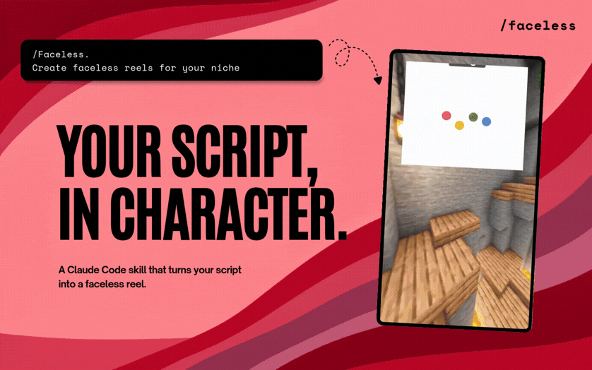

# Faceless



Turn a supplied script into a Peter & Stewie or Rick & Morty faceless reel: character dialogue, Fish Audio voiceover, and an optional local Minecraft-background video.

An open-source project from [Creatorberry](https://www.creatorberry.com/?utm_source=github&utm_medium=opensource&utm_campaign=faceless).

## What Faceless does

```text
source script
→ selected character pair
→ approved dialogue JSON + caption
→ local Fish Audio voice files
→ combined dialogue audio
→ optional local faceless reel with characters and captions
```

Faceless starts from a script you provide. It does not research a product, find viral videos, create thumbnails, send Telegram messages, or use n8n.

## Install

### Claude Code

```text
/plugin marketplace add Creatorberry/faceless
/plugin install faceless@faceless
```

Then run `/faceless`.

### Codex

```text
npx skills add Creatorberry/faceless --skill faceless --agent codex --global --yes
```

Then ask: `Use $faceless to create a reel.`

### Other agent CLIs

For Grok Build, Gemini CLI, OpenCode, Cursor, Cline, and other compatible agents:

```text
npx skills add Creatorberry/faceless --skill faceless --global
```

Follow the prompts to install Faceless in your agent. To update it later:

```text
npx skills update -g
```

## Updates

### Claude Code

```text
/plugin update faceless@faceless
/reload-plugins
```

For automatic updates, open `/plugin`, choose **Marketplaces**, select **faceless**, and enable auto-update.

### Codex

```text
npx skills update
```

## First run

Faceless needs:

- Node.js 20 or newer;
- a [Fish Audio API key](https://fish.audio/app/api-keys/).

Run `/faceless` or `$faceless`. If Fish Audio is not configured, Faceless gives you the Fish API-key page. On Windows, it opens a visible local input box so you can paste and confirm the key; other systems use visible terminal input. Never paste a Fish key into an AI chat.

Faceless automatically runs a preflight check first. If FFmpeg is missing, it sets up a local copy before it calls Fish Audio, so the combined audio file can always be created. It does not install FFmpeg system-wide.

The key is stored only in the local Faceless configuration on your computer. Your script is sent directly to Fish Audio only when you approve voice generation. Creatorberry does not receive your API key, generated audio, or final video.

## How a run works

1. Choose `Peter & Stewie` or `Rick & Morty`.
2. Paste a source script.
3. Review and approve the generated dialogue JSON and caption.
4. Approve Fish Audio generation. Faceless saves individual speaker clips and one combined `full-dialogue.mp3` locally.
5. Choose whether to generate the video. Faceless tells you the Minecraft pack is about 2.4 GB before downloading it. It then randomly chooses a Minecraft background, loops it if needed, and ends the video exactly when the combined audio ends.
6. Choose whether to add animated characters. Faceless places only the speaking character on screen: Stewie/Morty enter from the left, Peter/Rick from the right.
7. Choose whether to add center captions: white uppercase phrases with one cyan key word.
8. For script-matched visual animations, copy [Flick](https://github.com/Creatorberry/flick), paste the link into Claude or Codex, and ask it to install Flick. Follow its repository instructions to create the animations.

## Start with the right source

Faceless turns a source script into a finished reel. If you need to find what to make first, [Creatorberry](https://www.creatorberry.com/?utm_source=github&utm_medium=opensource&utm_campaign=faceless) helps you find the top creators in your niche, see the videos and hooks that have already generated millions of views, remix those proven ideas, and build your own script.

Use Creatorberry to develop the idea. Use Faceless to turn that script into a reel.

## Output

Every run stays local in one workspace:

```text
faceless-output/
├── scripts/<topic>/
│   ├── source-script.txt
│   ├── dialogue.json
│   └── caption.txt
├── audio/<topic>/
│   ├── 000.mp3
│   ├── 001.mp3
│   ├── full-dialogue.mp3
│   └── audio-manifest.json
└── video/<topic>/
    └── final-faceless-reel.mp4
```

## Minecraft templates

The reusable Minecraft template pack is intentionally not included in the Git repository. It is stored inside the installed Faceless skill folder after download, and its six files total about 2.4 GB. Faceless asks before downloading the pack. It is hosted as the separate `video-templates-v1` release and remains private while this repository is private. When Faceless is made public, users can download the pack only when they choose to generate their first video.

## Characters

`skills/faceless/Characters/` contains `Morty.png`, `Peter.png`, `Rick.png`, and `Stewie.png`. Faceless uses them automatically when you approve the character stage.

## Examples

- [Watch example 1 on Instagram](https://www.instagram.com/reel/DTfcyauDDND/?igsi=MW9pbmg2Mm1pMm4xdQ==)
- [Watch example 2 on Instagram](https://www.instagram.com/reel/DUfzpZIjFhe/?igsi=ZWZwdjN3MnBsOG1h)
- [Watch example 3 on Instagram](https://www.instagram.com/reel/DVYijVZjBDI/?igsi=MTBrc2JxdXMyZW9oeA==)

## Privacy and responsible use

Use only scripts, voices, video footage, and other material that you have the right to use. Keep your Fish Audio key private. Generated workspaces, audio, and videos stay on your computer and are ignored by Git by default.

## Contributing

Creatorberry maintains the core Faceless workflow. See [CONTRIBUTING.md](CONTRIBUTING.md) for contribution rules.

## License

MIT

Built by [Creatorberry](https://www.creatorberry.com/?utm_source=github&utm_medium=opensource&utm_campaign=faceless).
