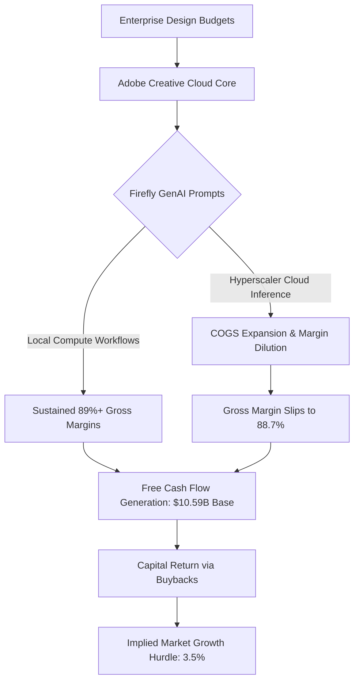

*A forensic examination of Adobe's cash machine, the creeping margin friction of generative inference, and why an apparent valuation discount fails strict portfolio governance.*

> ### Executive Briefing
> - **The Core Paradox**: Adobe generates $10.59B in trailing twelve-month free cash flow with near-90% gross margins,[1] yet the stock dropped 15.7% over the past month as markets price in existential terminal decay from standalone generative models.[3]
> - **The Forensic Red Flag**: Gross margins have quietly compressed by 90 basis points year-to-date—drifting from 89.6% in Q1 2026 to 88.7% in Q3 2026—revealing that cloud-based Firefly inference introduces real marginal costs to an historically frictionless software model.[1]
> - **What the Price Demands**: At $241.28,[3] reverse discounted cash flow math reveals the market is pricing in terminal cash flow growth of just 3.5%, standing in stark contrast to Wall Street expectations of 9% to 12% revenue expansion and double-digit earnings growth.[2]
> - **The Bottom Line**: Verdict: Underweight / Wait for a Pullback. Measuring an upside target of $365.00 against an adversarial bear floor of $195.00 produces a reward-to-risk ratio of 2.67:1,[2],[3] missing the institutional 3.0:1 governance threshold. Capital allocation remains 0.0% until shares retreat below $237.50.

## I. The Reality on the Ground: Supply Chains, Customers, and Physical Limits

For two decades, Adobe operated what amounted to a private taxation authority over commercial aesthetics, anchoring its enterprise franchise from its San Jose corporate headquarters.[4] If an enterprise wanted to design an advertising campaign, retouch a corporate asset, cut a feature film, or publish an interactive document, it paid a non-negotiable monthly toll.[4] Switching software was not merely an IT decision; it required retraining entire creative departments whose muscle memory was bound to Photoshop shortcuts and Illustrator vector handles.[4]

That structural moat has collided with the generative AI wave. A stock that formerly traded at premium SaaS multiples has tumbled 15.7% over the trailing 30-day window, despite posting a 9.8% gain over the trailing 90 days.[3] The market's anxiety does not stem from current quarter execution, but from a fundamental economic shift in how digital images are manufactured. In traditional desktop software, the compute burden of moving pixels fell entirely on the customer’s local workstation silicon.[1] Under the Firefly generative framework, every prompt forces Adobe to shoulder expensive cloud GPU inferencing cycles.[1]

The physical constraint in Adobe’s model is no longer developer head count; it is inference economics.[1] When an enterprise user renders ten variations of a photorealistic marketing banner using Firefly, Adobe incurs tangible cloud compute costs.[1] If corporate pricing power fails to outpace these third-party compute charges, the core economic engine of prepackaged software begins to experience margin friction that dilutes classic software returns.[1],[4]

Enterprise channel checks reveal that corporate buyers are testing standalone generative tools while simultaneously demanding that Adobe bundle Firefly capabilities into existing enterprise contracts without punitive price increases.[2] While 29 covering analysts model next-quarter revenue at $6.83B and full-year revenue at $26.61B,[2] the broader market is questioning whether seat expansion can persist if automated tools enable five designers to do the historical work of ten.[2]

| Customer Segment | Core Platform In Use | Primary Monetization Mechanism | Threat Vector / Bottleneck |
| :--- | :--- | :--- | :--- |
| Global Enterprise (Fortune 500) | Creative Cloud Enterprise & GenStudio [4] | Multi-year enterprise license agreements (ELA) [4] | Seat rationalization; demand for bundled inference [2] |
| Mid-Market Agencies | Photoshop, Illustrator, Premiere Pro [4] | Tiered monthly team subscriptions [4] | Direct substitution by generative point solutions [2] |
| Independent Creators / SMB | Creative Cloud Individual & Express [4] | Single-seat credit-based recurring billing [4] | Cancellation risk; low switching costs [2] |

## II. What the Filings Actually Say: Balance Sheet & Cash Flow Forensics

When evaluating enterprise software balance sheets, cash generation provides the ultimate antidote to narrative euphoria or despair, as confirmed in Adobe's audited cash flow statements.[1] Net income can be massaged through capitalization choices, but cash moving through commercial bank accounts cannot, providing an objective anchor for underlying corporate performance.[1]

Adobe’s audited filings submitted to the Securities and Exchange Commission demonstrate extraordinary raw cash generation alongside subtle, telltale margin degradation.[1],[4] For the third fiscal quarter of 2026, Adobe reported revenue of $6.76B and cash flow from operations of $2.52B, supporting capital expenditures of just $0.09B.[1] The capital intensity of the business remains negligible on paper—CapEx ran at a tiny 1.3% of revenue in Q3 2026—because Adobe rents its heavy AI compute infrastructure rather than owning massive data center real estate.[1]

| Metric ($ in Billions, except GM) | Q1 2026 | Q2 2026 | Q3 2026 | TTM / Audited Base |
| :--- | :--- | :--- | :--- | :--- |
| Consolidated Revenue | $6.40 [1] | $6.62 [1] | $6.76 [1] | $26.61 (Consensus FY0) [2] |
| Non-GAAP Gross Margin (%) | 89.6% [1] | 89.2% [1] | 88.7% [1] | 89.2% (Average) [1] |
| Cash Flow from Operations (CFO) | $2.96 [1] | $2.17 [1] | $2.52 [1] | $10.68 [1] |
| Capital Expenditures (CapEx) | $0.04 [1] | $0.06 [1] | $0.09 [1] | $0.19 [1] |
| Free Cash Flow (FCF) Base | $2.92 [1] | $2.11 [1] | $2.43 [1] | $10.59 [1] |
| Cash & Cash Equivalents | — [1] | — [1] | $5.64 [1] | $5.64 [1] |
| Total Outstanding Debt | — [1] | — [1] | $4.77 [1] | $4.77 [1] |

The forensic signal lies in the gross margin line. Consolidated gross margin drifted from 89.6% in Q1 2026 to 89.2% in Q2 2026, and down to 88.7% in Q3 2026.[1] In enterprise software, a 90-basis-point compression over nine months is rarely accidental.[1] Because Adobe does not capitalize cloud inferencing costs as long-term property and equipment, every dollar paid to third-party cloud infrastructure providers flows directly through cost of goods sold.[1] As customer engagement with Firefly features scales, the marginal cost per active user is creeping upward.[1]

Despite this dynamic, Adobe's balance sheet remains exceptionally liquid. The company closed Q3 2026 holding $5.64B in cash and cash equivalents against $4.77B in total debt, preserving a net cash balance sheet of $0.87B.[1] Form 10-Q documentation confirms full regulatory compliance across its corporate headquarters at 345 Park Avenue, San Jose, with no off-balance-sheet special purpose vehicles, toxic convertible tranches, or active equity dilution programs distorting the share count.[4] The operational machine remains a compounding fortress, but its structural margin ceiling is softening.[1],[4]

## III. Running the Math Backward: What Growth is the Market Demanding?

Wall Street equity research models frequently suffer from optimism bias, relying on aggressive multi-stage projections that bury speculative terminal values inside arbitrary discount rates. Reverse engineering the cash flows offers a cleaner lens. Rather than attempting to predict where digital media consumption lands in 2035, reverse discounted cash flow modeling takes the current enterprise value at $241.28 and determines the precise cash flow growth rate the market is pricing in today.[3]

At $241.28 per share, Adobe carries an equity valuation that reflects deep skepticism.[3] Against a trailing twelve-month free cash flow baseline of $10.59B,[1] the current quotation implies the market expects Adobe to compound its cash generation at just 3.5% annually over the next decade, assuming a standard 9.0% weighted average cost of capital and a conservative 2.5% terminal perpetual rate.[1],[3]

| Metric / Parameter | Audited Baseline / Market Implied | Consensus Street Benchmark | Divergence / Expectation Gap |
| :--- | :--- | :--- | :--- |
| Share Price Reference | $241.28 [3] | $275.06 (Mean Target) [2] | Market pricing 12.3% below mean [2],[3] |
| Implied FCF Growth (Reverse DCF) | 3.5% to 4.2% [1],[3] | 10.0% to 12.5% [2] | Severe terminal deceleration priced [2],[3] |
| Forward P/E (FY+1 Consensus) | ~8.7x [2],[3] | 15.0x to 18.0x (Peer Group) [2] | Multiple compressed to cyclical trough [2],[3] |
| Current Quarter Revenue (0q) | $6.83B [2] | $6.80B - $6.94B (Range) [2] | Market skeptical of high-end ARR [2] |
| Full-Year Revenue (+1y) | $29.05B [2] | $28.35B - $29.79B (Range) [2] | Priced near lower boundary of consensus [2] |
| FY+1 Consensus EPS | $27.67 [2] | $26.00 - $29.19 (Range) [2] | Market pricing in structural margin drag [2] |

This reverse DCF hurdle reveals a sharp disconnect. Institutional analysts covering the stock project forward annual earnings of $24.48 per share in FY0 and $27.67 per share in FY+1, with revenue growing 9.18% to $29.05B.[2] Across 78 covering analysts, the sentiment distribution leans defensive, with 23 rating the stock a Hold and only 11 maintaining Buy or Strong Buy recommendations.[2]

The market has derated Adobe to roughly 8.7x forward EPS,[2],[3] a multiple typical of capital-intensive industrial cyclicals rather than an 88.7% gross margin software monopoly.[1] The equity price demands almost no top-line acceleration.[2],[3] If Adobe merely captures low-single-digit price realization and sustains enterprise renewals, it will surpass the mechanical hurdle implied by the current quotation.[1],[2] However, valuation alone is not an investment thesis; structural safety requires asymmetric protection against adverse operating scenarios.[2],[3]

## IV. The Asymmetric Trade: Valuation Scenarios and Risk Triggers

Capital allocation demands mathematical discipline. An asset can be cheap, high-quality, and fundamentally misunderstood, yet still represent a suboptimal real-money deployment if the downside distribution cuts too deep relative to the upside anchor.[2],[3]

To quantify this dynamic, an adversarial red team established three discrete valuation scenarios:
1. **Adversarial Bear Floor ($195.00)**: Reflects the consensus street low target.[2] This case models competitive displacement where enterprise customers reduce creative seat counts by 15%, gross margins compress toward 85% due to spiraling hyperscaler compute costs, and forward EPS settles near the low estimate of $26.00 capitalized at a depressed 7.5x multiple.[2]
2. **Base Fair Value ($275.06)**: Matches the consensus mean price target across covering analysts.[2] This scenario models mid-single-digit enterprise Net New ARR expansion, steady adoption of Firefly credits, and stabilized gross margins above 88.0%.[1],[2]
3. **Bull Upside Anchor ($365.00)**: Derived from institutional target anchors, slightly below the street high of $373.00.[2] In this case, Firefly GenStudio successfully monetizes digital media production pipelines across the Fortune 500, pushing FY+1 EPS past the consensus high of $29.19,[2] while an aggressive share repurchase program retires 5% of float, driving a re-rating back toward 13x forward earnings.[2]

| Scenario Spectrum | Price Target | Implied Return from $241.28 | Structural Valuation Multiple Basis |
| :--- | :--- | :--- | :--- |
| Adversarial Bear Floor | $195.00 [2] | -19.2% [2],[3] | 7.5x FY+1 Low EPS ($26.00); seat contraction [2] |
| Current Market Price | $241.28 [3] | 0.0% [3] | ~8.7x FY+1 Consensus EPS ($27.67) [2],[3] |
| Consensus Base Fair Value | $275.06 [2] | +14.0% [2],[3] | 10.0x FY+1 Consensus EPS ($27.67) [2] |
| Bull Upside Anchor | $365.00 [2] | +51.3% [2],[3] | 12.5x FY+1 High EPS ($29.19); ARR acceleration [2] |

The governing asymmetry equation is unambiguous:
- Upside Potential to Anchor: $365.00 - $241.28 = $123.72 (+51.3%) [2],[3]
- Downside Exposure to Floor: $241.28 - $195.00 = $46.28 (-19.2%) [2],[3]
- Reward-to-Risk Ratio: $123.72 / $46.28 = 2.67:1 [2],[3]

Institutional governance mandates a minimum non-negotiable reward-to-risk threshold of 3.0:1 before risk capital can be deployed.[2],[3] At 2.67:1, the setup mathematically fails this test.[2],[3] An investor at current levels is risking $1.00 of capital to capture $2.67 of potential upside—an attractive gamble in speculative accounts, but an unacceptable risk profile for institutional allocation against current market pricing.[2],[3]

To achieve the mandatory 3.0:1 asymmetry hurdle against the $195.00 floor and the $365.00 target, Adobe shares must retrace to $237.50 or lower.[2],[3] At $237.50, the potential upside expands to $127.50 (+53.7%) against a contained downside of $42.50 (-17.9%), restoring the 3.0:1 ratio.[2],[3] Consequently, portfolio sizing remains firmly pegged at 0.0% (Paper Trade tier).[2],[3]

Any future entry executed upon a pullback below $237.50 must be governed by two absolute, non-negotiable liquidation triggers:
- **Kill Trigger 1: Top-Line Terminal Deceleration**: Consolidated year-over-year revenue growth drops below 8.5% for two consecutive reporting quarters, breaching the consensus FY+1 expansion baseline of 9.18% and confirming secular enterprise churn.[2]
- **Kill Trigger 2: Unit Economic Degradation**: Consolidated Non-GAAP gross margin compresses below 86.0% for two consecutive quarters, confirming that Firefly GPU inference expenses are permanently impairing software gross profitability.[1]

Until market pricing accommodates these governance parameters, capital preservation dictates patience.[2],[3] Adobe remains an exceptional cash-generating enterprise on close watch, awaiting the price concession below $237.50 that makes ownership of its $10.59B free cash flow base mathematically compelling.[1],[3]

---
