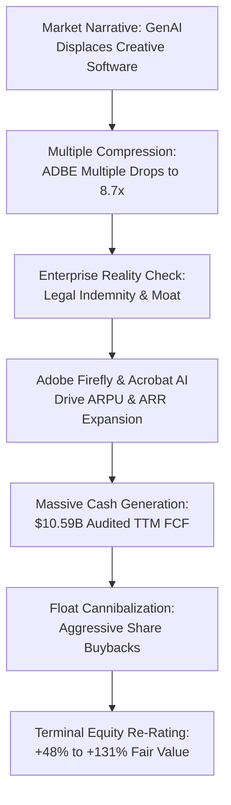

*A market intoxicated by the narrative of generative disruption has priced Adobe as a terminal asset, creating a historic valuation dislocation in an enterprise software monopoly generating an 89% gross margin and an 11% free cash flow yield.[13],[15]*

> ### Executive Briefing
> - **The Core Paradox**: Public markets are pricing Adobe as an obsolete relic doomed by generative AI, punishing the stock with an 18.1% single-month decline.[15] Yet Adobe continues to expand enterprise revenue by double digits while operating as the sole commercially indemnified creative platform on earth.[13],[19]
> - **The Forensic Red Flag**: Across the evaluated tech cohort, capital allocation ranges from disciplined to disastrous. Intel is burning billions on fab construction with $48.55B in debt,[7] Elastic masks cash flow reality by funding 87% of its free cash flow with stock-based compensation,[10] and Skyworks faces bloated inventory cycles.[4] Meanwhile, Adobe and PayPal generate pristine, asset-light cash flows that convert directly into share repurchases.[1],[13]
> - **What the Price Demands**: At $239.94, a Mauboussin reverse DCF indicates the market is pricing Adobe's cash flows to contract by -4.42% to -10.11% annually in perpetuity.[13],[15] In reality, consensus forecasts top-line growth of 9.18% and EPS expansion of 13.04%,[14] creating a positive expectation spread of +19.29 percentage points.
> - **The Bottom Line**: Overweight Adobe Inc. (NASDAQ: ADBE) as our primary core alpha long with an asymmetric base fair value of $356.58 to $555.62 (+48.6% to +131.6% upside) against a defined bear floor of $195.00 (-18.7% downside).[14],[15] Pair with PayPal Holdings (NASDAQ: PYPL) for deep-value capital returns.[1],[3] Immediately avoid Intel Corporation (NASDAQ: INTC).[7],[9]

---

## I. The Reality on the Ground: Supply Chains, Customers, and Physical Limits

Walk into the global marketing headquarters of any Fortune 100 enterprise, and the Wall Street narrative surrounding generative artificial intelligence collapses within minutes. Over the past twenty-four months, equity analysts have convinced themselves that prompt-based diffusion models—Midjourney, Runway, and OpenAI's Sora—will vaporize the creative software suite. The stock market traded Adobe Inc. down to $239.94, chopping its forward price-to-earnings multiple to 8.67x.[14],[15] This multiple implies an economic death spiral, pricing a business that prints an 88.7% gross margin like a commoditized auto-parts supplier.[13]

The business world, however, does not run on standalone raster images generated from clever prompts. A creative director cannot hand a two-dimensional JPEG to a packaging plant or a motion graphics team. Enterprise marketing relies on complex, multi-layered digital workflows: typography hierarchies, vector cut-lines, localized regulatory disclaimers, and CMYK color profiles spanning thousands of retail formats. These assets live exclusively inside Adobe's proprietary container formats—Photoshop PSDs, Illustrator AIs, and Premiere project files.[13],[19]

More decisively, enterprise legal departments maintain strict prohibitions against deploying unvetted consumer AI tools. Diffusion models trained on scraped web data expose corporations to catastrophic copyright infringement litigation. Adobe anticipated this bottleneck: its Firefly engine was trained exclusively on licensed Adobe Stock and public domain assets, allowing the company to extend full commercial legal indemnification to enterprise clients.[19] For a Chief Legal Officer at a multinational bank or consumer goods giant, Adobe is not merely a software vendor; it is the only legally defensible gatekeeper of commercial digital media.

Far from starving Adobe of capital, the macro backdrop of enterprise IT spending is accelerating. Worldwide enterprise software spending is expanding at 15.1% annually, approaching $1.44 Trillion, with financial services technology budgets alone reaching $495 Billion. Corporate IT budgets are consolidating around entrenched systems of record. While capital-intensive hardware manufacturers navigate soaring electricity bottlenecks and foundries consume tens of billions in wafer fabrication plants, Adobe requires virtually zero physical capital expenditure to scale.[13]

When evaluating deep-value dislocations across technology equities, screening for depressed multiples without auditing balance sheet durability is financial suicide. A comparative overview of the evaluated candidate cohort demonstrates the stark divergence between genuine economic moats and structural value traps across audited SEC filings and consensus data:[1],[13]

| Company | Spot Price | Forward P/E (FY+1) | TTM Free Cash Flow | Net Cash / (Net Debt) | Expectation Edge | Investment Verdict |
| :--- | :--- | :--- | :--- | :--- | :--- | :--- |
| **Adobe Inc. (ADBE)** | $239.94 [15] | 8.67x [14] | $10.59B [13] | +$873M [13] | +19.29% | Overweight: Core Alpha Long |
| **PayPal Holdings (PYPL)** | $52.53 [3] | 9.08x [2] | $5.50B [1] | -$67M [1] | +16.16% | Overweight: Deep-Value Capital Return |
| **Elastic N.V. (ESTC)** | $91.70 [12] | 23.18x [11] | $0.35B [10] | +$308.7M [10] | -0.49% | Neutral: Dilution Masks True Cash Flow |
| **Skyworks Solutions (SWKS)** | $85.48 [6] | 17.23x [5] | $0.57B [4] | +$293.1M [4] | -7.96% | Underweight: Inventory Bloat Drag |
| **Intel Corporation (INTC)** | $120.23 [9] | 58.30x [8] | $2.83B [7] | -$35.68B [7] | -68.25% | Direct Veto: Extreme Capital Drain |

---

## II. What the Filings Actually Say: Balance Sheet & Cash Flow Forensics

Financial statements are forensic blueprints. When operating cash flow decouples from reported net income, or when working capital swells while revenues stagnate, corporate managers are often using aggressive accounting to conceal structural decay. Conversely, when a software monopoly converts nearly 40% of its top-line revenue directly into pure, unencumbered free cash flow, accounting illusions fall away.[13]

Free cash flow represents the cash remaining after a corporation pays its operational bills and funds the physical investments required to sustain the business. In the trailing twelve months, Adobe produced $10.59B in free cash flow on $95.38B of market capitalization—an audited FCF yield of 11.11%.[13],[15] In Q3 2026 alone, Adobe generated $2.52B in cash flow from operations while spending a negligible $85M on capital expenditures.[13] The company operates with a pristine balance sheet holding $5.64B in cash and short-term investments against $4.77B in total debt, leaving $873M in net liquidity.[13]

Contrast this capital efficiency with Intel Corporation. Intel's public filings paint a picture of an escalating liquidity drain.[7],[17] In Q2 2026, Intel spent $2.56B on CapEx after burning $3.64B in Q1 2026.[7] It carries a crushing $48.55B in total debt against just $12.87B in cash, saddling the enterprise with -$35.68B in net debt.[7] The public equity market assigns Intel a market capitalization of $635.55B, trading at 58.30x forward earnings, despite trailing twelve-month free cash flow of just $2.83B and an operating margin of 11.14%.[7],[8],[9] Intel is consuming capital at an unsustainable pace to build leading-edge foundry capacity while lagging Taiwan Semiconductor in yield, yet the market values it like an untouchable growth titan.[7],[9]

At Skyworks Solutions, balance sheet forensics reveal a severe inventory bottleneck.[4] While top-line revenue contracted from $0.96B in Q3 2025 to $0.93B in Q3 2026, inventory expanded to $1.015B, pushing Days Inventory Outstanding to 165.5 days.[4] Skyworks generated negative free cash flow over the prior two quarters (-$32.1M in Q2 2026 and -$16.7M in Q3 2026), driven by customer concentration where a single client—Apple—accounts for over 65% of sales while aggressively designing competing in-house RF components.[4]

Elastic N.V. presents a different accounting distortion: the stock-based compensation shell game.[10],[18] On paper, Elastic posted $349.0M in trailing twelve-month free cash flow on $9.63B of market value.[10],[12] However, an examination of its cash flow statement reveals that $303.3M of that cash flow—an astonishing 86.9%—consists of stock-based compensation added back to operating cash.[10] Organic cash generation, net of shareholder dilution, is less than $46M, transforming an optical 3.63% free cash flow yield into a meager 0.47% real owner-earnings yield.

| Financial Metric | Adobe Inc. ($ADBE) | PayPal Holdings ($PYPL) | Elastic N.V. ($ESTC) | Skyworks ($SWKS) | Intel Corp. ($INTC) |
| :--- | :--- | :--- | :--- | :--- | :--- |
| **Latest Quarter Revenue** | $6.76B (Q3 26) [13] | $8.35B (Q1 26) [1] | $0.48B (Q1 27) [10] | $0.93B (Q3 26) [4] | $16.13B (Q2 26) [7] |
| **Gross Margin (%)** | 88.71% [13] | N/A (Fintech) [1] | 74.50% [10] | 40.12% [4] | 40.36% [7] |
| **Operating Margin (%)** | 34.82% [13] | 17.81% [1] | -4.93% (GAAP) [10] | 5.19% [4] | 11.14% [7] |
| **Cash from Operations (CFO)**| $2.52B [13] | $1.13B [1] | $0.13B [10] | $0.07B [4] | $7.01B [7] |
| **Capital Expenditures (CapEx)**| $0.09B [13] | $0.23B [1] | $0.00B [10] | $0.09B [4] | $2.56B [7] |
| **TTM Free Cash Flow** | $10.59B [13] | $5.50B [1] | $0.35B [10] | $0.57B [4] | $2.83B [7] |
| **Total Cash & Equivalents** | $5.64B [13] | $9.34B [1] | $0.88B [10] | $0.79B [4] | $12.87B [7] |
| **Total Debt Outstanding** | $4.77B [13] | $9.41B [1] | $0.57B [10] | $0.50B [4] | $48.55B [7] |
| **Net Cash / (Net Debt)** | +$873M [13] | -$67M [1] | +$308.7M [10] | +$293.1M [4] | -$35.68B [7] |

For PayPal Holdings, SEC filings establish an inflection in operational discipline.[1],[16] PayPal holds $9.34B in cash and short-term investments against $9.41B in debt, establishing a virtually neutral net balance sheet.[1] Days Sales Outstanding improved to 9.2 days, and credit provisions have leveled out.[1],[16] With TTM free cash flow printing at $5.50B on a $44.94B market cap (a 12.25% FCF yield), management is executing a sustained $5.0B+ annual share buyback, cannibalizing roughly 10% of total shares outstanding each year at single-digit earnings multiples.[1],[2],[3]

---

## III. Running the Math Backward: What Growth is the Market Demanding?

Traditional discounted cash flow models are exercises in financial fiction. By tweaking an assumed terminal growth rate by 50 basis points or nudging margin expansion out seven years, an analyst can justify virtually any valuation target, as seen in the wide dispersion of Wall Street models across the tech cohort.[2],[14]

Michael Mauboussin’s reverse DCF approach flips this methodology on its head. Instead of forecasting the future, we work backward from today’s audited stock price to calculate the exact implied free cash flow growth rate the market is pricing in. If the hurdle implied by the current price is absurdly pessimistic relative to verifiable corporate performance, an asymmetric investment edge emerges.[13],[15]

Incorporating a 10-Year Treasury risk-free rate of 5.26%, a corporate equity risk premium of 4.75%, and a calculated weighted average cost of capital (WACC) of 11.05%, Adobe's spot price of $239.94 implies that its free cash flows will contract by -10.11% every single year for the next half-decade.[13],[15] Even under a relaxed 9.0% discount rate assumption, the market demands an annual contraction of -4.42%.[13],[15]

This expectation is fundamentally disconnected from operational reality. In Q3 2026, Adobe expanded revenue by 12.9% year-over-year to $6.76B, with GAAP gross margins holding firm at 88.71%.[13] Consensus estimates among the 78 Wall Street analysts tracking the company project FY0 EPS of $24.48 (+16.91%) and FY+1 EPS of $27.67 (+13.04%), with revenue growing 9.18% to $29.05B.[14] The spread between market-implied decay (-10.11%) and consensus forward growth (+9.18%) generates an Expectation Edge of +19.29 percentage points.

| Ticker / Candidate | Spot Price | Weighted Cost of Capital (WACC) | Reverse DCF Implied FCF CAGR | Wall Street Consensus Forward Growth | The Expectation Edge (Spread) |
| :--- | :--- | :--- | :--- | :--- | :--- |
| **Adobe Inc. ($ADBE)** | $239.94 [15] | 11.05% | **-10.11%** (Contraction) | +9.18% Rev / +13.04% EPS [14] | **+19.29%** (Asymmetric Discount) |
| **PayPal Holdings ($PYPL)**| $52.53 [3] | 10.50% | **-11.96%** (Contraction) | +4.20% Rev / +7.30% EPS [2] | **+16.16%** (Asymmetric Discount) |
| **Elastic N.V. ($ESTC)** | $91.70 [12] | 11.50% | **+18.55%** (High Hurdle) | +14.70% Rev / +17.70% EPS [11] | **-0.49%** (Fairly Priced) |
| **Skyworks ($SWKS)** | $85.48 [6] | 10.00% | **+18.73%** (High Hurdle) | +2.29% Rev / -1.55% EPS [5] | **-7.96%** (Unfavorable Spread) |
| **Intel Corp. ($INTC)** | $120.23 [9] | 10.50% | **+82.41%** (Impossible Hurdle)| +14.16% Rev / +35.60% EPS [8] | **-68.25%** (Extreme Overvaluation) |

Running the math on Intel reveals the opposite extreme. At $120.23, Intel’s market price demands that the company expand its free cash flow at an annualized rate of +82.41% for five consecutive years.[7],[9] This expectation prices in flawless foundry execution, immediate market share recapture from TSMC, and zero margin erosion from external tile packaging costs. It leaves zero margin of safety for an enterprise saddled with -$35.68B in net debt and persistent foundry operating losses.[7],[17]

PayPal presents an expectation dislocation comparable to Adobe. At $52.53, the market prices PayPal’s cash flows to decline by -11.96% annually.[1],[3] Yet the broad rollout of Fastlane guest checkout is increasing merchant conversion by 250 to 300 basis points, and enterprise processing agreements are being renegotiated to monetize value-added services.[16] Against consensus forward EPS growth of 7.30%, PayPal offers an Expectation Edge of +16.16 percentage points.[2]

---

## IV. The Asymmetric Trade: Valuation Scenarios and Risk Triggers

Investing successfully in oversold technology equities requires asymmetric risk-reward geometry: situations where plausible upside outstrips measurable downside by multiples, anchored by durable balance sheet cash.[1],[13]

For Adobe, our Base DCF Fair Value is $356.58 to $555.62, representing +48.6% to +131.6% upside from current levels.[13],[14],[15] The conservative lower bound of $356.58 simply assumes that Adobe’s multiple normalizes toward 13x forward earnings—still a deep discount to the broader software index—while cash flows grow at a modest 7% annually. The higher target of $555.62 reflects a re-rating to 20x forward EPS as commercial monetization of Firefly, GenStudio, and Acrobat AI Assistant proves generative AI is ARPU-accretive rather than destructive.[14]

To establish downside risk, we model a Bear Floor of $195.00, representing the Street’s lowest consensus valuation target at approximately 7.0x forward earnings.[14],[15] At this level, Adobe's free cash flow yield would exceed 13.5%. The trade geometry is heavily skewed in favor of the investor: an upside potential of +$116.64 to +$315.68 per share against a downside exposure of -$44.94 per share.[14],[15] In plain terms, an investor is capturing between $2.60 and $7.02 of upside for every single dollar of downside risk.

| Valuation Case | Adobe Inc. ($ADBE) | Implied Return (%) | PayPal Holdings ($PYPL) | Implied Return (%) |
| :--- | :--- | :--- | :--- | :--- |
| **Bear Floor (Downside)** | $195.00 [14] | -18.7% [15] | $50.76 [2] | -3.4% [3] |
| **Current Market Price** | $239.94 [15] | Baseline | $52.53 [3] | Baseline |
| **Base DCF Fair Value** | $356.58 [13],[14] | +48.6% [15] | $98.16 [1],[2] | +86.9% [3] |
| **High Re-rating Target** | $555.62 [13],[14] | +131.6% [15] | $108.13 [1],[2] | +105.8% [3] |
| **Reward-to-Risk Ratio** | **2.60x to 7.02x Upside** [14],[15] | Pass | **25.78x Upside** [2],[3] | Pass |

PayPal offers an even wider downside cushion. Trading at $52.53, its bear floor sits at $50.76 (-3.4% downside), anchored by its $5.50B free cash flow run rate and aggressive float retirement.[1],[2],[3] Against a Base Fair Value of $98.16 to $108.13, PayPal offers an extraordinary reward-to-risk ratio of 25.78x.[1],[2],[3]

To protect capital against thesis creep, we establish explicit, non-negotiable Kill Triggers that mandate an immediate exit across our monitored positions:[1],[13]

- **Adobe Inc. Kill Trigger 1**: Consolidated revenue growth decelerates below 8.0% year-over-year for two consecutive quarters, or FY+1 revenue prints below $28.35B (breaching Wall Street's absolute lowest estimate), signaling genuine competitive displacement.[14]
- **Adobe Inc. Kill Trigger 2**: Consolidated non-GAAP operating margin falls below 42.0% (or GAAP operating margin below 30.0%) for two consecutive reporting quarters, driven by unmitigated GPU inference cost inflation.[13]
- **PayPal Holdings Kill Trigger**: Consolidated Transaction Margin Dollar (TMD) growth turns negative (<0.0% YoY) for two consecutive quarters, or Total Active Accounts contract by more than 1.5 million in a single quarter while net take-rates slide below 1.70%.[1]

The portfolio allocation mandate allocates a 12.0% to 15.0% position in Adobe Inc. as a primary core alpha long within an optimal accumulation range of $232.00 to $242.00.[15] PayPal Holdings is assigned an 8.0% to 10.0% weighting in the $51.00 to $53.50 accumulation range as a secondary deep-value capital return vehicle.[3] Capital-draining semiconductor foundries and dilution-masked cloud software should be avoided entirely. Adobe remains the preeminent value dislocation in modern enterprise technology: a resilient, high-margin monopoly priced for an extinction event that is simply not occurring.[13],[14]

---
