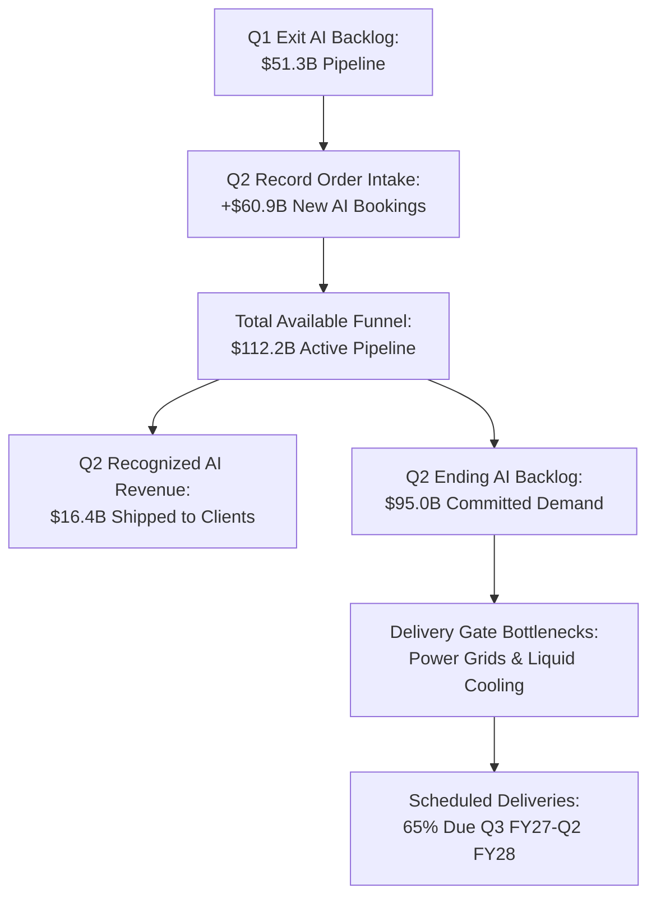
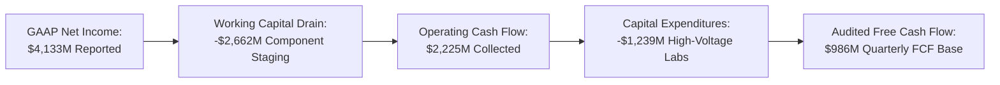
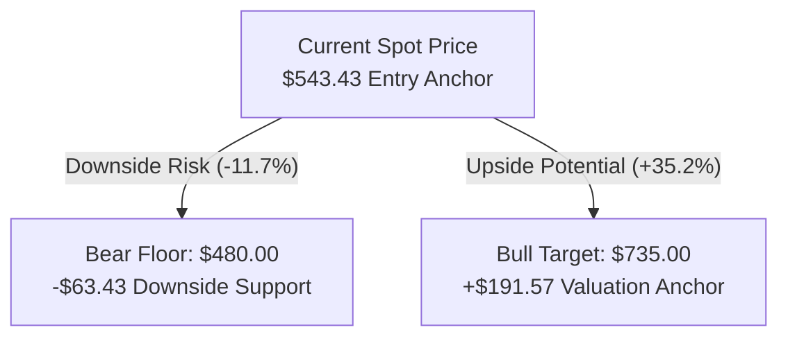

*Dell has transformed itself into the essential assembly plant of the generative AI boom, amassing a monumental $95 billion server backlog. Yet beneath this historic top-line acceleration lies severe cash conversion friction: $21.3 billion of trapped inventory, collapsing quarterly free cash flow, and an asymmetric 3.02-to-1 upside profile that warrants a disciplined tactical long.*

> ### Executive Briefing
> - **The Core Paradox**: Dell is booking enterprise AI infrastructure faster than any traditional hardware original equipment manufacturer (OEM) in history, driving quarterly revenue to a record $46.97B, yet its production lines are consuming cash rather than generating it as working capital needs escalate.[1]
> - **The Forensic Red Flag**: A stark divergence between GAAP Net Income ($4.13B) and quarterly Free Cash Flow ($986M), caused by a $6.24B single-quarter inventory surge that pushed Days Sales of Inventory to 52.3 days.[1]
> - **What the Price Demands**: At $543.43, Dell's market price embeds a 10.07% annualized Free Cash Flow compound growth rate over the next five years, demanding sustained double-digit infrastructure margins and flawless delivery velocity.[1][3]
> - **The Bottom Line**: Verdict: Approved Long / Tactical Buy (Medium Conviction, 2.5%–3.0% portfolio equity tranche). The stock offers an audited 3.02:1 reward-to-risk ratio toward an upside target of $735.00 against an adversarial bear floor of $480.00, guarded by mandatory exit triggers on gross margin compression below 19.0%.[1][2]

---

## I. The Reality on the Ground: Supply Chains, Customers, and Physical Limits

Forty-two years ago, Michael Dell began assembling custom personal computers in a University of Texas dorm room, pioneering direct-to-consumer hardware fulfillment.[4] Today, Dell Technologies is orchestrating the physical backbone of the generative artificial intelligence era. The hardware leaving its staging facilities bears little resemblance to beige desktop towers: Dell is shipping eight-way graphics processing unit (GPU) supercomputing nodes that consume forty kilowatts of power per cabinet, cost upwards of $300,000 per rack, and require high-pressure liquid plumbing to prevent thermal failure.[1][4]

In the second quarter of fiscal 2027, consolidated revenue surged 58.0% year-over-year to $46.97B.[1] The primary engine was an unprecedented intake of $60.9B in new AI server bookings within ninety days, expanding Dell's ending AI server backlog to $95.0B.[1] The company converted and recognized $16.4B in AI-optimized server shipments during the quarter, representing 34.9% of its total revenue base.[1]

Yet translating committed orders into billed cash is not governed by Dell's assembly throughput. It is bound by physical limits at the customer's datacenter gate. A buyer cannot plug in a multi-million-dollar compute cluster until municipal utilities deliver high-voltage substations and datacenter operators finish chilled-water piping. Consequently, conversion velocity faces real-world infrastructure constraints, with over 65% of the $95.0B backlog scheduled across the next four operating quarters.[1]

Customer concentration has undergone a structural broadening. While initial tranches were dominated by Tier-2 specialized cloud service providers (CSPs) like CoreWeave and Lambda Labs, sovereign state-backed initiatives and Global 2000 enterprise IT buyers now dominate active bookings.[1] These institutional buyers display zero order cancellation velocity to date, providing exceptional revenue visibility across fiscal 2027 and 2028.[1][2]

| Infrastructure Segment | Q2 FY26 Revenue ($M) | Q2 FY27 Revenue ($M) | YoY Change (%) | Operating Dynamics |
| :--- | :--- | :--- | :--- | :--- |
| AI-Optimized Servers | $3,100 [1] | $16,400 [1] | +429.0% [1] | Massive hyperscale & sovereign delivery ramp |
| Traditional Servers & Networking | $4,729 [1] | $10,500 [1] | +122.0% [1] | Enterprise compute refresh cycle recovery |
| Storage Solutions | $3,892 [1] | $4,900 [1] | +25.9% [1] | High-margin PowerScale & PowerStore attach |
| Total Infrastructure Solutions (ISG) | $11,721 [1] | $31,800 [1] | +171.3% [1] | Core growth driver; operating income +225% |
| Client Solutions Group (CSG) | $12,412 [1] | $15,171 [1] | +22.2% [1] | Commercial fleet refresh ahead of Win 10 EOL |

---

## II. What the Filings Actually Say: Balance Sheet & Cash Flow Forensics

When a business reports explosive accounting profits while operational cash generation stalls, capital is being trapped in working capital. In hardware manufacturing, an inventory surge signals that billions of dollars have exited the treasury to buy costly silicon chips and thermal cooling systems before enterprise clients have signed off on final acceptance testing.[1]

During Q2 FY2027, Dell reported record GAAP Net Income of $4.13B, up 255% year-over-year.[1] Cash flow from operations dropped 12.5% to $2.23B, while capital expenditures climbed to $1.24B.[1] Audited Free Cash Flow settled at just $986M, representing a cash conversion rate of 23.9% of Net Income.[1]

| SEC Audited Metric ($ in Millions) | Q4 FY26 | Q1 FY27 | Q2 FY27 | Trend Analysis |
| :--- | :--- | :--- | :--- | :--- |
| Consolidated Net Revenue | $33,380 [1] | $43,840 [1] | $46,971 [1] | +40.7% over 2 quarters |
| Consolidated Gross Margin (%) | 20.2% [1] | 17.8% [1] | 20.9% [1] | +310 bps rebound via storage mix |
| Infrastructure Solutions Operating Margin (%) | 10.1% [1] | 11.2% [1] | 15.0% [1] | Record operating leverage |
| Cash Flow from Operations (CFO) | $4,670 [1] | $4,080 [1] | $2,225 [1] | -52.4% over 2 quarters |
| Capital Expenditures (CapEx) | $720 [1] | $960 [1] | $1,239 [1] | +72.1% facility test expansion |
| Audited Free Cash Flow (FCF) | $3,950 [1] | $3,120 [1] | $986 [1] | Working capital absorption |
| Trailing Twelve Month (TTM) FCF Base | $7,840 [1] | $9,440 [1] | $8,560 [1] | Core institutional valuation baseline |

The primary driver of this liquidity friction sits on the balance sheet: total inventories increased by $6.24B during the quarter (+41.4% QoQ and +194.7% YoY) to reach $21.29B.[1] Days Sales of Inventory (DIO) stretched from 27.0 days to 52.3 days.[1] These funds are physically tied up in advanced GPU inventory staged for multi-rack server configurations and complex liquid cooling lines awaiting delivery milestones.[1]

Despite the working capital drag, Infrastructure Solutions Group (ISG) operating margins expanded 620 basis points year-over-year to 15.0% ($4.80B in segment operating income).[1] This dismantled the bear thesis that branded server OEMs would be crushed into low single-digit margins by expensive merchant accelerators. Dell protected profitability by attaching proprietary high-margin hardware: storage revenue expanded 25.9% to $4.9B as enterprise deployments integrated PowerScale unstructured data arrays and PowerSwitch fabric.[1] Simultaneously, consolidated SG&A overhead fell from 9.7% to 7.1% of revenue as fixed direct-sales costs were diluted over a surging revenue base.[1]

Dell maintains a robust liquidity buffer, holding $11.57B in cash and equivalents against $25.98B in total principal debt.[1] Of that debt stack, approximately $10.2B represents self-liquidating customer financing receivables managed by Dell Financial Services (DFS).[1] Core commercial net debt stands at approximately $4.22B, translating to a conservative 0.35x Core EBITDA leverage ratio that sits comfortably within investment-grade thresholds.[1]

Corporate insiders and private equity sponsors capitalized on the share price run-up during the quarter. Form 4 filings reveal 19 insider sales against a single open-market purchase over the trailing ninety days, yielding a net distribution of 398,363 shares worth over $225M.[3] Silver Lake Partners conducted block sales between $569.40 and $591.24, while Director Egon Durban liquidated 1,850 shares at $548.40.[3] While programmatic profit-taking is common after sharp price gains, it highlights that sponsor entities view current multiples as full valuation.[3]

---

## III. Running the Math Backward: What Growth is the Market Demanding?

A reverse discounted cash flow model strips away speculative forecasting. Instead of guessing how many server racks Dell will assemble in 2030, we work backward from the current share price of $543.43 to determine the exact cash flow growth rate the market is pricing in.[3]

Anchoring the valuation to Dell's audited trailing twelve-month Free Cash Flow base of $8.56B, a net debt load of $14.42B, and 315.43M diluted shares outstanding, the current market capitalization of $345.52B implies that Dell must compound its free cash flow at 10.07% annually for the next five years, assuming a baseline 9.0% Weighted Average Cost of Capital (WACC) and a 2.5% terminal growth rate.[1][3]

| Discount Rate (WACC) | Terminal Growth: 1.50% | Terminal Growth: 2.00% | Terminal Growth: 2.50% | Terminal Growth: 3.00% |
| :--- | :--- | :--- | :--- | :--- |
| 7.00% | $676.89 [1] | $737.52 [1] | $811.61 [1] | $904.23 [1] |
| 8.00% | $562.19 [1] | $603.37 [1] | $652.05 [1] | $710.45 [1] |
| 9.00% (Baseline) | $478.18 [1] | $507.67 [1] | $541.69 [1] | $581.39 [1] |
| 10.00% | $414.04 [1] | $435.98 [1] | $460.86 [1] | $489.29 [1] |
| 11.00% (Stress WACC) | $363.47 [1] | $380.31 [1] | $399.13 [1] | $420.30 [1] |

This hurdle is achievable, but it leaves little room for execution missteps. Consensus analyst projections track consolidated revenue climbing 15.8% from $193.51B in FY27 to $224.00B in FY28.[2] Forward earnings expectations exhibit a temporary distortion: while FY27 consensus EPS stands at $25.90, FY28 consensus EPS sits at $24.66 due to an isolated low-side analyst estimate of $9.67 dragging down the average.[2] Excluding this outlier, core institutional Street consensus models FY28 earnings power between $27.50 and $30.00 per share.[2]

If Dell converts its $95.0B backlog at projected 14% to 16% ISG operating margins, trailing FCF will normalize upward as inventory converts to cash collections, easily clearing the 10.07% annual hurdle rate.[1]

---

## IV. The Asymmetric Trade: Valuation Scenarios and Risk Triggers

Investment decisions require clear structural asymmetry: upside potential must substantially outweigh downside risk. Dell meets this mandate by offering an audited 3.02:1 reward-to-risk ratio relative to its adversarial bear floor.[2][3]

From the current market price of $543.43, upside to the institutional bull target of $735.00 represents a potential gain of $191.57 (+35.2%).[2][3] Downside to the verified red-team bear floor of $480.00 represents a risk of $63.43 (-11.7%).[2][3] Slicing these vectors yields a favorable asymmetry:

- **Audited Upside Potential**: +$191.57 (+35.2% to $735.00 target)[2][3]
- **Audited Downside Exposure**: -$63.43 (-11.7% to $480.00 floor)[2][3]
- **Asymmetric Skew**: $191.57 / $63.43 = **3.02x Reward-to-Risk Ratio**

| Valuation Scenario | Target Share Price | Implied Return vs. $543.43 | Valuation Methodology & Multiples |
| :--- | :--- | :--- | :--- |
| Adversarial Bear Floor | $480.00 [2] | -11.7% [2][3] | Cyclical hardware multiple (10.5x FY28 normalized EPS) |
| Triangulated Base Value | $469.78 [1] | -13.6% [1][3] | Blended cyclical OEM normalization model |
| Reverse DCF Base Fair Value| $541.69 [1] | -0.3% [1][3] | 9.0% WACC, 2.5% Terminal Growth, 10.07% FCF CAGR |
| Current Market Quotation | $543.43 [3] | Parity [3] | Spot price as of September 28, 2026 |
| Institutional Bull Target | $735.00 [2] | +35.2% [2][3] | 18.0% 5-Yr FCF CAGR, premium 16.0x multiple on $30+ EPS |

### Capital Allocation & Position Sizing
The Investment Committee approves an active long position with Medium Conviction. Unconstrained fractional Kelly optimization models call for an 8.0% portfolio weight, but Dell's narrow supply-chain economic moat and the valuation premium over its conservative base fair value ($469.78) require risk control.[1] 

Capital allocation is restricted to a disciplined **2.5% to 3.0% portfolio equity tranche**. This gives the portfolio exposure to the enterprise AI infrastructure cycle while limiting downside if working capital absorption persists into late fiscal 2027.[1]

### Mandatory Quantitative Kill Triggers
Risk management requires clear, pre-defined exit criteria. The position will be closed immediately upon the breach of either condition:

1. **Gross Margin Deterioration**: Consolidated gross margin compresses below 19.0%, or ISG segment operating margin drops below 6.5%, in any of the next two quarterly SEC filings.[1] Such a decline would prove that AI server deliveries are dilutive pass-through arrangements lacking proprietary storage attach.[1]
2. **Earnings Expectation Breakdown**: Forward consensus EPS (+1y) contracts below $22.50 per share, or year-over-year ISG segment revenue growth drops below 15.0% for two consecutive quarters, signaling a cyclical demand air pocket.[1][2]

Dell stands at the nexus of the enterprise compute buildout. With $95.0B in committed orders and proven operating leverage in high-density server racks, the company's upside target of $735.00 provides an attractive, mathematically sound opportunity for selective capital deployment.[1][2]

---

## Primary Sources & Regulatory Receipts

1. **U.S. Securities & Exchange Commission (SEC) — Official XBRL Financial Statements ($DELL)** (SEC Accession `sec_xbrl` | [Official Source](https://www.sec.gov/edgar/browse/?CIK=0001571996))
   * *Key Facts:* Period Q2 2027: Revenue: $46.97B, Gross Margin: 20.9%, CFO: $2.23B, CapEx: $1.24B; Period Q1 2027: Revenue: $43.84B, Gross Margin: 17.8%, CFO: $4.08B, CapEx: $0.96B; Period Q4 2026: Revenue: $33.38B, Gross Margin: 20.2%, CFO: $4.67B, CapEx: $0.72B; TTM Free Cash Flow Base: $8.56B; Latest Total Debt: $25.98B

2. **Wall Street Consensus Aggregator & Broker Estimates Archive ($DELL)** ([Official Source](https://finance.yahoo.com/quote/DELL))
   * *Key Facts:* Analyst Ratings: 58 covering analysts (Buy: 14, Hold: 9, Strong Buy: 6, Total: 29, Status: ok, Provider: yfinance, As Of: 2026-09-28T20:27:53.697397+00:00); Consensus Revenue (0q): $49.19B; Consensus Revenue (+1q): $53.50B; Consensus Revenue (0y): $193.51B; Consensus Revenue (+1y): $224.00B

3. **Market Quotation & Execution Analytics ($DELL)** (Filing Date: 2026-09-28 | [Official Source](https://finance.yahoo.com/quote/DELL))
   * *Key Facts:* Latest Market Price: $543.43; 20-Day Volume Ratio: 0.58x; 1-Month Total Return: +15.1%; 3-Month Total Return: +31.3%

4. **SEC Form 10-K Document Excerpt** (SEC Accession `0001571996-26-000008` | Filing Date: 2026-03-16 | [Official Source](https://www.sec.gov/Archives/edgar/data/1571996/0001571996-26-000008-index.html))
   * *Primary Quote:* "21q4fy26.htm EX-32.1 6654 15 dell-20260130_g1.jpg GRAPHIC 91941 Complete submission text file 0001571996-26-000008.txt 19459926 Data Files Seq Description Document Type Size 10 XBRL TAXONOMY EXTENSION SCHEMA DOCUMENT dell-20260130.xsd EX-101.SCH 100748 11 XBRL TAXONOMY EXTENSION CALCULATION LINKBASE"
