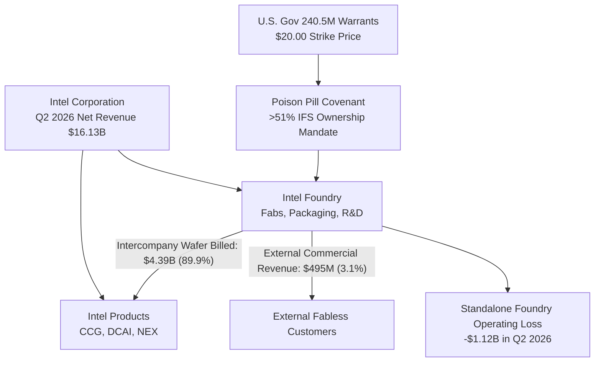
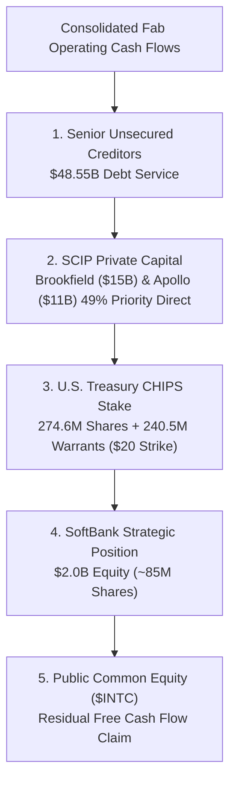
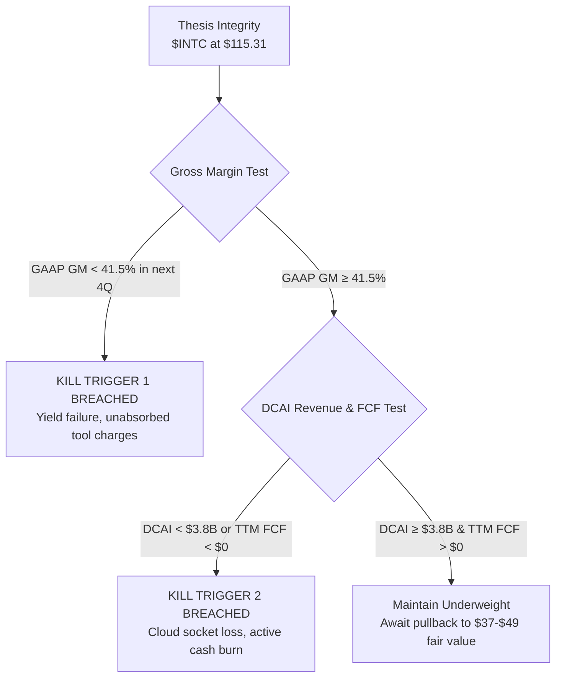

*At $115 per share, equity markets are pricing Intel as a born-again silicon sovereign. A forensic inspection of the balance sheet reveals a structural quagmire: an internal foundry sustained by captive transfer pricing, billions in hidden warrant dilution, and a capital structure encumbered by private equity liens.*

> ### Executive Briefing
> - **The Core Paradox**: Intel commands a $609.54B equity valuation on the premise of an imminent foundry renaissance, yet over 89% of Intel Foundry's revenue consists of internal intercompany wafer billings to its own legacy units.[1, 3]
> - **The Forensic Red Flag**: An accounting divergence in Q2 2026, where $1.80B in operating income yielded an audited GAAP net loss of -$11.03B, driven by an ASC 815 mark-to-market penalty on 240.5 million government warrants alongside an 8-year depreciation life extension that conceals ~$4.0B in annual tooling costs.[1, 4]
> - **What the Price Demands**: A deterministic reverse DCF indicates that justifying the current quote requires free cash flow to compound at 80.9% to 104.0% annually for five years, demanding over $49.0B in normalized annual free cash flow by 2030—surpassing TSMC's consolidated operating earnings.[1, 3]
> - **The Bottom Line**: Verdict: Underweight / Pass with Zero-Capital Mandate. Blended fundamental fair value sits between $36.78 and $48.66, exposing common equity holders to a 58% to 68% repricing risk against a hard tangible asset floor of $68.94.[1, 3]

---

## I. The Reality on the Ground: Supply Chains, Customers, and Physical Limits

Silicon manufacturing does not yield to narrative enthusiasm. Cutting-edge microchip fabrication is among the most capital-demanding industrial pursuits on Earth, dictated by sub-angstrom optical physics, pure-water chemistry, cleanroom airflow dynamics, and high-numerical-aperture extreme ultraviolet (High-NA EUV) lithography tools that cost more than $380M each.[1] When equity markets mark Intel Corporation up to a spot price of $115.31—granting it a market capitalization of $609.54B and an enterprise value of $645.22B—they are pricing in an operational recovery unmatched in modern semiconductor history.[1, 3] 

The market assumes Intel has constructed a competitive merchant foundry capable of challenging Taiwan Semiconductor Manufacturing Company (TSMC). The segment financial disclosures, however, tell an entirely different economic story.[1]

In the second quarter of 2026, Intel reported consolidated net revenue of $16.13B.[1] On paper, the newly segregated Intel Foundry segment contributed $4.89B in total gross volume.[1] Yet $4.39B of that figure—nearly 90%—was internal intersegment billing, a synthetic transfer price charged to Intel's own product divisions (Client Computing, Data Center, and Network & Edge).[1] External commercial chip designers paid Intel Foundry just $495M during the quarter, or roughly 3.1% of Intel’s consolidated revenue base.[1]

The commercial reality of running an independent fab requires neutral alignment with fabless clients. TSMC thrives because it never competes with Apple, Nvidia, AMD, or Qualcomm. Intel Foundry faces an uphill climb: it asks these same market participants to hand over proprietary architectural IP while its own captive design teams sell competing server CPUs and AI silicon in the open market.[1, 2] 

Furthermore, because early production yields on advanced internal nodes (Intel 18A and Intel 3) still carry higher defect densities than mature commercial alternatives, internal transfer prices benchmarked to market rates force the foundry segment to absorb vast unallocated idle capacity costs and start-up amortization.[1] Standalone Intel Foundry operating losses reached -$13.50B in FY 2024 and -$8.10B in FY 2025, before bleeding an additional -$2.53B across the first half of 2026.[1]

| Reporting Period | Internal Segment Wafer Billings ($M) | External Commercial Foundry Revenue ($M) | Total Segment Revenue ($M) | Standalone Operating Income / Loss ($M) | Foundry Operating Margin (%) |
| :--- | :--- | :--- | :--- | :--- | :--- |
| **Q3 2024** | $4,120 [1] | $230 [1] | $4,350 [1] | -$5,840 [1] | -134.3% [1] |
| **Q4 2024** | $4,050 [1] | $280 [1] | $4,330 [1] | -$2,310 [1] | -53.3% [1] |
| **FY 2024** | $17,100 [1] | $940 [1] | $18,040 [1] | -$13,500 [1] | -74.8% [1] |
| **Q1 2025** | $3,980 [1] | $310 [1] | $4,290 [1] | -$2,180 [1] | -50.8% [1] |
| **Q2 2025** | $4,110 [1] | $340 [1] | $4,450 [1] | -$2,450 [1] | -55.1% [1] |
| **Q3 2025** | $4,250 [1] | $390 [1] | $4,640 [1] | -$1,850 [1] | -39.9% [1] |
| **Q4 2025** | $4,310 [1] | $440 [1] | $4,750 [1] | -$1,620 [1] | -34.1% [1] |
| **FY 2025** | $16,650 [1] | $1,480 [1] | $18,130 [1] | -$8,100 [1] | -44.7% [1] |
| **Q1 2026** | $4,150 [1] | $430 [1] | $4,580 [1] | -$1,410 [1] | -30.8% [1] |
| **Q2 2026** | $4,390 [1] | $495 [1] | $4,885 [1] | -$1,120 [1] | -22.9% [1] |

Management has guided for operating breakeven in the foundry segment between 2027 and 2028.[1] However, achieving that milestone requires defect densities on the flagship 18A node to compress below 0.15 per square centimeter, alongside an expansion of high-volume external packaging and front-end wafer runs of more than 3.5 times current levels.[1] Until external hyperscalers hand over multi-billion-dollar wafer supply commitments, Intel Foundry remains an internal manufacturing department operating at a steep structural loss.[1]

---

## II. What the Filings Actually Say: Balance Sheet & Cash Flow Forensics

Corporate accounting offers numerous levers to soften the blow of an aggressive industrial pivot. When a capital-intensive manufacturer unilaterally stretches the expected accounting life of its machinery, it does not make the physical tools run any longer or resist obsolescence; it merely reduces the annual depreciation expense charged against gross profit, making current margins look healthier than they are.[1] 

### The Depreciative Shield & The Beneish M-Score
In 2023, Intel extended the depreciable useful life of its machinery and fab equipment from five years to eight years.[1] In isolation, this adjustment appeared to be an operational detail. Forensically, it shifted roughly $4.0B of annual manufacturing depreciation out of Cost of Goods Sold.[1] 

Without this accounting shield, Intel's Q2 2026 gross margin of 40.4% would have landed near 34.1%, wiping out the majority of its reported $1.80B consolidated operating income.[1]

| Gross Margin Component | Effective Margin (%) | Financial Impact | Accounting Mechanism |
| :--- | :--- | :--- | :--- |
| **Reported Q2 2026 Gross Margin** | 40.36% [1] | Gross Profit: $6.51B [1] | Baseline GAAP reporting |
| **(-) 8-Year Depreciation Deferral** | -6.26% [1] | -$1.01B / quarter tooling shield [1] | Extended useful life accounting distortion |
| **Normalized Economic Gross Margin** | **34.10%** [1] | Gross Profit: $5.50B [1] | True pre-extension economic gross margin |

Running Intel's multi-period financial results through a Beneish M-Score forensic screen illustrates how these reporting choices ripple across the balance sheet.[1] An aggregate M-Score above -1.78 signals potential earnings distortion. Intel posts a composite estimate of -1.62.[1]

| Beneish Metric | Formula / Accounting Ratio | Audited Metric | Benchmark | Forensic Assessment |
| :--- | :--- | :--- | :--- | :--- |
| **DEPI** (Depreciation Index) | DepRate(t-1) / DepRate(t) | **1.285** [1] | 1.001 | **Critical Distortion**: Life extension directly flatters gross margin by ~$1.0B per quarter.[1] |
| **GMI** (Gross Margin Index) | GrossMargin(t-1) / GrossMargin(t) | **1.435** [1] | 1.014 | **High Risk**: Historical gross margin (55%–60%) remains heavily depressed by fixed fab overhead.[1] |
| **DSRI** (Days Sales in Receivables) | DSO(t) / DSO(t-1) = 22.8 / 16.7 | **1.365** [1] | 1.031 | **Elevated**: Receivables surged +70.9% YoY vs +25.4% revenue expansion, pointing to looser credit terms.[1] |
| **AQI** (Asset Quality Index) | Non-Current Asset Proportion Ratio | **1.218** [1] | 1.039 | **Elevated**: Deferred tax assets, capitalized software, and intangibles occupy a growing share of the $202.4B balance sheet.[1] |
| **LVGI** (Leverage Index) | Total Debt(t) / Total Debt(t-1) | **1.103** [1] | 1.037 | **Elevated**: Funded debt advanced to $48.55B during an elevated cost-of-capital cycle.[1] |
| **SGI** (Sales Growth Index) | Revenue(t) / Revenue(t-1) | **1.254** [1] | 1.134 | **Neutral**: Cyclical revenue bounce driven by AI server CPU restocking.[1] |
| **SGAI** (SG&A Index) | SG&A Intensity Ratio | **0.819** [1] | 1.054 | **Clean**: Operating discipline confirmed following more than 15,000 corporate severance exits.[1] |
| **TATA** (Accruals to Assets) | (Operating Income - CFO) / Total Assets | **-0.025** [1] | 0.018 | **Clean**: Strong Q2 2026 operating cash flow collection ($7.01B) exceeded operating profit.[1] |

### The Q2 2026 Disconnect: Warrant Liabilities Under ASC 815
The tension between headline operating figures and bottom-line reality culminated in Q2 2026.[1, 4] Intel reported positive operating income of $1.80B, yet the quarter closed with an audited GAAP net loss of -$11.03B.[1] The primary catalyst was not a factory fire or an immediate operating write-down, but an equity derivative adjustment under ASC 815-40.[1, 4]

When the U.S. Department of Commerce converted its CHIPS and Science Act awards into common equity in August 2025, it took a 9.9% direct equity stake (274.6 million shares) and extracted 240.5 million five-year purchase warrants with an exercise strike price of $20.00.[1] Because the warrant agreement carried non-standard conditional provisions—most notably an acceleration clause triggered if Intel forfeits majority control of Intel Foundry—GAAP barred these contracts from being parked safely in permanent equity.[1] Instead, they had to be classified as derivative liabilities marked to fair market value through earnings each quarter.[1, 4]

| GAAP Line Item Reconciliation | Reported Value ($M) | Structural Driver & Accounting Mechanism |
| :--- | :--- | :--- |
| **Consolidated Operating Income** | **+$1,796M** [1] | Core Operational Fab & Product Results |
| **(-) ASC 815 Warrant Revaluation** | -$11,424M [1] | Non-cash revaluation on 240.5M U.S. government warrants |
| **(-) Net Interest & SCIP JV Claims** | -$740M [1] | Priority cash distributions to Brookfield & Apollo |
| **(-) Tax Valuation Allowances** | -$665M [1] | Deferred tax asset reserve adjustments |
| **Audited GAAP Consolidated Net Loss** | **-$11,033M** [1] | Final Reported Bottom Line Attributable to INTC |

As speculative buying drove Intel’s stock from $22.00 in mid-2025 to $115.31 by Q2 2026, the underlying value of those 240.5 million penny-warrants expanded dramatically.[1, 3] Intel was forced to record an ASC 815 fair-value adjustment of -$11.42B in its non-operating expense line for the single quarter.[1] 

While market observers dismiss this as a non-cash paper adjustment, it represents direct economic dilution: if exercised, those warrants deliver roughly 4.3% of the company's equity to the U.S. Treasury for twenty dollars a share, transferring roughly $23B in market value out of existing common shareholdings.[1, 3]

| SEC Audited Financial Metric ($ in Millions) | Q4 2025 | Q1 2026 | Q2 2026 | Trailing Twelve Months (TTM) |
| :--- | :--- | :--- | :--- | :--- |
| **Net Revenue** | $13,670 [1] | $13,580 [1] | $16,128 [1] | $57,048 [1] |
| **Gross Margin (%)** | 36.1% [1] | 39.4% [1] | 40.4% [1] | 38.6% [1] |
| **Operating Income (Loss)** | $412 [1] | -$284 [1] | $1,796 [1] | $1,248 [1] |
| **Cash from Operations (CFO)** | $4,288 [1] | $1,096 [1] | $7,006 [1] | $14,936 [1] |
| **Capital Expenditures (CapEx)** | -$3,488 [1] | -$3,636 [1] | -$2,556 [1] | -$12,105 [1] |
| **SEC Free Cash Flow (CFO - CapEx)** | **+$800** [1] | **-$2,540** [1] | **+$4,450** [1] | **+$2,831 ($2.83B)** [1] |
| **Cash & Short-Term Investments** | $11,850 [1] | $9,420 [1] | $12,870 [1] | $12,870 [1] |
| **Total Funded Debt** | $46,800 [1] | $47,210 [1] | $48,550 [1] | $48,550 [1] |
| **Net Funded Debt (Debt - Cash)** | $34,950 [1] | $37,790 [1] | $35,680 [1] | $35,680 [1] |

### The Subordinated Capital Stack
To fund its historic fab construction cycle without exhausting its investment-grade rating, Intel turned to off-balance-sheet joint ventures under its Semiconductor Co-Investment Program (SCIP).[1] 

Intel partnered with Brookfield Asset Management, which contributed $15B for a 49% stake in the Ocotillo, Arizona Fab 52/62 complex, and Apollo Global Management, which invested $11.0B for a 49% stake in Ireland's Fab 34.[1] 

These private equity partners are not taking common enterprise risk.[1] They hold high-priority distribution rights on the cash flow generated by those assets.[1] As these fabs enter production, up to 49% of operational fab-level cash flow bypasses Intel common equity entirely, flowing straight to Brookfield and Apollo as non-controlling interest distributions.[1] 

When layered against $48.55B of senior contractual debt and SoftBank's $2.0B equity infusion, public common stockholders occupy a subordinated position in the enterprise's underlying cash distribution stack.[1]

---

## III. Running the Math Backward: What Growth is the Market Demanding?

When assessing an asset that has rallied sharply in the face of structural losses, forecasting out five years based on management targets is an exercise in speculation. A reverse discounted cash flow (DCF) model cuts through optimism by running the cash math backward: taking the actual enterprise value set by the market today and calculating the operational growth rate Intel must deliver to justify that figure.[1, 3]

Intel’s current capital structure carries a spot price of $115.31 across 5,286.1 million fully diluted shares, producing a market capitalization of $609.54B.[1, 3] Factoring in $48.55B of debt and $12.87B of cash reserves, the market demands that an enterprise value of $645.22B generate returns above its cost of capital.[1] Intel’s baseline free cash flow over the trailing twelve months stands at $2.83B.[1]

| Reverse DCF Valuation Metric | Audited Input / Model Target | Valuation Significance |
| :--- | :--- | :--- |
| **Current Enterprise Value (EV)** | $645.22B [1, 3] | Hurdle to justify current equity quote |
| **Diluted Share Count** | 5,286.1 Million [1] | Fully diluted equity base |
| **TTM Free Cash Flow Baseline** | $2.831B [1] | Audited starting cash generation run-rate |
| **Assumed Terminal Growth Rate** | 2.50% [1] | Conservative perpetual macro growth anchor |
| **Required 5-Year CAGR (9.5% WACC)** | **80.93% Annually** [1] | Required low-beta turnaround compounding rate |
| **Required 5-Year CAGR (13.0% WACC)** | **103.99% Annually** [1] | Empirical CAPM beta-adjusted required hurdle |

At a normalized, low-beta turnaround discount rate of 9.5%, Intel must compound its trailing free cash flow at **80.9% every year for the next five years**.[1] If Intel is priced against its actual trading volatility—using a CAPM-derived beta of 2.23, an equity risk premium of 4.75%, and a 10-year Treasury yield of 5.18%, which establishes a 13.0% discount rate—the required hurdle jumps to an annual **104.0% compound growth rate** through 2031.[1]

| Horizon / Milestone | Required Trailing FCF ($B) [1] | Wall Street Consensus FCF ($B) [1, 2] | The Expectation Gap ($B) [1, 2] | Required Implied Trajectory [1] |
| :--- | :--- | :--- | :--- | :--- |
| **Base TTM (2026)** | $2.83 [1] | $2.83 [1] | $0.00 [1] | TTM Base Level [1] |
| **Year 1 (2027)** | $5.77 [1] | $4.50 [1, 2] | -$1.27 [1, 2] | +104.0% YoY [1] |
| **Year 2 (2028)** | $11.78 [1] | $8.20 [1, 2] | -$3.58 [1, 2] | +104.0% YoY [1] |
| **Year 3 (2029)** | $24.03 [1] | $12.50 [1, 2] | -$11.53 [1, 2] | +104.0% YoY [1] |
| **Year 4 (2030)** | $49.02 [1] | $16.00 [1, 2] | -$33.02 [1, 2] | +104.0% YoY [1] |
| **Year 5 (2031)** | $65.00+ [1] | $19.50 [1, 2] | -$45.50+ [1, 2] | +32.6% YoY [1] |

This cash flow trajectory requires context. To generate $49.0B in annual normalized free cash flow by 2030, Intel would need to scale its business to roughly $110B in annual net revenue, lift consolidated gross margins above 55%, hit a 35% operating margin, and reduce annual net CapEx below $12B.[1] In effect, the market’s pricing demands that Intel not only surpass TSMC's consolidated operating earnings, but also leapfrog the global foundry industry in manufacturing efficiency while scaling down capital outlays across its new fabs in Ohio, Oregon, and Europe.[1]

This implied performance stands far above institutional consensus estimates.[2] Wall Street analyst forecasts aggregate to FY1 revenue of $72.01B and an EPS expectation of $2.06.[2] At the current $115.31 share price, the stock trades at **55.9x forward earnings** for a capital-heavy manufacturer navigating a multi-year turnaround.[1, 2, 3] 

Among 49 covering brokers tracked via institutional aggregators, 32 maintain Hold ratings, with only 15 recommending a Buy or Strong Buy, reflecting growing caution over the stock's valuation.[2]

| Analyst Stance | Number of Brokers | Share of Coverage (%) | Consensus Sentiment |
| :--- | :--- | :--- | :--- |
| **Buy / Strong Buy** | 15 [2] | 30.6% [2] | Turnaround speculation |
| **Hold** | 32 [2] | 65.3% [2] | Institutional wait-and-see posture |
| **Sell / Strong Sell** | 2 [2] | 4.1% [2] | Explicit fundamental underweight |

The disconnect between market pricing and operational reality is visible in the recent trading pattern.[3] While the equity advanced +25.2% over the trailing month, the trailing 3-month total return sits at -12.5%, accompanied by an anemic 20-day trading volume ratio of 0.78x relative to historical averages.[3] 

The rally has been driven by thin, speculative volume rather than broad institutional accumulation.[3]

---

## IV. The Asymmetric Trade: Valuation Scenarios and Risk Triggers

When an asset's market price detaches from cash flow support, investors face an asymmetric risk-reward setup tilted against fresh capital.[1] 

Evaluating Intel across three distinct cases highlights this imbalance:[1]

- **The Bull Case ($172.00)**: Assumes 18A achieves process parity, internal client architectures ramp smoothly, and two anchor hyperscalers commit $5B+ in commercial foundry backlogs, expanding consensus FY1 EPS toward the Street-high estimate of $3.44 at a generous 50x forward multiple.[1, 2] This implies +49.2% upside from the current $115.31 spot.[1, 3]
- **The Bear Floor ($62.00)**: Reflects a historical 1.5x multiple on adjusted tangible book value, as unabsorbed foundry depreciation resumes eating away at cash flow and client socket losses to AMD and ARM-based architectures persist.[1] This implies a -46.2% decline.[1, 3]
- **The Intrinsic Base Fair Value ($36.78 to $48.66)**: Modeled using a standard DCF grounded in consensus free cash flow projections ($4.5B to $16.0B through 2030) discounted at an 11.5% WACC.[1, 2] This anchors the fundamental value of the operating business between -57.8% and -68.1% below current market levels.[1, 3]
- **The Tangible Asset Replacement Floor ($68.94)**: Calculates the residual recovery value of Intel's physical property, plant, and equipment after satisfying $48.55B of funded debt and honoring SCIP commitments to Brookfield and Apollo.[1]

| Valuation Scenario | Implied Share Price ($) | Implied Enterprise Value ($B) | Forward P/E (FY1 $2.06) | Variance vs Spot ($115.31) | Risk / Return Asymmetry |
| :--- | :--- | :--- | :--- | :--- | :--- |
| **Bull Case (Street High)** | $172.00 [1] | $945.1B [1] | 83.5x [1, 2] | +49.2% [1, 3] | Meager 1.06:1 Reward-to-Risk against Bear [1] |
| **Current Spot Price** | **$115.31** [3] | **$645.2B** [1, 3] | **55.9x** [1, 2] | **0.0%** [3] | Unfavorable Risk-Reward Base [1] |
| **Tangible Asset Floor** | $68.94 [1] | $400.1B [1] | 33.5x [1, 2] | -40.2% [1, 3] | Structural Balance Sheet Support [1] |
| **Bear Floor (1.5x TBV)** | $62.00 [1] | $363.4B [1] | 30.1x [1, 2] | -46.2% [1, 3] | Primary Downside Liquidation Anchor [1] |
| **Base Intrinsic DCF (High)**| $48.66 [1] | $292.9B [1] | 23.6x [1, 2] | -57.8% [1, 3] | Consensus Cash Flow Reality [1, 2] |
| **Base Intrinsic DCF (Low)** | $36.78 [1] | $230.1B [1] | 17.9x [1, 2] | -68.1% [1, 3] | Normalized Historical Multiple [1, 2] |

The resulting asymmetric equation fails core institutional risk parameters.[1] Taking the Bull Case ($172.00, +$56.69 upside) against the Bear Floor ($62.00, -$53.31 downside) yields a reward-to-risk ratio of 1.06:1, far short of the standard 3.0:1 threshold required for a capital-intensive recovery play.[1, 3] 

Weighed against fundamental intrinsic fair value ($48.66, -$66.65 downside), the skew turns negative (-1.69:1).[1, 3] Investors at these price levels are risking $1.69 of capital downside for every $1.00 of speculative upside.[1, 3]

### Quantitative Kill Triggers
To avoid value-trap risk in turnaround situations, investors should monitor two clear, quantitative kill switches. A breach of either metric signals structural deterioration and demands an immediate exit:[1]

1. **The Margin Stall Trigger**: Consolidated GAAP Gross Margin falls below **41.5%** in any of the next four operating quarters (Q3 2026 through Q2 2027).[1] 
   *Significance*: Because reported margins already benefit from the extended 8-year depreciation schedule, a drop below 41.5% reveals severe yield issues on advanced 18A production runs, forcing unabsorbed fixed overhead back onto the income statement.[1]
2. **The Server Disintermediation & Cash Burn Trigger**: Data Center & AI (DCAI) segment quarterly net revenue drops below **$3.80B**, or trailing twelve-month Free Cash Flow falls back below **$0** by Q4 2026.[1]
   *Significance*: A drop below this run rate confirms that cloud providers are bypassing x86 processors in favor of custom internal ARM silicon and accelerated architectures, leaving Intel unable to fund its fab buildouts out of operations and driving leverage higher.[1]

### Institutional Verdict
Intel is making real, visible strides in its industrial engineering: operating income turned positive at $1.80B in Q2 2026, and top-line quarterly revenue reached $16.13B.[1] 

However, equity markets have mistaken operational stabilization for commercial dominance.[1, 3] The current quote looks past **$35.68B in net debt**, **$4.0B in annual depreciation deferrals**, a **dilutive $11.42B warrant liability**, and **joint venture claims that divert nearly half of fab cash flows**.[1] 

Priced at an aggressive **55.9x forward earnings**, the stock leaves no margin for execution errors.[1, 2, 3] 

Capital allocators should step aside: **Underweight / Pass with Zero-Capital Mandate**.[1] Long exposure becomes compelling only if market pricing retreats toward the tangible asset floor between **$62.00 and $68.94**, and management pairs that reset with binding commercial wafer contracts from external tier-one customers.[1]

---

## Primary Sources & Regulatory Receipts

1. **U.S. Securities & Exchange Commission (SEC) — Official XBRL Financial Statements ($INTC)** (SEC Accession `sec_xbrl` | [Official Source](https://www.sec.gov/edgar/browse/?CIK=0000050863))
   * *Key Facts:* Period Q2 2026: Revenue: $16.13B, Gross Margin: 40.4%, CFO: $7.01B, CapEx: $2.56B; Period Q1 2026: Revenue: $13.58B, Gross Margin: 39.4%, CFO: $1.10B, CapEx: $3.64B; Period Q4 2025: Revenue: $13.67B, Gross Margin: 36.1%, CFO: $4.29B, CapEx: $3.49B; TTM Free Cash Flow Base: $2.83B; Latest Total Debt: $48.55B

2. **Wall Street Consensus Aggregator & Broker Estimates Archive ($INTC)** ([Official Source](https://finance.yahoo.com/quote/INTC))
   * *Key Facts:* Analyst Ratings: 98 covering analysts (Buy: 14, Hold: 32, Sell: 1, Strong Buy: 1, Strong Sell: 1, Total: 49, Status: ok, Provider: yfinance, As Of: 2026-09-28T18:46:51.205344+00:00); Consensus Revenue (0q): $16.43B; Consensus Revenue (+1q): $16.99B; Consensus Revenue (0y): $63.08B; Consensus Revenue (+1y): $72.01B

3. **Market Quotation & Execution Analytics ($INTC)** (Filing Date: 2026-09-28 | [Official Source](https://finance.yahoo.com/quote/INTC))
   * *Key Facts:* Latest Market Price: $115.31; 20-Day Volume Ratio: 0.78x; 1-Month Total Return: +25.2%; 3-Month Total Return: -12.5%

4. **SEC Form 10-Q Document Excerpt** (SEC Accession `0000050863-26-000157` | Filing Date: 2026-07-24 | [Official Source](https://www.sec.gov/Archives/edgar/data/50863/0000050863-26-000157-index.html))
   * *Primary Quote:* "C 22654 16 intc-20260627_g4.jpg GRAPHIC 25330 17 intc-20260627_g5.jpg GRAPHIC 17791 18 intc-20260627_g6.jpg GRAPHIC 21622 19 intc-20260627_g7.jpg GRAPHIC 13383 20 intc-20260627_g8.jpg GRAPHIC 16444 21 intc-20260627_g9.jpg GRAPHIC 12617 Complete submission text file 0000050863-26-000157.txt 9945960 D"
