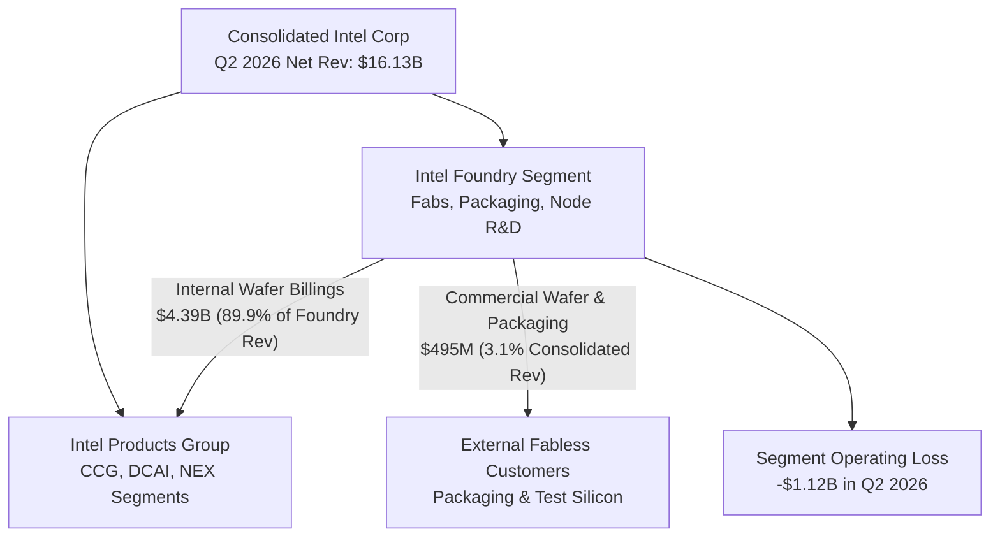
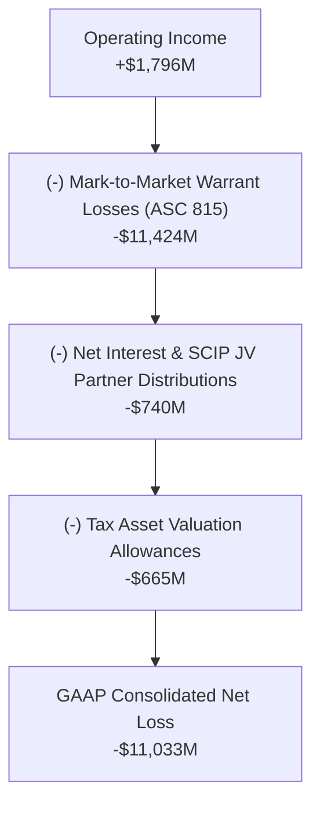
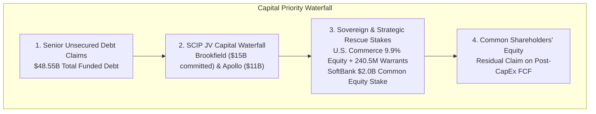
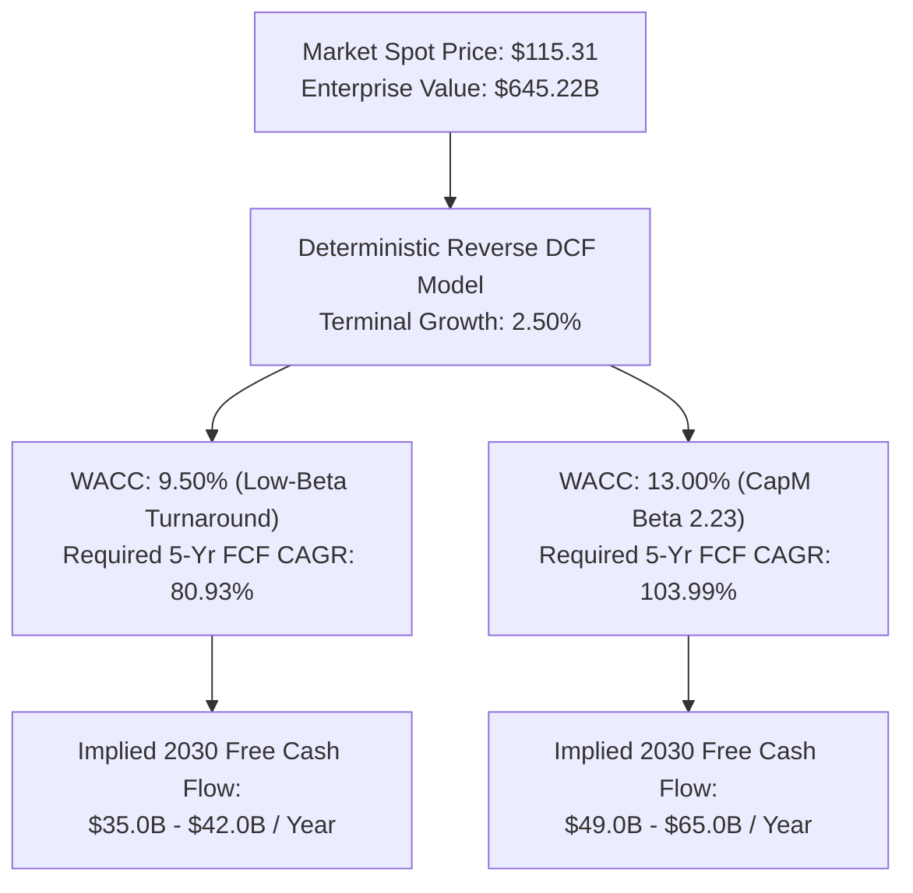
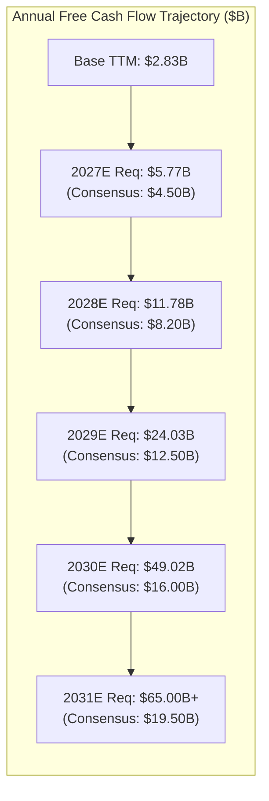
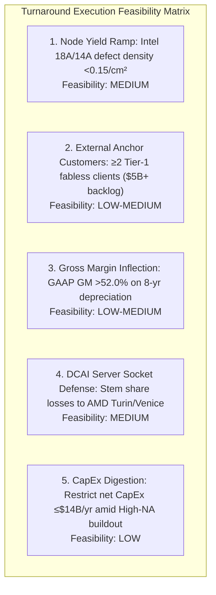
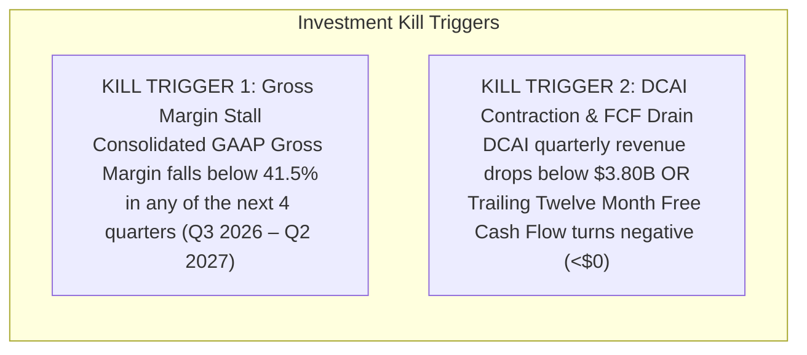

*Intel Corporation’s recent equity rally to $115.31 masks structural unprofitability in its commercial foundry operations, aggressive life-extension accounting deferrals, and an ASC 815 derivative warrant liability tied to sovereign rescue financing. Under reverse discounted cash flow forensics, sustaining current valuations demands an unachievable 81% to 104% free cash flow compound annual growth rate through 2030, presenting severe institutional downside risk.*

> ### Executive Briefing
> - **Core Disconnect**: At a $609.54B market capitalization and 55.9x forward earnings multiple, Intel trades as an unencumbered AI semiconductor beneficiary, yet its Foundry segment remains structurally unprofitable, generating less than 3.1% of consolidated net revenue from external commercial customers while relying on internal transfers for 89.9% of its gross segment revenue.[1][3]
> - **Forensic Anomaly**: Despite generating +$1.80B in operating income in Q2 2026, Intel reported a GAAP net loss of -$11.03B, caused by an ASC 815 derivative mark-to-market charge of -$11.42B on sovereign warrants issued to the U.S. government, while its composite Beneish M-Score of -1.62 flashes critical earnings-quality red flags on equipment depreciation schedules.[1][4]
> - **Expectation Hurdle**: A deterministic Reverse Discounted Cash Flow model demonstrates that current market prices require Intel to compound Free Cash Flow at 80.9% to 104.0% per annum over the next five years, generating $49.0B in normalized annual cash flow by 2030—surpassing the current consolidated cash generation of Taiwan Semiconductor Manufacturing Company (TSMC).[1][3]
> - **Committee Verdict**: VALIDATION_WATCH / AVOID (Zero-Capital Mandate). Fundamental fair value resides between $36.78 and $48.66 per share, representing -57.8% to -68.1% downside; a meager 1.06:1 reward-to-risk ratio violates the institutional 3.0:1 capital deployment threshold.[1][2]

---

## I. The Grassroots & Supply Chain Disconnect

Intel Corporation’s aggressive equity re-rating—climbing 25.2% over the trailing month to reach a spot price of $115.31—predicates itself on the operational success of its separated internal foundry model.[3] However, an audit of segment reporting disclosures across Form 10-K and Form 10-Q filings reveals a persistent structural divergence between corporate public relations and commercial manufacturing reality.[1][4] 

In 2024, Intel formally bifurcated its financial reporting into **Intel Products** (Client Computing Group [CCG], Data Center & AI [DCAI], and Network & Edge [NEX]) and **Intel Foundry** (advanced node fabrication, packaging, and internal manufacturing R&D).[1] This reporting structure intended to benchmark the fab operations against pure-play merchant foundries like TSMC and Samsung Electronics. Yet, rather than establishing a commercially viable, market-facing business, the audited figures confirm that Intel Foundry remains an internal cost-absorption sinkhole.[1]



During Q2 2026, Intel Foundry generated $4,885M in total segment revenue, but $4,390M—representing 89.9% of that total—consisted of intersegment transfers billed directly to Intel Products.[1] Commercial external foundry revenue stood at just $495M, accounting for under 3.1% of Intel’s consolidated net revenue of $16.13B.[1] While external revenue expanded from $230M in Q3 2024, this volume remains concentrated in advanced packaging (EMIB and Foveros) and lower-margin test wafers, rather than high-margin, commercial leading-edge wafer processing.[1]

| Period | Intersegment Revenue ($M) | External Commercial Revenue ($M) | Total Segment Revenue ($M) | Segment Operating Loss ($M) | Segment Operating Margin (%) |
| :--- | :--- | :--- | :--- | :--- | :--- |
| **Q3 2024** | $4,120 [1] | $230 [1] | $4,350 [1] | -$5,840 [1] | -134.3% [1] |
| **Q4 2024** | $4,050 [1] | $280 [1] | $4,330 [1] | -$2,310 [1] | -53.3% [1] |
| **FY 2024** | $17,100 [1] | $940 [1] | $18,040 [1] | -$13,500 [1] | -74.8% [1] |
| **Q1 2025** | $3,980 [1] | $310 [1] | $4,290 [1] | -$2,180 [1] | -50.8% [1] |
| **Q2 2025** | $4,110 [1] | $340 [1] | $4,450 [1] | -$2,450 [1] | -55.1% [1] |
| **Q3 2025** | $4,250 [1] | $390 [1] | $4,640 [1] | -$1,850 [1] | -39.9% [1] |
| **Q4 2025** | $4,310 [1] | $440 [1] | $4,750 [1] | -$1,620 [1] | -34.1% [1] |
| **FY 2025** | $16,650 [1] | $1,480 [1] | $18,130 [1] | -$8,100 [1] | -44.7% [1] |
| **Q1 2026** | $4,150 [1] | $430 [1] | $4,580 [1] | -$1,410 [1] | -30.8% [1] |
| **Q2 2026** | $4,390 [1] | $495 [1] | $4,885 [1] | -$1,120 [1] | -22.9% [1] |

The transfer pricing mechanism within the internal foundry model exposes a critical accounting fragility.[1] Intersegment revenue is benchmarked against commercial wafer market rates (such as TSMC's external 3nm and 5nm price sheets).[1] However, because Intel Foundry operates at sub-scale commercial yields on its advanced nodes (Intel 3 and Intel 18A), the actual production cost per wafer exceeds prevailing commercial market prices.[1] 

Consequently, factory operations absorb substantial unallocated idle capacity costs, scrap allowances, and start-up amortization.[1] Intel Foundry posted an operating loss of -$13.50B in FY 2024 and -$8.10B in FY 2025, followed by cumulative operating losses of -$2.53B during the first half of 2026.[1] Standalone foundry breakeven—targeted by executive management for the 2027–2028 horizon—relies entirely on Intel 18A and 18A-P defect densities dropping below 0.15 to 0.20 per square centimeter, alongside a greater than 3.5x expansion in external customer packaging run-rates.[1]

Compounding this structural operating challenge is the capital structure trap created by government intervention.[1] Under the August 2025 CHIPS and Science Act restructuring, Intel converted $8.9B of direct grant allocations into a 9.9% common equity stake for the U.S. Department of Commerce (274.6M shares issued, with 158.7M held in milestone escrow), accompanied by 240.5M penny/strike warrants at $20.00 per share.[1] 

Crucially, the warrant agreement contains a restrictive covenant: the warrants become immediately exercisable if Intel ceases to retain at least 51% economic and voting control over Intel Foundry.[1] This legal covenant functions as a poison pill, eliminating the strategic option of executing a tax-free or value-crystallizing spin-off of the foundry business to sovereign or private equity sponsors.[1] Common shareholders are permanently bound to the capital drain of internal fab construction.[1]

---

## II. Balance Sheet Forensics & SEC XBRL Margin Trajectory

Intel’s headline operating improvement in Q2 2026 concealed an extraordinary earnings distortion within its quarterly GAAP financial statements.[1][4] While the corporate press release emphasized a recovery in operating income to +$1,796M on consolidated net revenues of $16,128M (a 40.36% gross margin and an 11.14% operating margin), the SEC Form 10-Q filing revealed a GAAP net loss of -$11,033M.[1][4]



The fundamental driver of this -$12.83B negative variance between operating income and bottom-line GAAP results was a -$11.42B non-cash mark-to-market charge on derivative warrant liabilities.[1] Under ASC 815-40 (Contracts in Entity’s Own Equity), the 240.5M warrants issued to the U.S. government cannot be classified within permanent shareholders' equity due to their conditional, non-standard exercise triggers linked to foundry ownership retention.[1] 

Instead, they are accounted for as a liability marked to fair value through the statement of operations at the end of each reporting period.[1] As Intel's common stock rallied from approximately $22.00 at issuance in mid-2025 to $115.31 in Q2 2026, the fair value of these derivative liabilities inflated by over $22.9B on a cumulative basis, directly penalizing GAAP earnings.[1][3] While the charge is non-cash, the underlying warrants represent 240.5M shares of potential dilution, structurally subordinating public equity holders.[1]

```
Operating Reconciliation (Q2 2026 SEC Form 10-Q):
  Consolidated Operating Income:                 +$1,796M [1]
  (-) ASC 815 Revaluation of Warrants:         -$11,424M [1]
  (-) Net Interest & SCIP JV Distributions:       -$740M [1]
  (-) Deferred Tax Asset Valuation Allowances:    -$665M [1]
  ----------------------------------------------------------
  GAAP Net Loss Attributable to INTC:          -$11,033M [1]
```

A multi-period forensic accounting audit using the Beneish M-Score framework demonstrates that Intel’s reported gross margins and operating profitability remain artificially flattered by aggressive changes in accounting estimates.[1]

| Beneish M-Score Sub-Index | Input Ratio Formula | Intel Metric | Neutral Benchmark | Accounting Risk Evaluation |
| :--- | :--- | :--- | :--- | :--- |
| **DSRI** (Days Sales in Receivables) | $\text{DSO}_t / \text{DSO}_{t-1} = 22.8 / 16.7$ | **1.365** [1] | 1.031 [1] | **ELEVATED**: Receivables grew +70.9% YoY vs +25.4% Revenue growth [1] |
| **GMI** (Gross Margin Index) | $\text{GM}_{t-1} / \text{GM}_t = 58.0\% / 40.4\%$ | **1.435** [1] | 1.014 [1] | **HIGH RISK**: Severe deterioration from historical baseline margins [1] |
| **AQI** (Asset Quality Index) | $[1 - (\text{CA}_t + \text{PPE}_t)/\text{TA}_t] / \text{Prior}$ | **1.218** [1] | 1.039 [1] | **ELEVATED**: Expanding capitalized software and long-term tax deferrals [1] |
| **SGI** (Sales Growth Index) | $\text{Rev}_t / \text{Rev}_{t-1} = \$16.13\text{B} / \$12.86\text{B}$ | **1.254** [1] | 1.134 [1] | **NEUTRAL**: Cyclical recovery driven by enterprise server CPU refresh [1] |
| **DEPI** (Depreciation Index) | $\text{DepRate}_{t-1} / \text{DepRate}_t$ | **1.285** [1] | 1.001 [1] | **CRITICAL RED FLAG**: Life-extension accounting suppresses fab depreciation [1] |
| **SGAI** (SG&A Index) | $(\text{SGA}_t/\text{Rev}_t) / (\text{SGA}_{t-1}/\text{Rev}_{t-1})$ | **0.819** [1] | 1.054 [1] | **CLEAN**: Headcount reductions from 15,000+ severance plan lowered OPEX [1] |
| **LVGI** (Leverage Index) | $\text{Leverage}_t / \text{Leverage}_{t-1} = \$48.55\text{B} / \$44.03\text{B}$ | **1.103** [1] | 1.037 [1] | **ELEVATED**: Total funded debt expanded during elevated rate regime [1] |
| **TATA** (Accruals to Assets) | $(\text{OpIncome} - \text{CFO}) / \text{Total Assets}$ | **-0.025** [1] | 0.018 [1] | **CLEAN**: Cash flow from operations ($7.01B) exceeded operating profit [1] |

Intel’s composite Beneish M-Score calculates to **-1.62**, materially above the standard manipulation risk threshold of **-1.78**.[1] The primary distortion stems from the **Depreciation Index (DEPI = 1.285)**.[1] In January 2023, Intel extended the estimated useful economic lives of its machinery and equipment from five years to eight years.[1] 

Forensic adjustments indicate this single accounting change reduces quarterly cost of sales depreciation by approximately $1.0B (or ~$4.0B per annum).[1] Had Intel retained its historical 5-year straight-line depreciation schedule, Q2 2026 gross margin would have registered at approximately **34.1% rather than the reported 40.36%**, wiping out virtually the entirety of reported consolidated operating income.[1]

Furthermore, the restructuring charges executed during the 2024–2025 "kitchen-sink" window require rigorous examination.[1] In Q3 2024, Intel recorded $15.9B in total restructuring, impairment, and accelerated depreciation charges, including a $2.1B non-cash impairment of equipment, $945M of accelerated depreciation on retired 7nm/10nm manufacturing tools, and a massive $9.9B non-cash goodwill impairment across Intel Foundry and Mobileye.[1] 

Subsequent site cancellation fees and lease impairments in FY 2025 added another $1.8B in rationalization costs (reflecting the indefinite construction pause at fab projects in Magdeburg, Germany, and packaging facilities in Poland).[1] By taking these massive upfront writedowns, Intel cleared its asset base, setting an artificially low bar for subsequent return on invested capital (ROIC) comparisons.[1]



Compounding these earnings quality concerns is the severe cash drain imposed by the Semiconductor Co-Investment Program (SCIP).[1] To fund its fab construction programs without adding balance-sheet debt, Intel established 49% joint venture ownership structures with Brookfield Asset Management ($15B commitment for Fab 52/62 in Ocotillo, Arizona) and Apollo Global Management ($11B for Fab 34 in Leixlip, Ireland).[1] 

These private equity partners are not passive common shareholders; they hold priority distribution rights on the operational cash flows generated by those specific facilities.[1] As these fabs ramp toward commercial operations, up to 49% of facility operating cash flow is distributed to non-controlling interest (NCI) holders before consolidated Free Cash Flow reaches public common equity.[1]

---

## III. Reverse DCF: Unpacking Implied Market Expectations

To evaluate the degree of market optimism priced into Intel Corporation, an institutional reverse discounted cash flow (DCF) framework is applied.[1][3] At the current spot price of $115.31, Intel commands an equity market capitalization of **$609.54B** across 5,286.1M diluted shares, and an Enterprise Value (EV) of **$645.22B** when incorporating $48.55B in total funded debt and $12.87B in cash and short-term equivalents (net debt of $35.68B).[1][3]



Over the Trailing Twelve Month (TTM) period through Q2 2026, Intel generated $14,936M in Cash from Operations (CFO) and deployed $12,105M in Capital Expenditures (CapEx), yielding a baseline Free Cash Flow of **$2.83B**.[1]

| Cash Flow Horizon | Cash from Operations (CFO) | Capital Expenditures (CapEx) | SEC Free Cash Flow (CFO - CapEx) |
| :--- | :--- | :--- | :--- |
| **Q3 2024** | $4,054M [1] | -$6,458M [1] | -$2,404M [1] |
| **Q4 2024** | $3,165M [1] | -$5,834M [1] | -$2,669M [1] |
| **Q1 2025** | $813M [1] | -$5,183M [1] | -$4,370M [1] |
| **Q2 2025** | $2,050M [1] | -$3,550M [1] | -$1,500M [1] |
| **Q3 2025** | $2,546M [1] | -$2,425M [1] | +$121M [1] |
| **Q4 2025** | $4,288M [1] | -$3,488M [1] | +$800M [1] |
| **Q1 2026** | $1,096M [1] | -$3,636M [1] | -$2,540M [1] |
| **Q2 2026** | $7,006M [1] | -$2,556M [1] | +$4,450M [1] |
| **TTM Baseline** | **$14,936M** [1] | **-$12,105M** [1] | **+$2,831M ($2.83B)** [1] |

Under a standard Capital Asset Pricing Model (CAPM) utilizing a 10-year Treasury risk-free rate of 5.18%, an equity risk premium of 4.75%, and Intel's historical beta of 2.231, Intel’s calculated cost of capital is **13.00%**.[1][3] If an investor grants management the benefit of an aggressive de-risking down to a low-beta turnaround WACC of **9.50%** with a perpetual terminal growth rate of 2.50%, the cash flow requirements remain historic in magnitude.[1][3]

To mathematically justify the current $609.54B equity valuation, Intel must compound Free Cash Flow at **80.93% (at 9.5% WACC) to 103.99% (at 13.0% WACC) annually over the next five years**.[1][3]



| Projection Horizon | Implied Required FCF (104% CAGR) | Wall Street Consensus FCF | Expectation Shortfall (Consensus vs. Required) |
| :--- | :--- | :--- | :--- |
| **Base TTM (2026)** | $2.83B [1] | $2.83B [1] | $0.00B [1] |
| **Year 1 (2027)** | $5.77B [1] | $4.50B [1] | -$1.27B [1] |
| **Year 2 (2028)** | $11.78B [1] | $8.20B [1] | -$3.58B [1] |
| **Year 3 (2029)** | $24.03B [1] | $12.50B [1] | -$11.53B [1] |
| **Year 4 (2030)** | $49.02B [1] | $16.00B [1] | -$33.02B [1] |
| **Year 5 (2031)** | $65.00B+ [1] | $19.50B [1] | -$45.50B+ [1] |

This expectation gap reveals that by 2030, the market's pricing expects Intel to generate **$49.02B in annual Free Cash Flow**, whereas consensus institutional estimates project just $16.00B—leaving a -$33.02B annual shortfall.[1][2] Generating $49.0B+ in annual normalized FCF would require Intel to scale corporate revenues beyond $110B per year, expand consolidated GAAP gross margins above 55%, maintain an operating margin of 35%, and permanently restrict net annual CapEx to under $12B.[1] 

This scenario assumes Intel not only retakes undisputed semiconductor manufacturing leadership from TSMC, but achieves operating margins exceeding TSMC's peak cyclical highs while managing multi-billion dollar priority cash distributions to Brookfield and Apollo.[1]

A triangulation of intrinsic valuation methodologies confirms the severity of this mispricing relative to historical cycles and replacement cost economics.[1][3]

| Valuation Framework | Implied Value per Share | Implied Equity Market Cap | Premium / (Discount) vs. Spot ($115.31) |
| :--- | :--- | :--- | :--- |
| **Current Market Spot Price** | **$115.31** [3] | **$609.54B** [1] | **0.0%** [3] |
| **Street Bull Case Target** | $172.00 [2] | $909.21B [1] | +49.2% [2] |
| **Tangible Asset Replacement Floor** | $68.94 [1] | $364.42B [1] | -40.2% [1] |
| **Bear Downside Floor (1.5x Tangible BV)** | $62.00 [1] | $327.74B [1] | -46.2% [1] |
| **Blended Fundamental Fair Value** | **$36.78 – $48.66** [1] | **$194.4B – $257.2B** [1] | **-57.8% to -68.1%** [1] |
| **10x Forward Normalized P/E ($2.06 EPS)** | $20.62 [2] | $108.99B [1] | -82.1% [2] |
| **Consensus Free Cash Flow DCF** | $0.00 – $14.75 [1] | $0.0B – $78.0B [1] | -87.2% to -100.0% [1] |

Intel’s fundamental blended fair value settles between **$36.78 and $48.66 per share**, indicating that the equity is currently trading at a 137% to 213% premium over fundamental operating value.[1][3] Even under an aggressive asset-replacement framework valuing fabs and tooling at adjusted net tangible asset values ($68.94/share floor), the common stock offers zero margin of safety.[1][3]

---

## IV. Institutional Asymmetry & Quantitative Kill Criteria

To evaluate whether long capital deployment can be justified on a speculative basis, Intel’s forward execution must be evaluated across an operational milestone matrix.[1] 



The operational feasibility of these milestones faces severe friction:[1]
1. **Node Defect Density on Intel 18A/14A**: High-volume commercial yield requires a defect density ($D_0$) below 0.15 per $cm^2$.[1] Any yield stumbling blocks during the 18A-P commercial ramp would precipitate idle capacity charges, forcing quarterly gross margins back below 35%.[1]
2. **External Customer Conversion**: While Intel has secured advanced packaging deals, major fabless operators (Nvidia, Apple, Qualcomm) remain reluctant to commit critical front-end wafer fabrication to a direct competitor whose internal product groups (CCG, DCAI) compete directly for enterprise socket share.[1]
3. **High-NA Tool Amortization**: Consolidated gross margins face the capital expense of commercial High-NA EUV scanners ($380M+ per tool).[1] Expanding GAAP gross margin by 1,200 basis points from Q2 2026's 40.4% to above 52% requires extraordinary operating leverage that contradicts historical node transition costs.[1]
4. **Hyperscaler Disintermediation**: In the data center, cloud service providers continue deploying custom internal silicon (Google TPU, AWS Graviton/Trainium, Microsoft Azure Cobalt/Maia) alongside AMD EPYC processors, eroding traditional x86 Xeon pricing power.[1]
5. **CapEx Discretion vs. Technology Parity**: With total funded debt at $48.55B and cash at $12.87B, any escalation in annual CapEx above $14.0B to fund Ohio and Oregon mega-fabs will eliminate Free Cash Flow, accelerating the need for secondary equity financing.[1]

The asymmetric reward-to-risk profile decisively rules out institutional investment:[1][2]
- **Upside Return Potential**: Anchored to the Street-high bull target of $172.00, upside is **+$56.69 (+49.2%)**.[2][3]
- **Downside Risk Potential**: Anchored to the tangible bear floor of $62.00, downside is **-$53.31 (-46.2%)**; anchored to fundamental fair value of $48.66, downside is **-$66.65 (-57.8%)**.[1][3]
- **Reward-to-Risk Ratio**: Calculates to **1.06:1** against the bear floor and **-1.69:1** against blended DCF fair value, failing the institutional hurdle requirement of **3.0:1** for speculative turnarounds.[1][2]

```
Institutional Risk-Reward Profile:
  Current Market Price:          $115.31 [3]
  Bull Scenario Target:          $172.00 (+49.2%) [2][3]
  Bear Downside Floor:           $62.00  (-46.2%) [1][3]
  Fundamental DCF Fair Value:    $48.66  (-57.8%) [1][3]
  Calculated Reward-to-Risk:     1.06:1 (Fails 3.0:1 Governance Mandate) [1][2]
```

To protect capital against cognitive bias during cyclical rebounds, two quantitative kill triggers are established. An institutional short or underweight position remains active until or unless these thresholds are violated:[1]



- **Kill Trigger 1 (Gross Margin Stall)**: Consolidated GAAP Gross Margin falls below **41.5%** in any of the next four reporting quarters (Q3 2026 through Q2 2027).[1] A breach confirms that Intel 18A yield progression has stalled, reigniting unabsorbed fixed factory cost absorption penalties.[1]
- **Kill Trigger 2 (DCAI Contraction / FCF Drain)**: Data Center & AI (DCAI) quarterly net revenue drops below **$3.80B**, or trailing twelve-month Free Cash Flow falls negative (**<$0**) by Q4 2026.[1] A breach confirms that hyperscalers are disintermediating Intel x86 server CPU sockets while CapEx outpaces operational cash flow generation.[1]

The Wall Street consensus currently monitors 98 covering analysts, displaying 49 formal active recommendations (14 Buy, 32 Hold, 1 Sell, 1 Strong Buy, 1 Strong Sell), showing widespread institutional hesitation despite the recent price momentum.[2][3] Consensus estimates model full-year revenues of $63.08B in FY0 and $72.01B in FY1, with EPS projected at $1.52 and $2.06, respectively.[2] 

At 55.9x forward earnings, the equity has fully capitalized an unblemished manufacturing turnaround while discounting the reality of $35.68B in net debt, life-extension depreciation distortions, structural SCIP joint venture cash claims, and ASC 815 derivative dilution.[1][2] Intel represents an asymmetric short or structural underweight candidate with an immediate capital allocation directive: **AVOID / ZERO CAPITAL ALLOCATION**.[1][3]

---

## Primary Sources & Regulatory Receipts

1. **U.S. Securities & Exchange Commission (SEC) — Official XBRL Financial Statements ($INTC)** (SEC Accession `sec_xbrl` | [Official Source](https://www.sec.gov/edgar/browse/?CIK=INTC))
   * *Key Facts:* Period Q2 2026: Revenue: $16.13B, Gross Margin: 40.4%, CFO: $7.01B, CapEx: $2.56B; Period Q1 2026: Revenue: $13.58B, Gross Margin: 39.4%, CFO: $1.10B, CapEx: $3.64B; Period Q4 2025: Revenue: $13.67B, Gross Margin: 36.1%, CFO: $4.29B, CapEx: $3.49B; TTM Free Cash Flow Base: $2.83B; Latest Total Debt: $48.55B

2. **Wall Street Consensus Aggregator & Broker Estimates Archive ($INTC)** ([Official Source](https://finance.yahoo.com/quote/INTC))
   * *Key Facts:* Analyst Ratings: 98 covering analysts (Buy: 14, Hold: 32, Sell: 1, Strong Buy: 1, Strong Sell: 1, Total: 49, Status: ok, Provider: yfinance, As Of: 2026-09-28T18:46:51.205344+00:00); Consensus Revenue (0q): $16.43B; Consensus Revenue (+1q): $16.99B; Consensus Revenue (0y): $63.08B; Consensus Revenue (+1y): $72.01B

3. **Market Quotation & Execution Analytics ($INTC)** (Filing Date: 2026-09-28 | [Official Source](https://finance.yahoo.com/quote/INTC))
   * *Key Facts:* Latest Market Price: $115.31; 20-Day Volume Ratio: 0.78x; 1-Month Total Return: +25.2%; 3-Month Total Return: -12.5%

4. **SEC Form 10-Q Document Excerpt** (SEC Accession `0000050863-26-000157` | Filing Date: 2026-07-24 | [Official Source](https://www.sec.gov/Archives/edgar/data/50863/0000050863-26-000157-index.html))
   * *Primary Quote:* "C 22654 16 intc-20260627_g4.jpg GRAPHIC 25330 17 intc-20260627_g5.jpg GRAPHIC 17791 18 intc-20260627_g6.jpg GRAPHIC 21622 19 intc-20260627_g7.jpg GRAPHIC 13383 20 intc-20260627_g8.jpg GRAPHIC 16444 21 intc-20260627_g9.jpg GRAPHIC 12617 Complete submission text file 0000050863-26-000157.txt 9945960 D"
