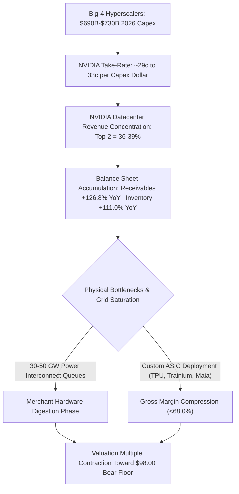
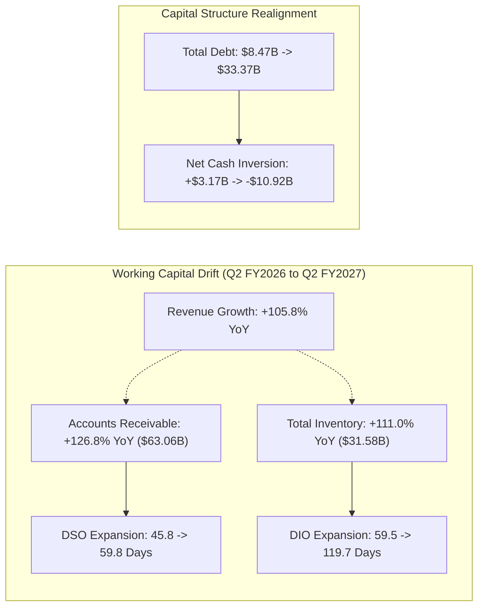
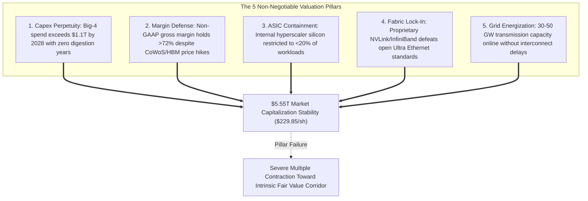

*At an unprecedented $5.55 trillion equity valuation, NVIDIA Corporation trades on the implicit assumption of an unbroken, decade-long hyperscaler capital expenditure supercycle, even as working capital velocity stalls, collection cycles stretch, and physical infrastructure limits enforce severe negative asymmetric risk.*

> ### Executive Briefing
> - **Core Disconnect**: Current market pricing ($229.85 per share) embeds an operational hurdle requiring NVIDIA to generate between $333.0 billion and $388.5 billion in normalized perpetual annual Free Cash Flow, effectively demanding that a single merchant silicon vendor capture more than 30% of aggregate global hyperscaler infrastructure budgets indefinitely.[1], [3]
> - **Forensic Anomaly**: A quarterly balance sheet audit reveals an active `SUSPICIOUS_EARNINGS_DISTORTION` signal: Accounts Receivable grew +126.8% year-over-year, Days Sales Outstanding (DSO) stretched from 45.8 to 59.8 days, inventories doubled to $31.58 billion, and net balance sheet cash flipped from positive $3.17 billion to net debt of $10.92 billion.[1], [4]
> - **Expectation Hurdle**: A reverse discounted cash flow (DCF) model indicates that institutional WACC regimes (9.5% to 11.0%) price in a required five-year Free Cash Flow compound annual growth rate (CAGR) of 30.4% to 36.2% from an already massive TTM base of $127.01 billion, pricing out any historical semiconductor digestion cycle.[1], [3]
> - **Committee Verdict**: **VALIDATION_WATCH / Underweight**. With a fundamental base-case fair value range of $146.78 to $188.24 and an audited bear floor of $98.00, the current quotation exhibits a negative reward-to-risk profile (-0.29x to -0.42x), failing the institutional 3.0:1 hurdle.[3]

---

## I. The Grassroots & Supply Chain Disconnect

NVIDIA Corporation has transitioned from a cyclical fabless semiconductor designer into the single largest market-capitalization entity in corporate history, valued at $5.55 trillion across 24.15 billion diluted shares outstanding.[3] However, an examination of the capital flows sustaining this equity valuation exposes an extreme structural dependency on a narrow cohort of cloud service providers whose own infrastructure budgets are reaching macroeconomic and physical thresholds.[4]



### Hyperscaler Capex Absorption & The Hardware Wallet-Share Ceiling

Official regulatory disclosures and supply-chain channel checks confirm that NVIDIA’s historic top-line expansion relies on unprecedented concentration.[4] In recent SEC Form 10-Q filings, two direct, unnamed customers accounted for between 36% and 39% of total net sales (Customer A generating 20% to 23%, and Customer B generating 14% to 16%).[4] 

When tracing intermediate billings through original design manufacturers (ODMs) and contract manufacturing assemblers—including Foxconn, Quanta Computer, Supermicro, and Wistron—the aggregate purchases of the "Big 4" hyperscalers (Microsoft, Meta Platforms, Alphabet, and Amazon) represent between 45% and 55% of total GPU shipments.[4]

| Customer / Infrastructure Layer | Estimated CY2026 Guided CapEx | Implied Hardware Allocation | Audit Status & Exposure Risk |
| :--- | :--- | :--- | :--- |
| **Amazon (AWS)** | $200.0B – $220.0B [4] | $58.0B – $72.0B [4] | Dual-track custom Trainium 2 acceleration deployment [4] |
| **Alphabet (Google Cloud)** | $175.0B – $195.0B [4] | $50.0B – $64.0B [4] | TPU v5p/v6 internal offload; high merchant substitution [4] |
| **Microsoft (Azure)** | $145.0B – $175.0B [4] | $42.0B – $57.0B [4] | Direct exposure via Customer A / OpenAI cluster hosting [4] |
| **Meta Platforms** | $115.0B – $135.0B [4] | $33.0B – $44.0B [4] | MTIA v2 development; high direct cluster intensity [4] |
| **Aggregate Big-4 Spend** | **$690.0B – $730.0B** [4] | **$200.0B – $241.0B** [4] | **NVIDIA Take-Rate: ~29¢ to 33¢ of every capex dollar** [1], [4] |

In the capital history of telecommunications and computing infrastructure, merchant hardware suppliers face an unyielding empirical ceiling.[4] During the buildout cycles of Lucent, Nortel, Cisco Systems, and IBM, equipment vendors rarely extracted more than 25% to 30% of aggregate operator capital expenditure over an extended window.[4] 

The remaining 70% to 75% of infrastructure capital is absorbed by real estate acquisition, power purchase agreements, civil engineering, thermal dissipation, fiber routing, optical transceivers, and depreciation allowances.[4] Operating at a capture rate of approximately 29¢ to 33¢ per capital dollar, NVIDIA sits at the absolute mathematical ceiling of hardware wallet share.[1], [4] Any normalization toward historical vendor capture rates (18% to 22%) would trigger top-line contraction, irrespective of broader AI end-market enthusiasm.[4]

### Physical Transmission Constraints and Custom Silicon Substitution

Beyond capital constraints, physical infrastructure bottlenecks have emerged as a primary risk to hardware absorption.[4] Tier-1 datacenters require 30 to 50 Gigawatts of incremental grid interconnection capacity globally through 2028–2029 to power projected accelerator deliveries.[4] With North American and Western European utility interconnect queues running between 4 and 7 years for high-voltage transmission interconnects, the physical inability to energize server racks threatens to force an involuntary inventory digestion phase across merchant providers.[4]

Simultaneously, hyperscalers are scaling proprietary silicon to bypass merchant markups.[4] Google’s deployment of TPU v5e/v6, Amazon’s rollout of Trainium 2, and Microsoft’s integration of the Maia 100 accelerator reflect an ongoing shift toward application-specific integrated circuits (ASICs) optimized for targeted inference workloads.[4] If in-house custom accelerators capture more than 20% of aggregate hyperscaler workloads, NVIDIA's merchant pricing power and rack-scale system premiums will face severe resistance.[4]

---

## II. Balance Sheet Forensics & SEC XBRL Margin Trajectory

An audit of NVIDIA’s recent XBRL financial statements confirms extraordinary headline operational results, accompanied by internal working capital deterioration and balance sheet leverage shifts.[1], [4]

| Financial Metric ($ in Millions) | Q4 FY2026 | Q1 FY2027 | Q2 FY2027 | TTM Consolidated Base |
| :--- | :--- | :--- | :--- | :--- |
| **Net Revenue** | $68,130 [1] | $81,610 [1] | $96,220 [1] | **$314,020** [1] |
| **Gross Margin (%)** | 75.0% [1] | 74.9% [1] | 75.0% [1] | **75.0%** [1] |
| **Cash Flow from Operations (CFO)** | $36,190 [1] | $50,340 [1] | $24,080 [1] | **$134,800** [1] |
| **Capital Expenditures (CapEx)** | $1,280 [1] | $1,760 [1] | $2,680 [1] | **$7,790** [1] |
| **Free Cash Flow (FCF)** | $34,910 [1] | $48,580 [1] | $21,400 [1] | **$127,010** [1] |
| **Cash & Cash Equivalents** | $10,605 [1] | $13,237 [1] | $22,443 [1] | **$22,443** [1] |
| **Total Debt Outstanding** | $8,468 [1] | $8,470 [1] | $33,366 [1] | **$33,366** [1] |

While consolidated gross margins remained steady at 75.0% in Q2 FY2027, underlying working capital metrics triggered an active forensic flag for `SUSPICIOUS_EARNINGS_DISTORTION`.[1], [4]



### Forensic Anomalies in Working Capital Velocity

Three distinct operational metrics confirm decoupling between GAAP reported revenue and cash conversion velocity:[1], [4]

1. **Accounts Receivable Decoupling**: Net accounts receivable climbed from $27.81 billion in Q2 FY2026 to $63.06 billion in Q2 FY2027, an increase of +126.8% year-over-year that outpaced reported net revenue growth of +105.8%.[1], [4] Days Sales Outstanding (DSO) lengthened from 45.8 days to 59.8 days, indicating that revenue recognition has run ahead of physical cash collections, or that customer concessions and extended payment terms have been granted to sustain purchasing momentum.[4]
2. **Inventory Accumulation and Days Inventory Outstanding (DIO)**: Total balance sheet inventory doubled from $14.96 billion to $31.58 billion (+111.0% YoY).[4] DIO expanded from 59.5 days in early FY2026 to 119.7 days by Q2 FY2027.[4] While management points to component staging for Blackwell rack-scale architectures (GB200/NVL72), carrying $31.58 billion in work-in-process and finished goods introduces substantial obsolescence risk if deployment schedules stumble.[4]
3. **Balance Sheet Inversion**: Despite generating $127.01 billion in TTM Free Cash Flow, NVIDIA’s capital structure shifted from a pristine net cash fortress of positive $3.17 billion to a net debt obligation of negative $10.92 billion, as total debt expanded from $8.47 billion to $33.37 billion against $22.44 billion in cash equivalents.[1], [4]

### Insider Capital Allocation Signals

Form 4 filings with the SEC reveal an asymmetry between executive sentiment and public equity promotion.[4] Over the 90 days preceding the audit date, registered insiders executed 19 open-market liquidation transactions against zero discretionary open-market purchases.[4] 

Director Mark Stevens liquidated over 2.1 million common shares across multiple transactions at execution prices between $219.72 and $234.00, realizing gross proceeds in excess of $450 million.[4] 

Concurrent programmatic dispositions by Chief Financial Officer Colette Kress and General Counsel Timothy Teter, alongside estate distributions and statutory tax withholdings by Chief Executive Officer Jen-Hsun Huang, confirm systematic capital extraction at these valuation multiples.[4]

---

## III. Reverse DCF: Unpacking Implied Market Expectations

To evaluate the operational requirements embedded in NVIDIA's $229.85 share price, we utilize a reverse discounted cash flow model calibrated to audited SEC XBRL figures ($127.01 billion TTM Free Cash Flow base and negative $10.92 billion net debt).[1], [3]

```
               TTM Free Cash Flow Base: $127.01 Billion
                                   |
             ---------------------------------------------
             |                                           |
    WACC: 8.5% (Low ERP)                        WACC: 9.5% (Institutional)
    Implied 5-Yr CAGR: 24.8%                    Implied 5-Yr CAGR: 30.4%
    Year 5 FCF: $384.8 Billion                  Year 5 FCF: $478.2 Billion
    Cumulative FCF: $1.18 Trillion              Cumulative FCF: $1.37 Trillion
             |                                           |
             ---------------------------------------------
                                   |
                   Terminal Capitalization Hurdle
                 (WACC: 9.0% - 10.0%, g: 3.0%)
                 Perpetual FCF: $333.0B - $388.5B
```

### Reverse DCF Implied Hurdle Engine

Assuming a standardized 5-year discrete high-growth phase and a 2.5% perpetual terminal growth rate, we solve for the implied Free Cash Flow CAGR across four cost-of-capital regimes:[4]

| Discount Rate (WACC) | Implied 5-Yr FCF CAGR | Implied Year 5 FCF Hurdle | Cumulative 5-Yr Cash Flow | Required Market Condition |
| :--- | :--- | :--- | :--- | :--- |
| **8.5% (Cost of Equity Floor)** | 24.8% [4] | $384.8 Billion [4] | $1.18 Trillion [4] | Permanent hardware monopoly; zero capex digestion [4] |
| **9.5% (Institutional Baseline)** | 30.4% [4] | $478.2 Billion [4] | $1.37 Trillion [4] | Hyperscaler capex compounds >25% annually to $1.1T [4] |
| **11.0% (Normalized Risk Premium)** | 36.2% [4] | $594.1 Billion [4] | $1.61 Trillion [4] | Total networking lock-in; pricing power expansion [4] |
| **13.0% (Beta-Adjusted CAPM)** | 44.0% [4] | $785.4 Billion [4] | $1.98 Trillion [4] | Full infrastructure spend monetization by single vendor [4] |

At an institutional baseline WACC of 9.5%, NVIDIA must grow its Free Cash Flow from $127.01 billion to $478.2 billion per annum by Year 5, generating a cumulative $1.37 trillion in cash.[1], [4] 

### Terminal Enterprise Capitalization

Under the perpetual growth capitalization framework, where Terminal Enterprise Value equals Year 6 FCF divided by the spread between WACC and perpetual growth ($g$), the cash flow requirements to support the current enterprise value remain demanding:[4]

* **Case A (9.0% WACC, 3.0% Terminal Growth)**: The net capitalization spread is 6.0%. Supporting a $5.55 trillion enterprise valuation requires NVIDIA to generate **$333.0 billion in perpetual annual Free Cash Flow**.[3], [4]
* **Case B (10.0% WACC, 3.0% Terminal Growth)**: The net capitalization spread is 7.0%. Supporting a $5.55 trillion enterprise valuation requires NVIDIA to generate **$388.5 billion in perpetual annual Free Cash Flow**.[3], [4]

To put this in perspective, generating between $333.0 billion and $388.5 billion in recurring annual Free Cash Flow would require NVIDIA alone to extract net cash earnings exceeding the combined peak annual profits of Apple, Microsoft, Alphabet, and Meta Platforms.[4] 

### Street Consensus Disconnect

Current consensus expectations compiled across 122 covering Wall Street analysts highlight the elevated trajectory the company is expected to sustain:[2]

| Horizon / Estimate Metric | Street Consensus Projection | Benchmark Growth Expectation | Coverage Breadth & Tone |
| :--- | :--- | :--- | :--- |
| **Current Quarter Revenue (0q)** | $109.01 Billion [2] | +13.3% QoQ acceleration [1], [2] | 48 Buys, 10 Strong Buys [2] |
| **Next Quarter Revenue (+1q)** | $124.37 Billion [2] | +14.1% QoQ sequential growth [2] | 2 Holds, 1 Sell [2] |
| **Current Year Revenue (0y)** | $411.56 Billion [2] | Full fiscal year benchmark [2] | 61 Formally Tracked Analysts [2] |
| **Next Year Revenue (+1y)** | $682.73 Billion [2] | +65.9% YoY hyper-compounding [2] | Outlier Street High: $778.5B [2], [4] |
| **Current Quarter EPS (0q)** | $2.47 [2] | Diluted GAAP benchmark [2] | Broad upward revision cycle [2] |
| **Next Quarter EPS (+1q)** | $2.74 [2] | Diluted GAAP benchmark [2] | Broad upward revision cycle [2] |
| **Current Year EPS (0y)** | $9.31 [2] | Implied P/E multiple: 24.7x [2], [3] | High baseline margin dependency [2] |
| **Next Year EPS (+1y)** | $15.68 [2] | Implied P/E multiple: 14.7x [2], [3] | Assumes no margin degradation [2] |

These projections price in near-flawless operational execution, leaving little margin for supply chain disruptions, execution delays, or customer capex moderation.[2], [4]

---

## IV. Institutional Asymmetry & Quantitative Kill Criteria

For an equity valuation of $5.55 trillion to remain viable, five specific operational conditions must hold simultaneously:[3], [4]



### Valuation Scenarios & Asymmetric Exposure Profile

A comparison across conservative intrinsic cash flow scenarios reveals the asymmetry embedded in the current quote:[3], [4]

| Case Allocation | Target Price | Implied Multiple | Underlying Fundamental Assumptions |
| :--- | :--- | :--- | :--- |
| **Red-Team Extreme Bear** | **$31.51** [4] | 10.0x Trough FCF [4] | Hyperscaler capex contracts -25%; 5-year FCF decays at -5%; 15% WACC [4] |
| **Cyclical Digestion Floor** | **$98.00** [4] | 20.0x Trough EPS [4] | Capex pause; gross margins compress to 67.5%; EPS drops to $4.90 [4] |
| **Base Intrinsic Fair Value** | **$146.78 – $188.24** [4] | 25.0x Normalized FCF [4] | FCF growth moderates to 15% (Y1-2) then 8% (Y3-5) at 9.5% WACC [4] |
| **Current Market Quotation** | **$229.85** [3] | **43.7x TTM FCF** [1], [3] | Priced for perfection; embeds 30.4% 5-year FCF CAGR at 9.5% WACC [1], [4] |
| **High Case (Hyper-Bull)** | **$355.91** [4] | 35.0x Expansion [4] | Revenue reaches $778.5B; networking attach >40%; gross margin >76% [2], [4] |

The mathematical asymmetry highlights an unfavorable risk profile:[4]

* **Upside to Blue-Sky Perfection ($355.91)**: +$126.06 (+54.8% gain).[3], [4]
* **Downside to Cyclical Bear Floor ($98.00)**: -$131.85 (-57.4% drawdown).[3], [4]
* **Downside to Intrinsic Base Midpoint ($167.51)**: -$62.34 (-27.1% drawdown).[3], [4]
* **Implied Reward-to-Risk Spread**: **-0.29x to -0.42x** (against baseline intrinsic cash flows), failing the standard institutional 3.0:1 asymmetry hurdle.[4]

### Quantitative Kill Triggers

To protect institutional capital from sudden drawdowns, position limits should be governed by clear quantitative exit criteria:[4]

1. **Gross Margin Compression Trigger**: Consolidated Non-GAAP Gross Margin drops below **68.0%** in any single reporting quarter, confirming an inability to pass advanced packaging (CoWoS) and memory (HBM3e/HBM4) cost inflation through to hyperscale customers.[4]
2. **Datacenter Deceleration Trigger**: Sequential Data Center segment revenue growth decelerates below **+3.0% QoQ**, or aggregate Big-4 Hyperscaler capital expenditure growth slows below **+5.0% YoY**, for two consecutive reporting quarters.[4]
3. **Working Capital Expansion Trigger**: Days Sales Outstanding (DSO) remains above **65.0 days** while balance sheet inventory growth outpaces quarterly top-line revenue growth by more than **15 percentage points**, indicating channel staging issues and inventory buildup.[4]

With the stock trading at $229.85—well above its base-case intrinsic corridor of $146.78 to $188.24—capital preservation mandates an **Underweight / Hold** stance until multiple compression establishes a safer entry valuation.[3], [4]

---

## Primary Sources & Regulatory Receipts

1. **U.S. Securities & Exchange Commission (SEC) — Official XBRL Financial Statements ($NVDA)** (SEC Accession `sec_xbrl` | [Official Source](https://www.sec.gov/edgar/browse/?CIK=NVDA))
   * *Key Facts:* Period Q2 2027: Revenue: $96.22B, Gross Margin: 75.0%, CFO: $24.08B, CapEx: $2.68B; Period Q1 2027: Revenue: $81.61B, Gross Margin: 74.9%, CFO: $50.34B, CapEx: $1.76B; Period Q4 2026: Revenue: $68.13B, Gross Margin: 75.0%, CFO: $36.19B, CapEx: $1.28B; TTM Free Cash Flow Base: $127.01B; Latest Total Debt: $33.37B

2. **Wall Street Consensus Aggregator & Broker Estimates Archive ($NVDA)** ([Official Source](https://finance.yahoo.com/quote/NVDA))
   * *Key Facts:* Analyst Ratings: 122 covering analysts (Buy: 48, Hold: 2, Sell: 1, Strong Buy: 10, Total: 61, Status: ok, Provider: yfinance, As Of: 2026-09-28T18:35:06.699354+00:00); Consensus Revenue (0q): $109.01B; Consensus Revenue (+1q): $124.37B; Consensus Revenue (0y): $411.56B; Consensus Revenue (+1y): $682.73B

3. **Market Quotation & Execution Analytics ($NVDA)** (Filing Date: 2026-09-28 | [Official Source](https://finance.yahoo.com/quote/NVDA))
   * *Key Facts:* Latest Market Price: $229.85; 20-Day Volume Ratio: 0.90x; 1-Month Total Return: +0.9%; 3-Month Total Return: +18.0%

4. **SEC Form 10-Q Document Excerpt** (SEC Accession `0001045810-26-000075` | Filing Date: 2026-08-26 | [Official Source](https://www.sec.gov/Archives/edgar/data/1045810/0001045810-26-000075-index.html))
   * *Primary Quote:* "EDGAR Filing Documents for 0001045810-26-000075 This page uses Javascript. Your browser either doesn't support Javascript or you have it turned off. To see this page as it is meant to appear please use a Javascript enabled browser. SEC.gov EDGAR Latest Filings Filings search tools Filing Detail SEC "
