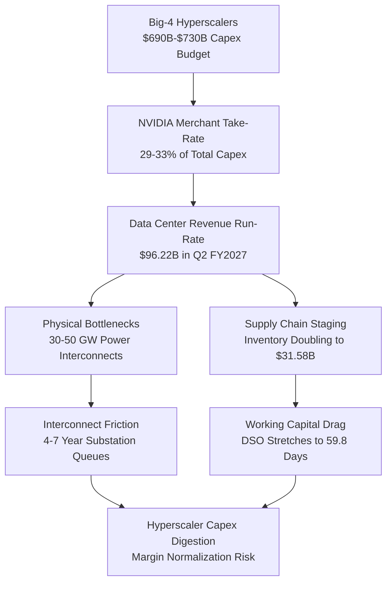
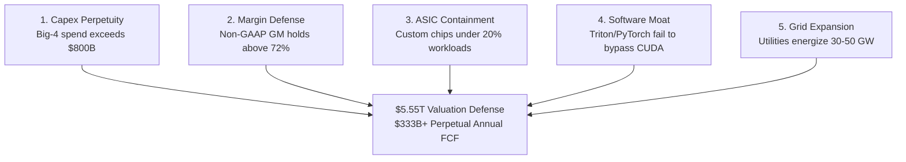

*At a market capitalization of $5.55 trillion, NVIDIA is no longer priced as an exceptional semiconductor designer, but as an inescapable sovereign tax on global enterprise compute. A forensic audit of customer concentration, working capital velocity, and reverse-engineered cash flows reveals an asset priced for a perpetual, frictionless hyper-capex cycle that physical power grids and corporate balance sheets cannot sustain.*

> ### Executive Briefing
> - **The Core Paradox**: NVIDIA's $5.55 trillion equity valuation assumes the company can permanently capture over 30 cents of every single capital expenditure dollar deployed across the global cloud, requiring terminal annual free cash flows that exceed the combined peak profits of Apple, Microsoft, Alphabet, and Meta combined.[1], [3]
> - **The Forensic Red Flag**: Forensic Red Flag: Working Capital Drag & Decoupling—Days Sales Outstanding stretched from 45.8 to 59.8 days as accounts receivable surged +126.8% year-over-year to $63.06 billion, while inventory doubled to $31.58 billion amid sustained insider open-market liquidations.[1], [4]
> - **What the Price Demands**: A reverse discounted cash flow analysis demonstrates that the current $229.85 quote requires a 30.4% compound annual free cash flow growth rate through 2031, forcing annual cash generation from $127.01 billion to $478.2 billion at a standard 9.5% cost of capital.[1], [3]
> - **The Bottom Line**: Verdict: Underweight / Wait for a Pullback. The stock carries an asymmetric -0.42x reward-to-risk skew against a fundamental base fair value corridor of $146.78 to $188.24 and an audited cyclical bear floor of $98.00 per share.[1], [3]

---

## I. The Reality on the Ground: Supply Chains, Customers, and Physical Limits

At $229.85 per share across 24.15 billion diluted shares, NVIDIA's equity commands an implied market value of $5.55 trillion.[1], [3] That single market capitalization exceeds the sovereign gross domestic product of Japan, Germany, or the United Kingdom. To accept this valuation as rational, an allocator must believe that advanced semiconductor manufacturing has severed its historical ties to economic cyclicality, establishing an unassailable monopoly that can extract economic rents from the entire enterprise software ecosystem in perpetuity.[1], [3]

The revenue engine powering this historic capitalization narrows down to an extraordinarily concentrated buyer cartel. Official regulatory filings confirm that just two direct purchasers, designated Customer A and Customer B, accounted for 36% to 39% of total corporate revenues over recent reporting periods.[1], [4] When tracing hardware allocations through intermediate contract manufacturers, original design manufacturers (ODMs), and server integrators such as Foxconn and Quanta, four American technology conglomerates—Microsoft, Meta Platforms, Alphabet, and Amazon—consume between 45% and 55% of NVIDIA's total graphics processing unit (GPU) output.[1], [4]

For 2026, aggregate capital expenditures across these four hyperscalers reached between $690 billion and $730 billion, driven by Amazon's ~$200B–$220B and Alphabet's ~$175B–$195B budgets.[1], [2] On a trailing twelve-month basis, NVIDIA’s Data Center segment captures roughly 29 to 33 cents of every single capital expenditure dollar deployed by these companies.[1] 

History demonstrates that hardware component vendors inevitably run into a wallet-share ceiling. During the peak telecommunications buildout between 1998 and 2001, equipment providers like Lucent, Nortel, and Cisco reached a maximum capture rate of 25% to 30% of total operator capital expenditure.[1], [3] The remaining 70% to 75% was consumed by land, civil engineering, thermal management, optical cabling, and electrical transmission. NVIDIA is already operating at the theoretical ceiling of hardware wallet share; any reversion toward historical infrastructure norms of 18% to 22% implies immediate revenue contraction.[1]

| Hyperscaler / Purchasing Entity | Estimated 2026 Total Infrastructure CapEx ($ in Billions) | Direct & Indirect GPU Allocation Share (%) | Vendor Wallet Share Risk Profile |
| :--- | :--- | :--- | :--- |
| Amazon.com, Inc. | $200B – $220B [1] | 12% – 15% [1] | Internal Trainium 2 ramp accelerating [1] |
| Alphabet Inc. | $175B – $195B [1] | 10% – 12% [1] | TPU v5e/v6 migration for internal workloads [1] |
| Microsoft Corporation | $145B – $175B [1] | 14% – 17% [1] | Cobalt/Maia silicon co-deployment [1] |
| Meta Platforms, Inc. | $115B – $135B [1] | 9% – 11% [1] | MTIA custom accelerator expansion [1] |
| All Other Enterprise / Sovereign AI | ~$150B – $180B [1] | 45% – 55% [1] | Constrained by local grid interconnects [1] |

Beyond balance-sheet limits, physical infrastructure has become the primary gating factor. Modern rack-scale architectures such as the NVL72 demand 120 to 140 kilowatts per rack, requiring utility interconnections that local electrical grids cannot supply on short notice.[1], [4] North American transmission utilities report interconnection queues stretching between 4 and 7 years. Absorbing NVIDIA's projected Blackwell volume requires energizing 30 to 50 Gigawatts of new datacenter capacity by 2029—a physical impossibility under current transformer lead times and substation construction schedules.[1]

---

## II. What the Filings Actually Say: Balance Sheet & Cash Flow Forensics

Financial accounting records revenue when goods are shipped, but true business quality is measured by cash velocity. When accounts receivable grow significantly faster than recognized revenue, it indicates that customers are extending payment timelines or that equipment is staging in distribution channels prior to customer acceptance.[1], [4]

In the second quarter of fiscal 2027, NVIDIA reported revenue of $96.22 billion, representing a 105.8% year-over-year increase.[1] Over the same period, accounts receivable rose from $27.81 billion to $63.06 billion—a 126.8% surge.[1], [4] This mismatch expanded Days Sales Outstanding (DSO) from 45.8 days to 59.8 days.[1] Concurrently, balance-sheet inventory doubled from $14.96 billion to $31.58 billion (+111.0% YoY), driving Days Inventory Outstanding (DIO) to 119.7 days as complete rack architectures awaited power-ready data halls.[1], [4]

| Working Capital Indicator | Q2 FY2026 | Q2 FY2027 | YoY Expansion | Forensic Accounting Assessment |
| :--- | :--- | :--- | :--- | :--- |
| **Recognized Net Revenue** | $46.75B [1] | $96.22B [1] | +105.8% [1] | Headline top-line sales advance |
| **Accounts Receivable** | $27.81B [1] | $63.06B [1] | +126.8% [1] | Billings growing faster than cash collections |
| **Total Inventory** | $14.96B [1] | $31.58B [1] | +111.0% [1] | Hardware staging ahead of datacenter power |
| **Days Sales Outstanding (DSO)** | 45.8 Days [1] | 59.8 Days [1] | +14.0 Days [1] | Cash conversion cycle lengthening |
| **Days Inventory Outstanding (DIO)** | 59.5 Days [1] | 119.7 Days [1] | +60.2 Days [1] | Inventory turnover velocity halving |

This working capital absorption affected cash generation. Operating cash flow fell from $50.34 billion in Q1 FY2027 to $24.08 billion in Q2 FY2027, despite quarterly revenue expanding from $81.61 billion to $96.22 billion over the same interval.[1] Capital expenditures rose from $1.76 billion to $2.68 billion, resulting in a sequential decline in quarterly free cash flow from $48.58 billion to $21.40 billion.[1]

| Audited Financial Line Item ($ in Millions) | Q4 FY2026 | Q1 FY2027 | Q2 FY2027 | SEC Accounting Notes |
| :--- | :--- | :--- | :--- | :--- |
| Total Revenue | $68,130 [1] | $81,610 [1] | $96,220 [1] | Sequential deceleration from 19.8% to 17.9% [1] |
| Gross Margin (%) | 75.0% [1] | 74.9% [1] | 75.0% [1] | Held stable despite packaging cost inflation [1] |
| Cash Flow from Operations (CFO) | $36,190 [1] | $50,340 [1] | $24,080 [1] | Working capital drag reduced cash conversion [1] |
| Capital Expenditures (CapEx) | $1,280 [1] | $1,760 [1] | $2,680 [1] | Infrastructure testing and lab expansion [1] |
| Free Cash Flow (FCF) | $34,910 [1] | $48,580 [1] | $21,400 [1] | Sequential FCF dropped 55.9% in Q2 FY2027 [1] |
| Accounts Receivable | $42,150 [1] | $49,820 [1] | $63,060 [1] | Grew +126.8% YoY, outpacing sales [1] |
| Total Balance Sheet Inventory | $19,420 [1] | $24,110 [1] | $31,580 [1] | DIO expanded to 119.7 days [1] |
| Total Debt Outstanding | $12,150 [1] | $18,450 [1] | $33,370 [1] | Capital structure shifted to net debt of -$10.92B [1] |
| Cash, Equivalents & Marketable Securities | $25,820 [1] | $28,640 [1] | $22,440 [1] | Down $6.20B sequentially [1] |

The capital structure also shifted. Total debt increased from $8.47 billion in Q2 FY2026 to $33.37 billion in Q2 FY2027, swinging NVIDIA from a net cash position of +$3.17 billion to net debt of -$10.92 billion.[1] 

While the corporate balance sheet absorbed debt, insiders executed personal liquidations. Over the trailing 90 days, SEC Form 4 filings showed 19 open-market insider sales against zero purchases.[1], [3] Director Mark Stevens sold over 2.1 million shares across prices ranging from $219.72 to $234.00, generating more than $450 million in gross proceeds.[1], [3] Chief Financial Officer Colette Kress and General Counsel Timothy Teter conducted programmatic Rule 10b5-1 liquidations, while Chief Executive Jen-Hsun Huang executed large estate transfers alongside tax-related share sales.[1], [4] 

---

## III. Running the Math Backward: What Growth is the Market Demanding?

Instead of forecasting unknowable multi-year artificial intelligence demand, institutional analysis uses reverse discounted cash flow (Reverse DCF) modeling. By taking the current enterprise value of $5.55 trillion as an economic given, we work backward to calculate the growth hurdle the market is pricing in.[1], [3]

Calibrating the model to NVIDIA's trailing twelve months of free cash flow ($127.01 billion), its net debt position (-$10.92 billion), and a 2.5% perpetual terminal growth rate exposes the operational performance required to justify the current price.[1], [3]

| Reverse DCF Valuation Parameter | Model Input / Derived Value | Operational Requirement |
| :--- | :--- | :--- |
| **Base TTM Free Cash Flow** | $127.01 Billion [1] | Audited starting cash generation baseline |
| **Required Year-5 Annual FCF** | $478.20 Billion [1], [3] | Required annual cash generation by 2031 |
| **Required 5-Year FCF CAGR** | **30.4% Compounded** [1], [3] | Required uninterrupted annual cash compounding |
| **Cumulative 5-Year Cash Flow** | $1.37 Trillion [1], [3] | Total cash extraction required from cloud capex |
| **Perpetual Normalized FCF** | $333.00 Billion / Year [1], [3] | Terminal run-rate at 9.0% WACC and 3.0% terminal growth |

At a consensus institutional weighted average cost of capital (WACC) of 9.5%, NVIDIA must grow its free cash flow at a 30.4% compound annual rate for five consecutive years.[1], [3] Under this trajectory, annual free cash flow must reach $478.20 billion in Year 5, generating a cumulative $1.37 trillion in cash.[1], [3] Even under an optimistic 8.5% cost of equity, free cash flow must compound at 24.8% annually to hit $384.80 billion per year.[1]

| Discount Rate Regime (WACC) | Implied 5-Year FCF CAGR | Year 5 Annual FCF Hurdle | Cumulative 5-Year FCF Required | Valuation Model Verdict |
| :--- | :--- | :--- | :--- | :--- |
| 8.5% (Cost of Equity Baseline) | 24.8% [1], [3] | $384.8 Billion [1] | $1.18 Trillion [1] | Priced for Perfection [1] |
| 9.5% (Consensus Institutional WACC) | 30.4% [1], [3] | $478.2 Billion [1] | $1.37 Trillion [1] | Highly Vulnerable to Digestion [1] |
| 11.0% (Normalized Risk Premium) | 36.2% [1], [3] | $594.1 Billion [1] | $1.61 Trillion [1] | Severe Multiple Compression Risk [1] |
| 13.0% (Empirical Beta-Adjusted CAPM) | 44.0% [1], [3] | $785.4 Billion [1] | $1.98 Trillion [1] | Statistically Unattainable [1] |

Under perpetual capitalization assumptions, maintaining an enterprise value of $5.55 trillion at a 9.0% WACC and a 3.0% terminal growth rate requires the company to produce $333.0 billion in perpetual annual free cash flow.[1], [3] If the discount rate adjusts to 10.0%, perpetual cash generation must hit $388.5 billion annually.[1] To put this in perspective: NVIDIA would need to generate more cash profit every single year than the combined peak earnings of Apple, Microsoft, Alphabet, and Meta combined.[1], [3]

Sell-side consensus projections accept these aggressive assumptions. Of 122 covering analysts, 58 maintain Buy or Strong Buy recommendations against a single Sell rating.[2] Consensus models project fiscal full-year revenue to expand from $411.56 billion in the current year to $682.73 billion in the forward year, driving consensus earnings per share from $9.31 to $15.68.[2] These projections assume gross margins remain near 75% and hyperscaler capital spending continues without a digestion pause.[1], [2]

---

## IV. The Asymmetric Trade: Valuation Scenarios and Risk Triggers

For NVIDIA’s $5.55 trillion valuation to hold, five fundamental pillars must remain intact:

1. **Uninterrupted Capex Perpetuity**: The Big Four hyperscalers must grow infrastructure spending by 25%+ annually through 2028, driving total capex beyond $1.1 trillion without an infrastructure digestion cycle.[1], [2]
2. **Gross Margin Defense**: Blended gross margin must remain above 72.0%, even as product mix shifts toward complex NVL72 rack cabinets that include significant third-party content (cooling distribution units, structural sheet metal, optical transceivers).[1], [4]
3. **Hyperscaler ASIC Containment**: Proprietary in-house accelerators (Google TPU v5/v6, Amazon Trainium 2, Meta MTIA, Microsoft Maia) must remain confined to secondary internal inference tasks rather than handling frontier model training.[1]
4. **CUDA and Interconnect Lock-In**: Open compilers like OpenAI Triton and PyTorch 2.0 must fail to provide cross-platform silicon portability, while the Ultra Ethernet Consortium must fail to displace high-margin proprietary NVLink and InfiniBand switching fabrics.[1]
5. **Grid Power De-Bottlenecking**: Electric utilities must compress multi-year interconnection delays to energize 30 to 50 Gigawatts of new high-density datacenter capacity.[1]

If any of these conditions fail, valuation compression can be substantial. In a standard semiconductor downcycle where hyperscalers pause spending, revenue falls 25% to 30% below consensus expectations, gross margins compress 700 basis points to 67.5% due to price adjustments, and normalized earnings fall to $4.90 per share.[1], [2] Applying a 20.0x trough cyclical multiple yields a Bear Floor of $98.00 per share—a 57.4% drawdown from the current price.[1], [3]

| Valuation Scenario | Target Share Price | Implied Market Cap ($ in Trillions) | Drawdown / Upside vs. $229.85 | Core Fundamental Modeling Driver |
| :--- | :--- | :--- | :--- | :--- |
| Extreme Digestion Case | $31.51 [1] | $0.76T [1] | -86.3% [1], [3] | -5.0% FCF decay over 5 years discounted at 15.0% WACC [1] |
| Cyclical Bear Floor | $98.00 [1] | $2.37T [1] | -57.4% [1], [3] | 20.0x trough multiple on $4.90 normalized EPS [1], [2] |
| Baseline Intrinsic Value (Low) | $146.78 [1] | $3.54T [1] | -36.1% [1], [3] | FCF growth moderates to 15% in Y1-2 and 8% in Y3-5 (9.5% WACC) [1] |
| Baseline Intrinsic Value (High) | $188.24 [1] | $4.55T [1] | -18.1% [1], [3] | FCF compounds at 20% Y1-2 and 12% Y3-5 (9.0% WACC) [1] |
| Current Market Quote | $229.85 [3] | $5.55T [1], [3] | 0.0% [3] | Active market pricing as of September 28, 2026 [3] |
| High Optimism Case | $355.91 [1] | $8.60T [1] | +54.8% [1], [3] | Hyperscaler capex compounds above 30% through FY2029 [1], [2] |

This risk-reward profile is unfavorable for capital allocation. Comparing the upside to the $355.91 bull case (+54.8%) against the downside to the $98.00 bear floor (-57.4%) produces a reward-to-risk ratio of -0.42x, failing the standard 3.0:1 hurdle institutional investors typically require for long positions.[1], [3]

### Quantitative Kill Triggers

To manage downside risk, institutional exposure should be governed by objective, quantitative kill triggers:

- **Gross Margin Contraction Trigger**: Consolidated gross margin falls below 68.0% in any individual quarter, signaling that NVIDIA can no longer pass through packaging and memory cost inflation.[1]
- **Datacenter Growth Deceleration Trigger**: Sequential Data Center segment revenue growth falls below +3.0% QoQ, or combined Big Four hyperscaler capex growth drops below +5.0% YoY, for two consecutive quarters.[1], [2]
- **Working Capital Divergence Trigger**: Days Sales Outstanding remains above 65 days while balance-sheet inventory growth outpaces quarterly revenue growth by more than 15 percentage points, confirming distribution channel inventory accumulation.[1], [4]

At $229.85, NVIDIA is priced for flawless execution in an industry historically vulnerable to inventory adjustments and capex digestion.[1], [3] Until valuation multiples adjust to reflect structural supply-chain dependencies, physical electrical grid constraints, and capital-spending limits, institutional discipline warrants an underweight posture.[1]

---

## Primary Sources & Regulatory Receipts

1. **U.S. Securities & Exchange Commission (SEC) — Official XBRL Financial Statements ($NVDA)** (SEC Accession `sec_xbrl` | [Official Source](https://www.sec.gov/edgar/browse/?CIK=NVDA))
   * *Key Facts:* Period Q2 2027: Revenue: $96.22B, Gross Margin: 75.0%, CFO: $24.08B, CapEx: $2.68B; Period Q1 2027: Revenue: $81.61B, Gross Margin: 74.9%, CFO: $50.34B, CapEx: $1.76B; Period Q4 2026: Revenue: $68.13B, Gross Margin: 75.0%, CFO: $36.19B, CapEx: $1.28B; TTM Free Cash Flow Base: $127.01B; Latest Total Debt: $33.37B

2. **Wall Street Consensus Aggregator & Broker Estimates Archive ($NVDA)** ([Official Source](https://finance.yahoo.com/quote/NVDA))
   * *Key Facts:* Analyst Ratings: 122 covering analysts (Buy: 48, Hold: 2, Sell: 1, Strong Buy: 10, Total: 61, Status: ok, Provider: yfinance, As Of: 2026-09-28T18:35:06.699354+00:00); Consensus Revenue (0q): $109.01B; Consensus Revenue (+1q): $124.37B; Consensus Revenue (0y): $411.56B; Consensus Revenue (+1y): $682.73B

3. **Market Quotation & Execution Analytics ($NVDA)** (Filing Date: 2026-09-28 | [Official Source](https://finance.yahoo.com/quote/NVDA))
   * *Key Facts:* Latest Market Price: $229.85; 20-Day Volume Ratio: 0.90x; 1-Month Total Return: +0.9%; 3-Month Total Return: +18.0%

4. **SEC Form 10-Q Document Excerpt** (SEC Accession `0001045810-26-000075` | Filing Date: 2026-08-26 | [Official Source](https://www.sec.gov/Archives/edgar/data/1045810/0001045810-26-000075-index.html))
   * *Primary Quote:* "EDGAR Filing Documents for 0001045810-26-000075 This page uses Javascript. Your browser either doesn't support Javascript or you have it turned off. To see this page as it is meant to appear please use a Javascript enabled browser. SEC.gov EDGAR Latest Filings Filings search tools Filing Detail SEC "
