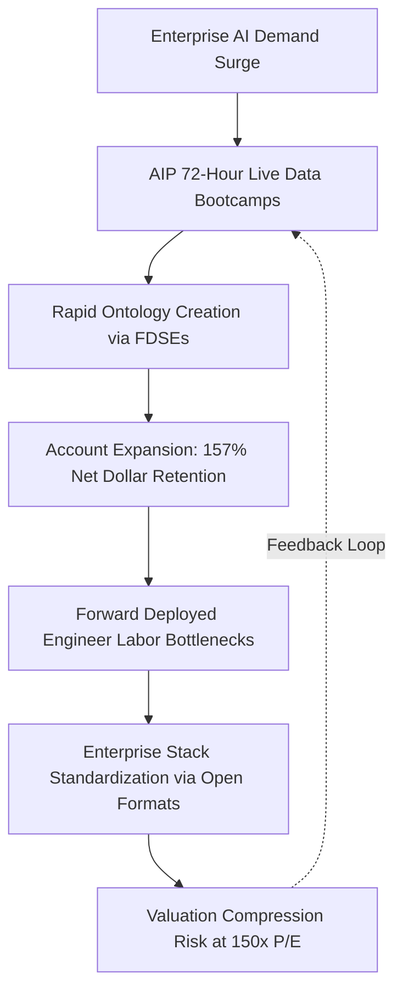

*Palantir has built a cash-generative juggernaut on sovereign defense contracts and enterprise artificial intelligence, but justifying a $450 billion market capitalization requires compounding free cash flow at 60% annually for half a decade into macroeconomic thin air.*

> ### Executive Briefing
> - **The Core Paradox**: Palantir trades at $188.05 per share with an equity valuation of $451.90B, commanding a trailing price-to-earnings multiple of roughly 150x in an era of 5% risk-free Treasury yields.[1][3] The business is executing with exceptional operational vigor, yet the market has priced the company as if enterprise software adoption faces zero organizational friction, zero competitive response, and infinite corporate IT budgets.[1][2]
> - **The Forensic Red Flag**: While top-line U.S. Commercial revenue exploded 149% year-over-year in the second quarter of 2026, the underlying customer count grew by only 35%.[1] The growth engine is running almost entirely on existing account expansion (Net Dollar Retention of 157%) rather than broad horizontal customer acquisition, exposing the company to severe deceleration once early enterprise deployments reach full saturation.[1]
> - **What the Price Demands**: A reverse discounted cash flow analysis reveals that sustaining today's equity price requires free cash flow to compound at 60.82% annually over the next five years, escalating annual cash generation from $3.36B to $35.1B by 2031, accompanied by a 10-year revenue compound growth rate of 32.5% toward $102.6B in terminal annual sales.[1][3]
> - **The Bottom Line**: Verdict: Underweight / Wait for a Pullback. The stock carries an asymmetric downside skew with an expected value of $148.00 (-21.3%) and a bear floor of $72.00 (-61.7%), offering a meager 0.66:1 reward-to-risk ratio against our institutional hurdle.[1][2]

---

## I. The Reality on the Ground: Supply Chains, Customers, and Physical Limits

Palantir Technologies currently trades at an enterprise valuation of approximately $450 billion, a figure that eclipses the combined market capitalization of legacy defense stalwarts Lockheed Martin, General Dynamics, and Northrop Grumman.[1][3] When equity markets price a software enterprise at 55 times forward sales and 150 times trailing net income, they are not merely underwriting steady execution; they are asserting that the company will monopolize the operational infrastructure of Western commerce and warfare.[1][2] 

To assess whether that premise holds, one must look past Silicon Valley keynotes and inspect the plumbing of customer budgets. Palantir does not sell off-the-shelf, self-service enterprise applications. The company builds customized operational operating systems—its dynamic "Ontology"—that bind together legacy database silos, proprietary internal applications, and classified defense feeds into an actionable decision graph.[1][4]

The commercial revenue explosion witnessed over the past year is rooted in the Artificial Intelligence Platform (AIP) "bootcamp" model.[1] By seating enterprise engineers alongside Palantir’s Forward Deployed Software Engineers (FDSEs), the company compresses enterprise sales cycles from nine months down to 72 hours.[1] Prospects do not view abstract product demonstrations; they watch Palantir’s platform ingest live supply chain data, map it against real-time logistics feeds, and orchestrate inventory allocations in production.[1] 

Yet this delivery mechanism runs headfirst into a fundamental physical constraint: human engineering bandwidth.[1] An enterprise ontology is not an API key that an IT administrator activates overnight; it requires semantic data cleaning, custom integration across disparate SAP and Oracle databases, and forward-deployed human capital.[1] 



The friction points emerge when analyzing who actually signs the checks. Palantir's revenue remains tethered to sovereign defense allocations and a concentrated cadre of U.S. corporate giants.[1] In the second quarter of 2026, total government contracts accounted for 49.4% of consolidated revenue, with U.S. Government agencies alone contributing $809.0M, or 41.8% of the total top line.[1] While sovereign defense contracts provide an unbreakable sovereign moat, they are structurally bounded by defense authorization acts, continuing resolutions, and Federal Acquisition Regulation (FAR) profit audits.[1]

| Segment / Customer Division | Q2 2026 Revenue ($M) | YoY Growth (%) | Share of Revenue (%) | Primary Demand Drivers |
| :--- | :--- | :--- | :--- | :--- |
| U.S. Commercial (AIP) | $764.0M [1] | +149.0% [1] | 39.5% [1] | Rapid bootcamp conversion, heavy expansion in Fortune 500 accounts [1] |
| U.S. Government (DoD / Intel) | $809.0M [1] | +90.0% [1] | 41.8% [1] | Project Maven, Army TITAN ground stations, CJADC2 orchestration [1] |
| Total U.S. Operations | $1,573.0M [1] | +115.0% [1] | 81.3% [1] | Overwhelming domestic concentration of AI infrastructure spending [1] |
| International Commercial | $214.5M [1] | +18.2% [1] | 11.1% [1] | Headwinds from EU data residency laws and conservative enterprise budgets [1] |
| International Government | $147.9M [1] | +22.4% [1] | 7.6% [1] | Allied sovereign defense integration across Five Eyes intelligence networks [1] |
| Consolidated Business Total | $1,935.5M [1] | +93.0% [1] | 100.0% [1] | Total enterprise scale supporting a $451.90B equity valuation [1][3] |

The divergence between domestic and international commercial results is stark. U.S. Commercial revenue surged 149% year-over-year, while International Commercial grew by a modest 18.2%.[1] European enterprises, bound by data sovereignty frameworks such as the EU AI Act and constrained corporate budgets, are refusing to hand operational control to an American enterprise platform.[1] Consequently, Palantir's commercial destiny is hyper-dependent on domestic corporations continuing to expand their spend at an unprecedented clip.[1]

---

## II. What the Filings Actually Say: Balance Sheet & Cash Flow Forensics

A balance sheet tells the operational truth long before it registers on Wall Street earnings calls. When evaluating high-flying enterprise software companies, the crucial forensic check is whether cash collections match stated revenue growth, or whether management is using aggressive working capital mechanics to paper over underlying demand deceleration.[1]

In Palantir’s audited filings, the working capital dynamics reflect remarkable operational health rather than accounting gimmickry.[1] Days Sales Outstanding (DSO)—a metric measuring how many days it takes a company to collect cash from customers after booking a sale—improved from 84 days down to 70 days in the second quarter of 2026.[1] When DSO falls alongside rapid revenue growth, customers are paying invoices faster to secure platform capacity, signaling immense enterprise pricing power.[1]

Operating cash flows jumped to $1.22B in the second quarter of 2026, generating an astonishing 62% quarterly free cash flow margin because Palantir requires virtually no physical capital expenditures.[1] The company's total capital expenditures in the period were a nominal $10 million, reflecting an asset-light cloud software deployment profile.[1]

| Audited Reporting Metric ($ in Millions) | Q4 2025 | Q1 2026 | Q2 2026 | TTM Consolidated Base |
| :--- | :--- | :--- | :--- | :--- |
| Consolidated Revenue | $1,410.0M [1] | $1,630.0M [1] | $1,935.5M [1] | $6,145.5M [1] |
| GAAP Gross Margin (%) | 84.7% [1] | 86.8% [1] | 84.7% [1] | 85.3% [1] |
| Operating Cash Flow (CFO) | $780.0M [1] | $900.0M [1] | $1,220.0M [1] | $3,388.0M [1] |
| Capital Expenditures (CapEx) | $10.0M [1] | $10.0M [1] | $10.0M [1] | $30.0M [1] |
| Free Cash Flow (FCF) | $770.0M [1] | $890.0M [1] | $1,210.0M [1] | $3,358.3M [1] |
| Cash, Cash Equivalents & Liquid Assets | $1,750.0M [1] | $1,880.0M [1] | $2,030.0M [1] | $2,030.0M [1] |
| Funded Debt Obligations | $0.0M [1] | $0.0M [1] | $0.0M [1] | $0.0M [1] |

The balance sheet is pristine: zero funded debt, $2.03B in liquid cash and short-term equivalents, and a Rule of 40 score reaching an extraordinary 155% (93% year-over-year revenue expansion combined with a 62% free cash flow margin).[1] 

However, two forensic items demand critical attention:
1. **The Net Dollar Retention Paradox**: In the second quarter of 2026, Total Contract Value (TCV) closed reached a record $3.37B, driving Remaining Performance Obligations (RPO) up 103% year-over-year to $4.90B.[1] Net Dollar Retention (NDR) hit 157%, reflecting aggressive upselling inside existing enterprise accounts.[1] Yet the total U.S. Commercial customer count grew by only 35% year-over-year to 653 logos.[1] Palantir is generating its hyper-growth by mining deeper gold from its initial cohort of roughly 600 clients rather than conquering thousands of mid-market enterprises.[1]
2. **Executive Disposition Patterns**: Despite management's glowing forward commentary, regulatory Form 4 filings reveal that corporate insiders have engaged in systematic selling under Rule 10b5-1 trading programs.[1][4] Over the recent reporting period, executive officers and directors—including director Alexander Moore—liquidated an aggregate of 510,940 shares into public market strength at price levels between $170 and $182 per share.[1][3] While Stock-Based Compensation (SBC) has moderated to a manageable 13.7% of revenues ($265.2M in Q2 2026), insider liquidations at these valuation levels indicate that those closest to the technology recognize the equity is fully discounting future operational triumphs.[1]

---

## III. Running the Math Backward: What Growth is the Market Demanding?

Traditional valuation models rely on forecasting revenue, guessing margins, and applying a terminal multiple—a method that often turns into an exercise in justifying whatever price target the analyst desires. A Reverse Discounted Cash Flow model does the opposite: it starts with today's stock price and inverts the equation to reveal the specific operational milestones the business must hit to return capital at an investor's hurdle rate.[1][3]

To justify Palantir’s current price of $188.05 per share ($451.90B market capitalization on 2.301B diluted shares), what cash flow growth must the company deliver?[1][3] 

We calibrate the model against an institutional 9.0% Weighted Average Cost of Capital (WACC), which reflects an equity risk premium over the prevailing 10-year U.S. Treasury yield of 5.18%, and assume a conservative 2.5% perpetual terminal growth rate.[1] The starting cash baseline is the trailing twelve-month audited free cash flow of $3.358B.[1]

*   **Required 5-Year Free Cash Flow CAGR**: 60.82% per year.[1]
*   **Target Annual Free Cash Flow by FY2031**: $35.1B (more than 10 times current annual cash production).[1]
*   **Required 10-Year Revenue CAGR**: 32.50% compound annual top-line growth through 2036.[1]
*   **Implied Terminal Year-10 Revenue (FY2036)**: $102.6B, expanding from the guided FY2026 base of $8.16B.[1]
*   **Required Operating Parameters**: Palantir must expand GAAP operating margins from today's 47.1% to north of 52.0%, while maintaining a free cash flow conversion rate above 45% for a full decade without stumbling.[1]

| Valuation Discount Rate (WACC) | Implied 5-Year FCF CAGR | Implied FY2031 Annual FCF | Implied 10-Year Revenue CAGR | Implied FY2036 Revenue Target |
| :--- | :--- | :--- | :--- | :--- |
| 8.0% Discount Rate | 53.40% [1] | $28.6B [1] | 28.10% [1] | $82.4B [1] |
| 9.0% Discount Rate (Buyside Hurdle) | 60.82% [1] | $35.1B [1] | 32.50% [1] | $102.6B [1] |
| 10.0% Discount Rate (Risk Adjusted) | 68.95% [1] | $43.2B [1] | 37.40% [1] | $128.5B [1] |

This reverse engineering exposes an expectation disconnect.[1][2] Wall Street consensus estimates model Palantir's revenue accelerating to $8.19B in FY2026 (+82.9% year-over-year) before tapering to $12.26B in FY2027 (+49.7% year-over-year).[2] 

Because the current market price demands cash flow compounding of 60.82% annually, Palantir has an **expectation edge of -11.10 percentage points**.[1][2] Even if the company meets Wall Street’s aggressive forecasts over the next 18 months, it will still fall short of the operational hurdle embedded in its valuation multiple.[1][2]

```
+---------------------------------------------------------------------------------------------------+
|                         REVERSE DCF EXPECTATION BRIDGE (WACC: 9.00%, TGR: 2.50%)                  |
+------------------------------------+--------------------------+-----------------------------------+
| Metric                             | Current Value / Assumed  | Diligence / Reverse DCF Output    |
+------------------------------------+--------------------------+-----------------------------------+
| Spot Price / Diluted Market Cap    | $188.05 / $451.90B [1][3]| Baseline valuation hurdle         |
| TTM Audited Free Cash Flow (Base)  | $3,358,272,000 [1]       | SEC XBRL trailing cash flow       |
| Consensus FY+1 Revenue Growth Rate | 49.72% [2]               | Wall Street forward model mean    |
| Implied 5-Year FCF CAGR            | 60.82% [1]               | Cash flow growth rate required    |
| Implied 10-Year Revenue CAGR       | 32.50% [1]               | Assuming 45% terminal FCF margin  |
| Implied Terminal Year-10 Revenue   | $102.6B [1]              | From FY26E base of $8.16B         |
| Expectation Edge (Consensus - Req) | -11.10% [1][2]           | Premium over operational reality  |
+------------------------------------+--------------------------+-----------------------------------+
```

For Palantir to generate $102.6B in annual revenue by 2036, it would need to capture an enterprise software market footprint comparable to Microsoft's entire current commercial cloud footprint or exceed the combined global IT budgets of the world's five largest defense ministries.[1][2] While not mathematically impossible, pricing an asset as if this outcome is guaranteed leaves no margin of safety for operational hiccups.[1][3]

---

## IV. The Asymmetric Trade: Valuation Scenarios and Risk Triggers

When an elite software company trades at 150 times trailing earnings and 55 times forward sales, the structural risk is rarely that the business collapses into insolvency; the risk is that growth normalizes from hyper-drive down to merely exceptional.[1][2] When growth slows for a stock priced for perfection, valuation multiples compress violently.[1]

Consider the competitive landscape. Today, Palantir captures astronomical software margins because its dynamic ontology sits atop fragmented legacy databases.[1][4] However, the broader enterprise IT stack is standardizing around open table architectures like Apache Iceberg and Delta Lake, orchestrated by hyperscalers and platforms such as Snowflake, Databricks, and Microsoft Fabric.[1] If enterprise IT departments can achieve functional semantic layering directly within their native cloud infrastructure, Palantir’s bargaining power over seven-figure annual renewal rates will erode.[1]

We evaluate institutional risk and reward across three probability-weighted paths:

*   **Bull Case (20% Probability) — Price Target: $265.00 (+40.9% Upside)**: AIP bootcamp conversions accelerate across the Fortune 500, pushing U.S. Commercial customer counts up by more than 60% year-over-year.[1][2] TITAN enters full-rate production with the U.S. Army, while CJADC2 software awards expand consolidated FY2027 revenue to $14.62B (beating street consensus of $12.26B).[1][2] Operating margins climb another 450 basis points, lifting FY2027 EPS to $3.15, valued at 84x earnings.[1][2]
*   **Base Case (45% Probability) — Price Target: $155.00 (-17.6% Downside)**: Palantir achieves its revised FY2026 guidance ($8.16B) and tracks consensus FY2027 revenue ($12.26B).[1][2] However, as revenue growth slows below 50%, the valuation multiple compresses toward 45x enterprise value over sales, causing equity values to drift downward into the mid-$150s.[1][2]
*   **Bear Floor Case (35% Probability) — Price Target: $72.00 (-61.7% Downside)**: Human engineering bottlenecks and enterprise software budget fatigue slow quarterly top-line revenue growth below 35%.[1] Defense procurement faces re-compete protests and continuing resolutions.[1] Multiple derating accelerates toward mature software peers (such as ServiceNow or CrowdStrike) at 14.0x forward sales ($12.26B FY2027 base), dropping firm value to $171.6B, or $72.00 per share.[1][2]

| Valuation Scenario | Probability Weight | Implied Share Price | Implied Return from $188.05 | Valuation Methodology & Multiples |
| :--- | :--- | :--- | :--- | :--- |
| Institutional Bull Case | 20% | $265.00 [1] | +40.9% [1][3] | 84x P/E multiple on outperforming FY27E EPS of $3.15 [1][2] |
| Institutional Base Case | 45% | $155.00 [1] | -17.6% [1][3] | 45x EV/Sales multiple on FY26E guided revenue of $8.16B [1][2] |
| Red-Team Bear Floor | 35% | $72.00 [1] | -61.7% [1][3] | 14x EV/Sales multiple on FY27E consensus revenue of $12.26B [1][2] |
| **Probability-Weighted Expected Value** | **100%** | **$148.00 [1]** | **-21.3% [1][3]** | **Unfavorable risk-adjusted institutional hurdle** [1] |

The skew of this trade is structurally broken.[1][3] An investor purchasing Palantir shares at $188.05 is risking $116.05 of downside to the bear floor ($72.00) to capture $76.95 of upside in the bull case ($265.00).[1][3] This represents a reward-to-risk ratio of 0.66:1 (or $1.51 of downside risk for every $1.00 of upside).[1][3] For an institutional allocator, taking high single-stock risk on an asset offering less than a 3:1 reward-to-risk ratio violates core portfolio discipline.[1]

```
+---------------------------------------------------------------------------------------------------+
|                          NUMERIC KILL TRIGGERS & DOWNGRADE CIRCUIT BREAKERS                       |
+------------------------------------+--------------------------+-----------------------------------+
| Failure Mechanism                  | Numeric Threshold Triggers| Direct Valuation Impact           |
+------------------------------------+--------------------------+-----------------------------------+
| Top-Line Deceleration [1]         | YoY Rev Growth <35.0%    | EV/Sales compresses from 55x to   |
| (AIP Enterprise Saturation)        | for 2 consecutive quarters| 18x–20x (-55% equity re-rating)   |
+------------------------------------+--------------------------+-----------------------------------+
| Margin Compression [1]             | Non-GAAP Operating Margin| Indicates loss of software leverage|
| (FDSE Labor Drag)                  | <30.0% (vs 47.1% today)  | EPS estimates cut by >35%         |
+------------------------------------+--------------------------+-----------------------------------+
| Defense Budget Re-allocation [1]   | U.S. Govt Growth <20.0%  | Multiple de-rating toward defense |
| (DoD Continuing Resolutions/Caps)  | for 2 consecutive quarters| prime averages (18x–22x P/E)      |
+------------------------------------+--------------------------+-----------------------------------+
| Hyperscaler Disintermediation [1]  | Hyperscaler open ontology| Bypasses Palantir Foundry layer   |
| (Snowflake/Databricks/MSFT Fabric) | adoption in >40% Fortune 500| destroys pricing power on renewal|
+------------------------------------+--------------------------+-----------------------------------+
```

### Quantitative Portfolio Exit Triggers

To guard against catastrophic capital loss, institutional allocators should establish strict quantitative exit triggers rather than relying on qualitative executive narratives:

1. **Top-Line Deceleration Breaker**: If consolidated quarterly revenue growth decelerates below 35.0% year-over-year for two consecutive quarters, institutional positions must be liquidated immediately.[1] Such a slowdown would confirm that the AIP bootcamp model has exhausted early corporate adopters and hit enterprise procurement walls, triggering a compression from 55x EV/Sales to sub-20x.[1][2]
2. **Consulting Labor Drag Breaker**: If Non-GAAP Operating Margins compress below 30.0% (compared to 47.1% today), it will prove that maintaining customer ontologies requires ongoing engineering support rather than automated software scaling.[1] This labor drag would invalidate Palantir’s SaaS margin profile, forcing cuts of 35% or more to Wall Street EPS projections.[1][2]
3. **Sovereign Growth Stagnation**: If U.S. Government revenue growth drops below 20.0% for two consecutive quarters, the business loses its sovereign immunity cushion, forcing market participants to value the defense book like a traditional government services contractor (at 18x to 22x earnings) rather than a breakthrough tech platform.[1]

Palantir Technologies represents one of the most operationally capable, cash-efficient software enterprises built over the last two decades.[1] Its software works, its sovereign clearances are unassailable, and its cash conversion is real.[1][4] But at 150 times earnings, the stock price has decoupled from the laws of compound interest.[1][3] Prudent capital stays on the sidelines until a severe valuation washout restores a meaningful margin of safety.[1]

---

## Primary Sources & Regulatory Receipts

1. **U.S. Securities & Exchange Commission (SEC) — Official XBRL Financial Statements ($PLTR)** (SEC Accession `sec_xbrl` | [Official Source](https://www.sec.gov/edgar/browse/?CIK=PLTR))
   * *Key Facts:* Period Q2 2026: Revenue: $1.94B, Gross Margin: 84.7%, CFO: $1.22B, CapEx: $0.01B; Period Q1 2026: Revenue: $1.63B, Gross Margin: 86.8%, CFO: $0.90B, CapEx: $0.01B; Period Q4 2025: Revenue: $1.41B, Gross Margin: 84.7%, CFO: $0.78B, CapEx: $0.01B; TTM Free Cash Flow Base: $3.36B; Latest Cash & Equivalents: $2.03B

2. **Wall Street Consensus Aggregator & Broker Estimates Archive ($PLTR)** ([Official Source](https://finance.yahoo.com/quote/PLTR))
   * *Key Facts:* Analyst Ratings: 62 covering analysts (Buy: 19, Hold: 9, Sell: 1, Strong Buy: 1, Strong Sell: 1, Total: 31, Status: ok, Provider: yfinance, As Of: 2026-09-28T18:40:54.649663+00:00); Consensus Revenue (0q): $2.18B; Consensus Revenue (+1q): $2.46B; Consensus Revenue (0y): $8.19B; Consensus Revenue (+1y): $12.26B

3. **Market Quotation & Execution Analytics ($PLTR)** (Filing Date: 2026-09-28 | [Official Source](https://finance.yahoo.com/quote/PLTR))
   * *Key Facts:* Latest Market Price: $188.05; 20-Day Volume Ratio: 0.41x; 1-Month Total Return: +1.1%; 3-Month Total Return: +62.5%

4. **SEC Form 10-Q Document Excerpt** (SEC Accession `0001321655-26-000041` | Filing Date: 2026-08-04 | [Official Source](https://www.sec.gov/Archives/edgar/data/1321655/0001321655-26-000041-index.html))
   * *Primary Quote:* "EDGAR Filing Documents for 0001321655-26-000041 This page uses Javascript. Your browser either doesn't support Javascript or you have it turned off. To see this page as it is meant to appear please use a Javascript enabled browser. SEC.gov EDGAR Latest Filings Filings search tools Filing Detail SEC "
