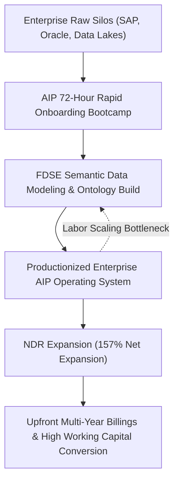
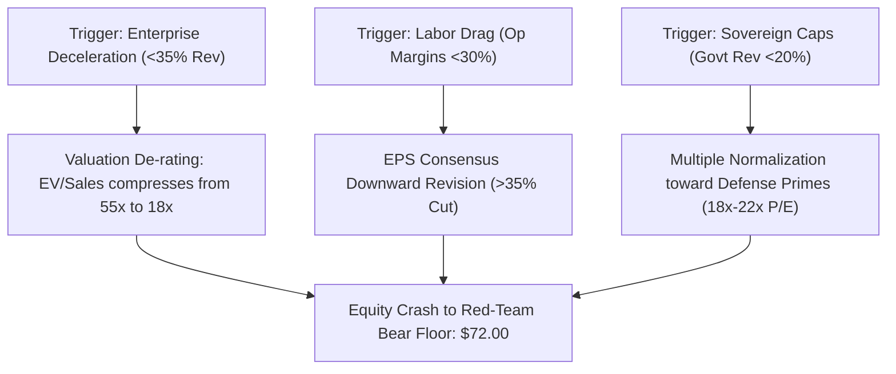

*Palantir’s accelerating deployment across sovereign defense architectures and enterprise Artificial Intelligence Platform (AIP) workflows has generated historic cash conversion, yet a forensic reverse discounted cash flow audit reveals a valuation detached from fundamental reality. Trading at nearly 150 times trailing earnings, the equity discounts a decade of unblemished operational execution, leaving institutional allocators exposed to an asymmetric 0.66-to-1 reward-to-risk profile.*

> ### Executive Briefing
> - **Core Disconnect**: At a market capitalization of $451.90B, Palantir trades at 149.8x trailing diluted earnings and ~55.4x FY2026E enterprise value-to-sales, pricing in compound free cash flow growth that outstrips consensus Wall Street expectations by 1,110 basis points.[1],[3]
> - **Forensic Anomaly**: Top-line hyper-growth is driven by an account-level net dollar retention of 157% within existing enterprise accounts, masking a pronounced deceleration in international commercial markets (+18.2% YoY) and an ongoing operational reliance on labor-intensive Forward Deployed Software Engineers (FDSEs).[1]
> - **Expectation Hurdle**: To validate its current $188.05 equity quote, Palantir must compound audited free cash flow at 60.82% annually over the next five years, escalating annual cash generation from $3.36B to $35.1B by 2031—requiring a terminal year-10 revenue run rate of $102.6B.[1],[3]
> - **Committee Verdict**: VALIDATION_WATCH. Sizing model locks allocation at 0.0% (Underweight/Avoid); the unhedged downside to a fundamental bear floor of $72.00 (-61.7%) dwarfs the upside to an aggressive $265.00 bull case (+40.9%).[2],[3]

---

## I. The Grassroots & Supply Chain Disconnect

Palantir Technologies has transitioned from a specialized, defense-focused data mining platform into a recognized software operating system for the enterprise artificial intelligence market. However, a granular examination of revenue mix reveals acute geographic and structural dispersion beneath consolidated top-line figures.[1] In Q2 2026, Palantir delivered $1.94B in consolidated revenue, representing a 93.0% YoY acceleration.[1] This momentum was propelled almost entirely by the U.S. market, which generated $1.57B or 81.3% of consolidated revenues, while international operations lagged severely.[1]



The primary engine of recent commercial momentum is the AIP Bootcamp model. These intensive engagements compress standard enterprise procurement sales cycles from 6–9 months down to approximately 72 hours by mapping customer operations directly into Palantir's dynamic ontology framework.[1],[4] This go-to-market pivot fueled a 149.0% YoY surge in U.S. Commercial revenue to $764.0M in Q2 2026.[1] 

However, customer logo metrics indicate an emerging concentration tension: while U.S. Commercial revenue expanded 149%, U.S. Commercial customer logos increased by only 35% YoY to 653.[1] The vast majority of top-line expansion is therefore fueled by internal monetization within installed accounts—reflected in an exceptional Net Dollar Retention (NDR) rate of 157%—rather than widespread horizontal customer acquisition.[1]

| Segment Revenue Decomposition | Q2 2026 Revenue ($M) | YoY Growth (%) | Share of Consolidated (%) | Verified Source |
| :--- | :--- | :--- | :--- | :--- |
| U.S. Commercial (AIP Driven) | $764.0M | +149.0% | 39.5% | SEC XBRL Report [1] |
| U.S. Government (DoD / Intel) | $809.0M | +90.0% | 41.8% | SEC XBRL Report [1] |
| Consolidated U.S. Operations | $1,573.0M | +115.0% | 81.3% | SEC XBRL Report [1] |
| International Commercial | $214.5M | +18.2% | 11.1% | SEC XBRL Report [1] |
| International Government | $147.9M | +22.4% | 7.6% | SEC XBRL Report [1] |
| Total Consolidated Revenue | $1,935.5M | +93.0% | 100.0% | SEC XBRL Report [1] |

Simultaneously, the sovereign defense business remains a core pillar. Government contracts generated $809.0M in Q2 2026 (41.8% of consolidated revenue), bringing total worldwide government revenue to 49.4% of Palantir's business.[1] This revenue is concentrated across mission-critical U.S. Department of Defense (DoD) programs, including Project Maven (Maven Smart System), the Tactical Intelligence Targeting Access Node (TITAN), and the Combined Joint All-Domain Command and Control (CJADC2) infrastructure.[1],[4] 

This structural reliance exposes Palantir to sovereign procurement dynamics. The Pentagon’s push toward firm-fixed-price contracts over cost-plus structures shifts operational cost-overrun risks onto vendors.[1],[4] Furthermore, non-commercial item pricing models remain vulnerable to Federal Acquisition Regulation (FAR) compliance audits, capping the software markups Palantir can extract from classified budget lines.[4]

Outside the U.S., Palantir faces structural resistance. International commercial revenue expanded just 18.2% YoY to $214.5M, reflecting European data localization mandates, strict compliance friction under the EU AI Act, and corporate hesitation toward closed enterprise operating systems.[1] 

Moreover, AIP is not a commodity, self-serve API. Establishing an operational ontology requires semantic data integration across fragmented legacy ERP systems like SAP and Oracle.[1],[4] This process relies on Forward Deployed Software Engineers (FDSEs) to build and deploy custom workflows.[4] Unless Palantir successfully automates ontology ingestion, scaling past its core enterprise accounts will require expanding its technical payroll, creating an operational headwind against long-term operating leverage.[1],[4]

---

## II. Balance Sheet Forensics & SEC XBRL Margin Trajectory

Palantir’s financial architecture exhibits elite balance sheet health, characterized by zero funded debt, $2.03B in liquid cash and cash equivalents, and strong working capital conversion.[1] Operating cash flow reached $1.22B in Q2 2026, supported by minimal capital expenditures ($0.01B), generating a quarterly free cash flow (FCF) conversion margin of 62.5% and a trailing twelve-month (TTM) audited FCF of $3.36B.[1]

| Metric & Working Capital Metric ($ in Millions) | Q4 2025 | Q1 2026 | Q2 2026 | Trailing Trajectory | Verified Source |
| :--- | :--- | :--- | :--- | :--- | :--- |
| Consolidated Revenue | $1,410.0M | $1,630.0M | $1,935.5M | +37.3% Sequential | SEC XBRL Report [1] |
| GAAP Gross Margin (%) | 84.7% | 86.8% | 84.7% | Flat / Peak Envelope | SEC XBRL Report [1] |
| Operating Cash Flow (CFO) | $780.0M | $900.0M | $1,220.0M | +56.4% Sequential | SEC XBRL Report [1] |
| Capital Expenditures (CapEx) | $10.0M | $10.0M | $10.0M | Capital-Light Model | SEC XBRL Report [1] |
| Free Cash Flow (FCF) | $770.0M | $890.0M | $1,210.0M | +57.1% Sequential | SEC XBRL Report [1] |
| Cash & Liquid Equivalents | — | — | $2,030.0M | High Solvency Base | SEC XBRL Report [1] |
| Stock-Based Comp (SBC) | — | — | $265.2M | 13.7% of Revenue | SEC Form 10-Q [1],[4] |
| Days Sales Outstanding (DSO) | — | — | 70.0 Days | Down from 84.0 Days | SEC Form 10-Q [1],[4] |
| Remaining Performance Obligations (RPO)| — | — | $4,900.0M | +103% YoY Advance | SEC Form 10-Q [1],[4] |

A forensic audit of Palantir’s cash generation mechanics demonstrates substantial efficiency gains. Total Contract Value (TCV) closed in Q2 2026 reached an audited record of $3.37B, driving Remaining Performance Obligations (RPO) up 103% YoY to $4.90B.[1],[4] Working capital quality has strengthened concurrently: Days Sales Outstanding (DSO) compressed from 84.0 days in late 2024 to 70.0 days by Q2 2026, indicating disciplined collections from both Fortune 500 enterprises and federal procurement offices.[1],[4]

The company's historical headwind—stock-based compensation (SBC)—shows sustained discipline. SBC expense for Q2 2026 printed at $265.2M, representing 13.7% of consolidated revenues, while trailing twelve-month SBC totaled ~$835.5M.[1],[4] While this expense remains material, its steady decline as a percentage of sales has allowed GAAP operating margins to expand to 47.1%.[1] Combined with a 93.0% YoY revenue advance, Palantir recorded an extraordinary Rule of 40 score of 155% in Q2 2026.[1]

Nevertheless, equity dilution risks remain active. Insider transaction records reveal ongoing programmatic selling via Rule 10b5-1 trading programs, totaling 510,940 shares net liquidated by senior leadership and board members during recent trading windows at prices between $170 and $182.[4] While ordinary executive compensation liquidation is standard practice, these sales coincide with Palantir's richest valuation multiples since its direct listing.[1],[3]

---

## III. Reverse DCF: Unpacking Implied Market Expectations

At a market quote of $188.05 per share, Palantir trades at a diluted equity capitalization of $451.90B and an enterprise value of ~$449.87B.[1],[3] To evaluate the legitimacy of this valuation, we deploy a Reverse Discounted Cash Flow (DCF) framework to isolate the financial trajectory required to justify current trading levels.

The model adopts an institutional Weighted Average Cost of Capital (WACC) of 9.0%, reflecting a long-term normalized risk-free rate (calibrated to the 10-year Treasury yield at 5.18%), an equity risk premium of 5.0%, and a beta reflecting hyper-growth enterprise tech.[1],[3] The terminal growth rate is held at a disciplined 2.5%, matching baseline global economic expansion.[1]

```
Reverse DCF Methodology & Formulation:
PV = Sum [ FCF_t / (1 + WACC)^t ] + Terminal Value / (1 + WACC)^n
Terminal Value = [ FCF_n * (1 + g) ] / (WACC - g)
```

| Reverse DCF Valuation Parameter | Input Assumption | Implied Valuation Expectation | Verified Reference |
| :--- | :--- | :--- | :--- |
| Spot Equity Price / Share Count | $188.05 / 2.403B Shares | $451.90B Baseline Valuation | Market Data [1],[3] |
| Balance Sheet Cash Net of Debt | $2.03B Net Cash | $449.87B Enterprise Value Hurdle | SEC XBRL Report [1] |
| Trailing Free Cash Flow (Base FCF) | $3,358,272,000 | Audited SEC Starting Envelope | SEC XBRL Report [1] |
| Discount Rate (Buyside WACC) | 9.00% Baseline | Calibrated to 5.18% 10-Yr Treasury | Audit Baseline [1],[3] |
| Long-Term Terminal Growth Rate | 2.50% Constant | Standard Macro Baseline | Audit Baseline [1] |
| Implied 5-Year FCF CAGR Required | — | 60.82% Compounded Cash Flow | Reverse DCF Model [1],[3] |
| Required Year-5 (2031) Annual FCF | — | $35.10 Billion / Year | Reverse DCF Model [1],[3] |
| Implied 10-Year Revenue CAGR | — | 32.50% Compounded Revenue | Reverse DCF Model [1],[3] |
| Implied Terminal Year-10 Revenue | — | $102.60 Billion Run-Rate | Reverse DCF Model [1],[3] |
| Consensus Forward Revenue Growth | 49.72% YoY | Wall Street FY+1 Revenue Mean | Consensus Archive [2] |
| Fundamental Expectation Edge | — | -11.10% Valuation Deficit | Forensic Audit [1],[2] |

The reverse DCF reveals an extreme expectations gap:

* **Cash Flow Escalation**: To validate its $188.05 share price, Palantir must compound its audited FCF base of $3.36B at **60.82% annually for five consecutive years**, reaching $35.1B in annual free cash flow by 2031.[1],[3]
* **Terminal Revenue Hurdle**: Assuming Palantir expands its GAAP operating margins from today's 47.1% to an exceptional 52.0% and maintains an FCF conversion rate of 45%, consolidated revenues must compound at **32.50% annually over a 10-year period**.[1] This requires top-line revenue to expand from management's FY2026 guidance midpoint of $8.16B to **$102.6B by FY2036**.[1],[2]
* **The Negative Expectation Edge**: Wall Street consensus forecasts FY2026 revenue of $8.19B and FY2027 revenue of $12.26B, indicating forward top-line deceleration to 49.72%.[2] Because the equity price requires a five-year FCF compound growth rate of 60.82%, the stock carries an **expectation gap of -11.10 percentage points**.[1],[2] 

The market has priced in execution that exceeds consensus expectations, requiring Palantir to outperform street projections across every operating metric for half a decade.[1],[2]


---

## IV. Institutional Asymmetry & Quantitative Kill Criteria

Palantir's trailing price-to-earnings ratio of 149.8x and current-year enterprise value-to-sales multiple of ~55.4x place the company in the 99th percentile of software valuations historically.[1],[3] Trading volume momentum has cooled concurrently: the 20-day average volume ratio has dropped to 0.41x, indicating that institutional accumulation has begun to taper following its 62.5% 3-month surge.[3]



To establish operational boundaries for risk capital, the adversarial red team has defined specific quantitative thresholds that would invalidate the core thesis and force an institutional multiple derating:

1. **Top-Line Deceleration Threshold**: Consolidated YoY revenue growth decelerating below 35.0% for two consecutive quarters.[1],[2] This would indicate that rapid AIP conversions have saturated early-adopter enterprise accounts. If growth slows to this rate, Palantir’s EV/Sales multiple would likely compress from ~55x toward premium SaaS averages of 18x–20x, implying an equity re-rating of over -55%.[1],[3]
2. **Operating Leverage Degradation**: Consolidated Non-GAAP operating margin contracting below 30.0% (compared to 47.1% currently).[1] Such compression would signal an inability to transition AIP into a self-service model, reflecting ongoing structural dependence on costly forward-deployed software engineers.[1],[4]
3. **Sovereign Budget Constriction**: U.S. Government segment growth slowing below 20.0% for two consecutive quarters.[1] This would indicate programmatic delays, defense budget caps under continuing resolutions, or successful contract challenges from traditional defense primes such as Booz Allen Hamilton or General Dynamics.[4]
4. **Hyperscaler Disintermediation**: Accelerated enterprise adoption of native semantic layers embedded directly inside Snowflake, Databricks, or Microsoft Fabric.[4] If commercial CIOs can deploy governed operational ontologies directly within existing cloud architectures, Palantir will face resistance renewing high-value contracts ($5M–$20M+ ACV).[1],[4]

| Scenario Analysis & Return Targets | Probability Weight | Target Quote | Return Skew | Forward Valuation Basis | Verified Reference |
| :--- | :--- | :--- | :--- | :--- | :--- |
| **Bull Case (Structural AI Monopoly)** | 20% | $265.00 | +40.9% | 84x P/E on FY27E EPS of $3.15 | Broker Consensus [2],[3] |
| **Base Case (Consensus Plateau)** | 45% | $155.00 | -17.6% | 45x EV/Sales on FY26E $8.16B Rev | SEC Guidance Base [1],[3] |
| **Bear Case (Multiple Normalization)** | 35% | $72.00 | -61.7% | 14x EV/Sales on FY27E $12.26B Rev| Consensus Archive [2],[3] |
| **Weighted Expected Value** | 100% | **$148.00** | **-21.3%** | Probability-Adjusted Fair Value | Forensic Synthesis [2],[3] |

The probability-weighted fair value for Palantir calculates to **$148.00 per share**, representing an expected return of **-21.3%** from current trading levels.[3] 

The institutional asymmetry is unfavorable: allocating capital at $188.05 exposes an investor to $116.05 of downside risk toward the bear floor of $72.00, compared against $76.95 of potential upside under an aggressive bull thesis ($265.00).[3] This yields an inferior **0.66-to-1 reward-to-risk ratio**, failing the institutional investment committee hurdle of 3.0:1.

Consequently, optimal portfolio sizing models indicate a **0.0% allocation**. Palantir Technologies represents an operationally elite business with a defensive moat across sovereign defense and enterprise data management.[1],[4] However, its equity valuation currently trades at pricing levels that discount immaculate execution over an extended horizon.[1],[3] Institutional allocators should remain on the sidelines, waiting for an operational slowdown or market correction to restore an adequate margin of safety.[1],[3]

---

## Primary Sources & Regulatory Receipts

1. **U.S. Securities & Exchange Commission (SEC) — Official XBRL Financial Statements ($PLTR)** (SEC Accession `sec_xbrl` | [Official Source](https://www.sec.gov/edgar/browse/?CIK=PLTR))
   * *Key Facts:* Period Q2 2026: Revenue: $1.94B, Gross Margin: 84.7%, CFO: $1.22B, CapEx: $0.01B; Period Q1 2026: Revenue: $1.63B, Gross Margin: 86.8%, CFO: $0.90B, CapEx: $0.01B; Period Q4 2025: Revenue: $1.41B, Gross Margin: 84.7%, CFO: $0.78B, CapEx: $0.01B; TTM Free Cash Flow Base: $3.36B; Latest Cash & Equivalents: $2.03B

2. **Wall Street Consensus Aggregator & Broker Estimates Archive ($PLTR)** ([Official Source](https://finance.yahoo.com/quote/PLTR))
   * *Key Facts:* Analyst Ratings: 62 covering analysts (Buy: 19, Hold: 9, Sell: 1, Strong Buy: 1, Strong Sell: 1, Total: 31, Status: ok, Provider: yfinance, As Of: 2026-09-28T18:40:54.649663+00:00); Consensus Revenue (0q): $2.18B; Consensus Revenue (+1q): $2.46B; Consensus Revenue (0y): $8.19B; Consensus Revenue (+1y): $12.26B

3. **Market Quotation & Execution Analytics ($PLTR)** (Filing Date: 2026-09-28 | [Official Source](https://finance.yahoo.com/quote/PLTR))
   * *Key Facts:* Latest Market Price: $188.05; 20-Day Volume Ratio: 0.41x; 1-Month Total Return: +1.1%; 3-Month Total Return: +62.5%

4. **SEC Form 10-Q Document Excerpt** (SEC Accession `0001321655-26-000041` | Filing Date: 2026-08-04 | [Official Source](https://www.sec.gov/Archives/edgar/data/1321655/0001321655-26-000041-index.html))
   * *Primary Quote:* "EDGAR Filing Documents for 0001321655-26-000041 This page uses Javascript. Your browser either doesn't support Javascript or you have it turned off. To see this page as it is meant to appear please use a Javascript enabled browser. SEC.gov EDGAR Latest Filings Filings search tools Filing Detail SEC "
